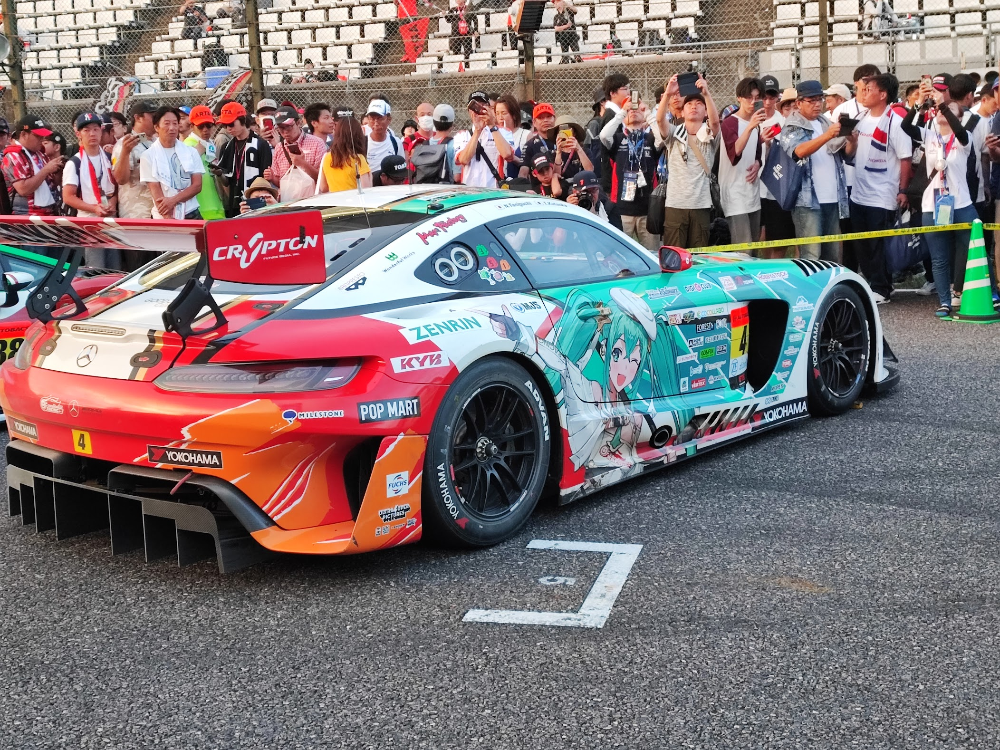
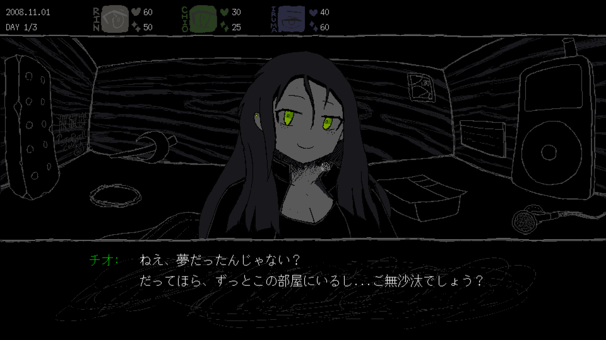
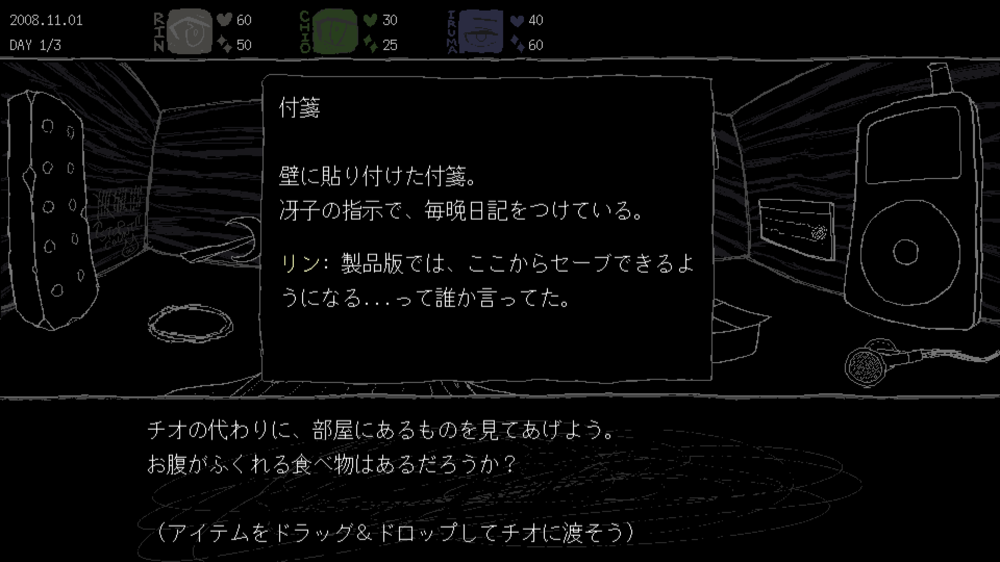
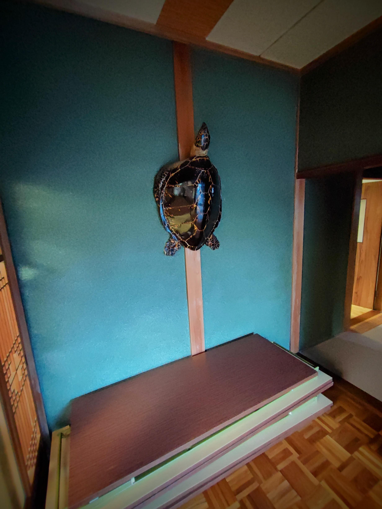

2回目の開発日記（週報？）です！今週は土日に三重県へと旅行に行き、水族館や鈴鹿サーキットに行ったり、友人の親戚の超立派な古民家に泊まったりしました。

で、その友人の古民家に泊まっていたのですが、普段深夜まで起きているせいでなかなか寝付けず、携帯も圏外だったので次の開発日記の妄想が始まりました。ファンタジー仕立てのシナリオです。

*山奥の古民家を不眠でうろつき、代々の親族によって整頓されてきたであろう立派な家に引け目を感じていると、玄関に掛けられた亀の剥製がこちらに話しかけてくる。亀は自らを育てた純和風の伝統芸術に大変誇りを抱いていて、僕がインディーゲームというねじ曲がった創作をしていることを告げると、亀はまともに取り合いもせず一笑に付す。それでも言い返せずにもじもじしていると、せせら笑いながら今週やったことを報告するように促してくる......*

昨晩実際に書き上げ、今朝見たのですが、なんか微妙だし長すぎたのでごっそり削除しました。普通に淡々と書きます。布団の中で思いついたときは、いいアイデアだと思ったんですけど。

#### デモのブラッシュアップを進めています

相変わらずSAEKOのデモを作っています。これまで実験的に仕様をいじっていたり、完璧なクオリティの絵が出来るまで待っていたりするせいで、今あるデモには「ここは心の目で見てください」「ここは別途資料を見ながら操作してください」という未完成の部分が多々ありました。開発者しかプレイしないんだし、自分の頭の中で整合性が取れてたらスルーして、次の面白そうなギミックの開発にかかっていた、といった具合です。

ただ、この1週間でSAEKOに関して色々な動きがありました。『一刻も早くお伝えしたいニュース（注：大人の事情で詳細は言えません）』的なやつです。色々な方面でその準備を進めているのですが、並行してデモの開発の仕方も少し変え、ゲームとして一応第三者目線でも違和感なくプレイできるものを作りたいと考えています。

色々とスケジュールがかつかつなので、少し怖い部分はあります。自分を追い込んで頑張る必要がありそうです。......レースとか見に行ってたの、修羅場で後悔しそう。

#### UIを変えました

デモのブラッシュアップの一環で、UIに関しても見直しを行いました。特に大きな変化は、セリフのダイアログです。

右下の「セーブ」「ロード」といったボタンがなくなり、全体的にすっきりしました。没入感も増えた気がするし、個人的には気に入っています。

じゃあ、セーブ/ロードはどうするのかというと、引き出しの中のアイテムを使ってできるようにしようと考えています。

この付箋をクリックすると、SAEKOならではの特徴あるユーザーインターフェースに飛んで、特徴ある操作によってセーブ/ロードができるはずです。......ただ、このアイテムの説明にもある通り、一旦は製品版まで後回しです。

#### おわり

文章を書こうとすると、つい余計に凝り始めて時間を費やしてしまう傾向があります。でも、その時間はゲーム自体に費やしたほうが明らかに良いです。なので、開発日記はできるだけ手を抜き、雑に書き捨てられるようなクオリティを維持していこうと思います。

僕が `開発日記_2023_08_29(亀との対話ver_超面白い).md` を削除したのも、そういう理由でした。亀くん、出演の機会を奪ってしまってごめんなさい。その勇姿を日記に掲載しておくので、これで成仏してもらえると嬉しいです。

