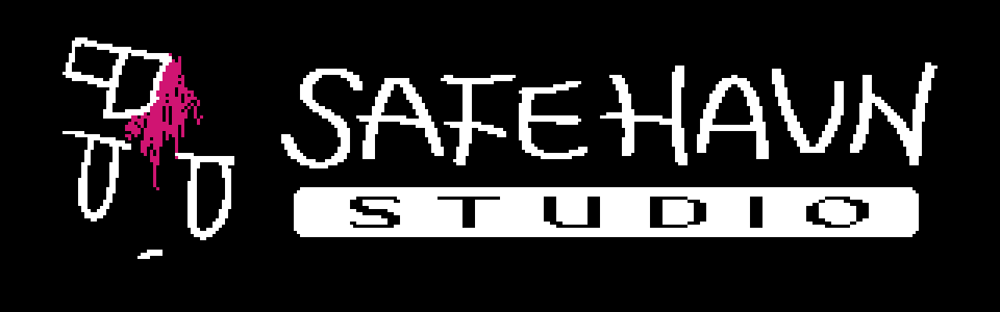
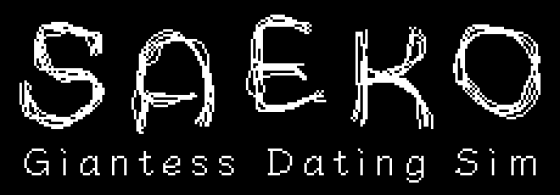
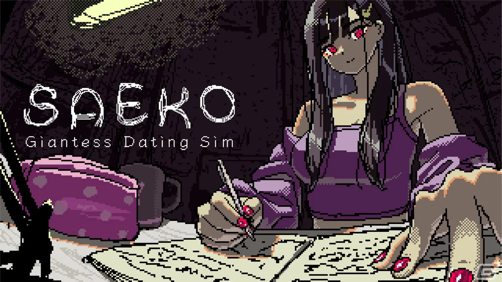
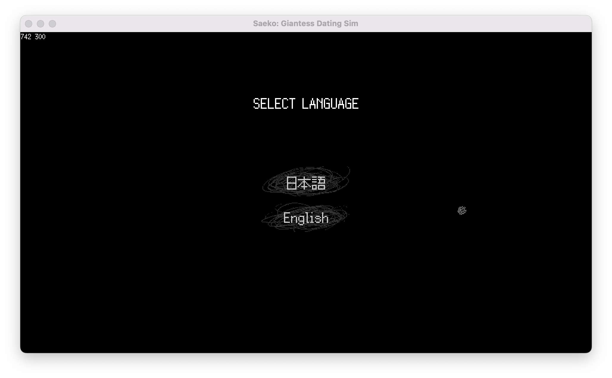
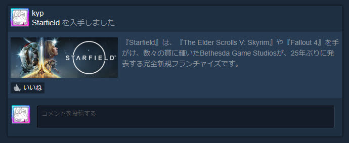

この開発日記をあなたが読んでいるということは、既にSAEKO: Giantess Dating Simに関しての重大発表をご覧になっていることでしょう。だってうるさいくらいRTしているから。ごめんなさい、嫌いにならないで......良い子にするから......

<blockquote class="twitter-tweet">
SAFE HAVN STUDIO開発のADV『SAEKO: Giantess Dating Sim』 新たなパブリッシュタイトルとして発表いたします。<a href="https://t.co/kDk5RFLjSR">https://t.co/kDk5RFLjSR</a>  9月21日(木)〜24日(日)の <a href="https://twitter.com/hashtag/%E6%9D%B1%E4%BA%AC%E3%82%B2%E3%83%BC%E3%83%A0%E3%82%B7%E3%83%A7%E3%82%A62023?src=hash&amp;ref_src=twsrc%5Etfw">#東京ゲームショウ2023</a> では、 HYPER REALブースで試遊可能なデモ版を展示予定です。 <a href="https://t.co/h3yTF0mlgY">pic.twitter.com/h3yTF0mlgY</a>
— HYPER REAL (@HYPERREAL_jp) <a href="https://twitter.com/HYPERREAL_jp/status/1699210804795457710?ref_src=twsrc%5Etfw">September 6, 2023</a></blockquote>

私たちSAFE HAVN STUDIOは、開発中のゲーム『SAEKO: Giantess Dating Sim』について、[HYPER REAL](https://hyperreal.jp/)様とパブリッシャー契約を結びました。今月21日〜24日に行われる東京ゲームショウにて、早速私たちのゲームが展示されるみたいです。

なんというか......すごく......控えめに言って......ドキドキしています。あまり考えすぎないようにしています。深呼吸......深呼吸......

#### かっこいいロゴが増えた

これと関連して、私たち「SAFE HAVN STUDIO」にかっこいいロゴが増えました。それから、私たちの作品「SAEKO: Giantess Dating Sim」にも。いずれも私たちのクールなデザイン担当、[maztani](https://twitter.com/k_maztani)の作品です。

<figure>
    
    <figcaption>美しく、しかもこれまでのSAEKOやスタジオのイメージを継承するロゴを作ってくれた。 本当にありがとう</figcaption>
  </figure>

クールな新しいロゴは、既にTGS用に新調したティザービデオだったり、パブリッシャーが新しく用意してくれたPR用画像などに使われ始めています。

あ......パブリッシャー......ああ......

#### パブリッシャー契約

パブリッシャー契約について。パブリッシャーとは何か？ゲームの起動前に出てくるかっこいいロゴを増やしてくれるところです。嘘です。ごめんなさい。ゲーム開発に付随する大人の仕事を色々とやってくれるところだと信じています。

パブリッシャーとはVGA的なものを結んだ気がしていて（MBAだったかも）、怖いのでこの記事では詳細について触れません。ですが、契約できたことについて大変感謝しています。

6月に[Tokyo Indiesでゲームをプレゼンしてから](https://twitter.com/saekogame/status/1669358785570406403SAEKO)、ありがたいことに想像を超える反響をいただき、スピードを重視してスタジオメンバーが自らSteamのストアページやローカライズの準備を進めてきました。全てを自分たちだけでやってみて、正直、「出来なくはなさそう」という感想ではあったのですが、一方で色々なところで迷うことがありました。

私たちSAFE HAVN STUDIOのメンバーは、大学の文化祭やコミケ等でゲームを頒布した経験はあるのですが、Steamでのリリースはこれが初めてです。ましてや自分のゲームを翻訳してもらった経験などありません。QAも。自分たちでベストは尽くしているつもりでも、知識不足で何かミスをしているのではないか？もっと良い方法があるのではないか？そんな悩みが常に頭をよぎっていました。

今回、HYPER REALさんと契約していただけることにより、これらの自分たちが存在すら知らなかった業務を担当していただけるだけでなく、インディーゲームのプロフェッショナルたちと大きなチームを組めることは大変嬉しいです。話し相手が増えるし、アドバイスもらえそうだし、それにほら、自分たちだけだったら経験できないこともさせてもらえるし、た、例えば、東京ゲームショウへの出展とか......

#### 東京ゲームショウに私たちのゲームが展示されます

東京ゲームショウに私たちのゲームが展示されます。

*東京ゲームショウに私たちのゲームが展示されます！*

東京ゲームショウ......私はそれほどイベントを熱心に追うタイプの人間ではないのですが、それでも東京ゲームショウだけは行ったことがあります。中学生くらいの頃、もちろん一般日に。エナジードリンクとシールだけもらって、試遊の列はとにかく人が多くて、それでなんとなく怖くなって帰ったような......

『巨大な少女のノベルゲームを出す』というのは元々私の頭の中にあったアイデアに過ぎませんでした。それがまず私のコンピューター上のプログラムになって、グラフィッカー(koh, maztani)が入って、パブリッシャーが加わって、そして子供のときにちらりと覗いたイベントの一角に展示されて......なんかすごいことが起きている気がします。

夢が叶ったぜ、ぜひ見に来てくれよな、白い歯を覗かせてそう爽やかに言いたいところなのですが、正直なところを言うと、脳内では大戦争が起きています。根拠のない自信 vs 根拠のある不安・恐怖連合軍です。戦線は常に拮抗しつつ、連合軍が徐々にリードを広げています。

おおお......ナーバスな気持ちの詳細について、包み隠さず言語化するのは非常に難しいのですが......うあああ......少なくとも私は、他のブースの作品を心の底から楽しむことはできないでしょう。だって、絶対に比較して、絶対に落ち込んでしまうから。最悪の場合、SAEKOの展示機があるブースに行って、今すぐ展示をとりやめるようパブリッシャーの人に泣きついてしまうかもしれません。もしそうなったら手足を縛って東京湾に沈めてください。

誰にも見られない海の底で、岩に隠れてゲームを作ります。

ともかく。

全てが順調に進めば、私たちのゲームが東京ゲームショウのHYPER REALさんのブースで展示されます。運が良ければ、実際にデモを遊んでもらうこともできるはずです。

展示用のデモを作るというのは、想像していたよりはるかに大変な作業です。特に私たちはノベルゲームで時間の調整が難しいし、ローカライズも必要だし、絶賛開発中で「ここはあとでちゃんとしたファイルに置き換える！」って素材やらプログラムやらがたくさんあるし、とにかく、うう、不安の種は尽きません。

<figure>
    
    <figcaption>デモ用の準備の例：急遽作成した言語選択画面。 画像は開発中のものです。</figcaption>
  </figure>

一方で、こういった大規模なイベントで出展できるというのは本当に貴重な機会です。正直、パブリッシャーの方から出展の打診を受けたときは本当に嬉しかったですし、二つ返事で「はい」って答えました。そこからSAFE HAVN STUDIOのメンバーも含め、沢山の人にかなり無理なスケジュールを言いながら準備してもらっています。私もできることを頑張って、来場いただいた方に少しでも良い状態のSAEKOを見せられたらと思っています。

というわけで、頑張ります。頑張り......ます......ああ............

やっぱり......ちょっとだけStarfieldやってもいい？
