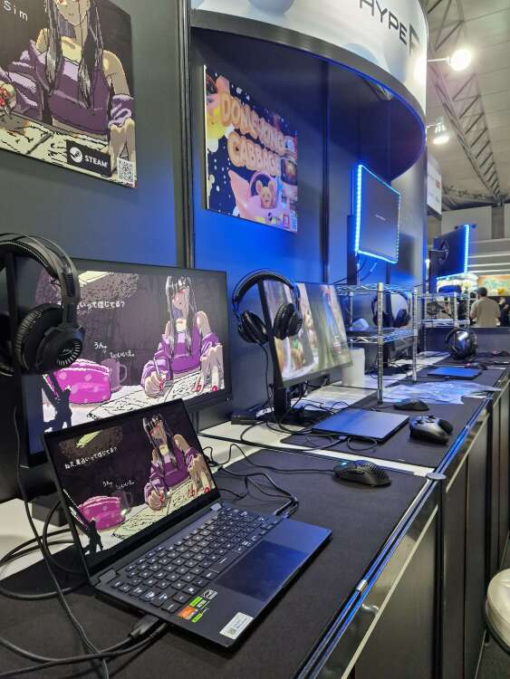
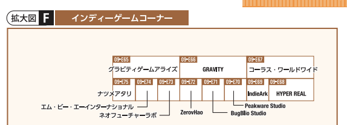
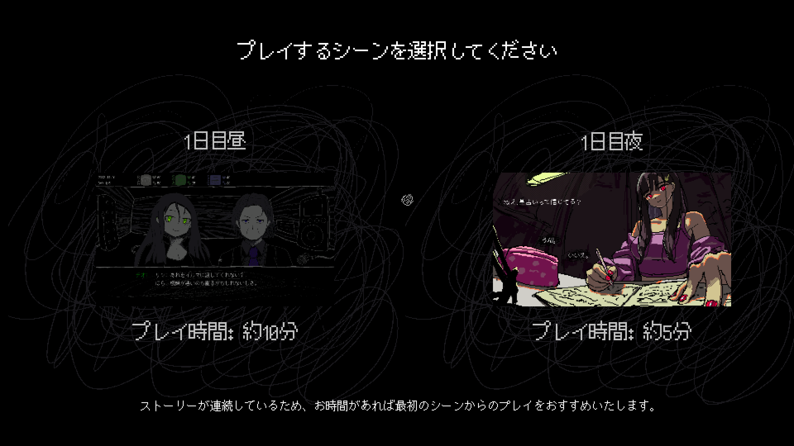

表題の通り、2023年9月21日〜24日に幕張メッセで開催される[TOKYO GAME SHOW 2023](https://tokyogameshow.jp)で、私達が現在開発しているノベルゲーム、[SAEKO: Giantess Dating Sim](https://store.steampowered.com/app/2492120/SAEKO_Giantess_Dating_Sim/)が展示されます。幕張メッセに、私達の作品が展示されるということです。やばいです。

#### 詳細

SAEKO: Giantess Dating Simは、パブリッシャーである[HYPER REAL](https://hyperreal.jp/)様のブースで展示されます。**09-E68**という場所らしいです。へえ、09-E68......ふーん......なるほどね......（どこだろう......）

<figure>
    
    <figcaption>
      ぜひ<a href="https://tgs.nikkeibp.co.jp/tgs/2023/assets/images/display/map/tgs2023map_jp.pdf">地図</a>をご確認ください！
    </figcaption>
  </figure>

HYPER REAL様のブースでは、ポスターやトレイラーの展示に加え、なんといっても**SAEKOを実際にプレイすることができます！**

SAEKOはこれが初のイベントになるので、東京ゲームショウは一般の方に我々のゲームを遊んでいただく最初の機会となります。もちろん、ゲーム中にはこれが初披露となるイラスト・BGM・シナリオ等が盛りだくさんなので、多くの嬉しい驚きがあるはずです！おそらく！

今回のデモでは、今後無料で公開する予定の体験版から先行して1〜2シーンを抜き出しました。ゲーム中の選択画面から、**好きなシーンを選択し、実際にプレイしていただくことができます**。シナリオがあるので、お時間に余裕がある場合には（周りに並んでいる人がいない場合には）、「1日目昼」からプレイしていただくことをおすすめします。

あと、大事なことですが......今回のデモでは、**日本語・英語どちらでもプレイしていただけます**。急なスケジュールで、素晴らしい訳文を仕上げてきてくださった翻訳者の方に深くお礼申し上げます。

あと、あと......HYPER REAL様のブースでは、**数量限定のステッカーも用意されている**みたいです。東京ゲームショウにお越しの際は、ぜひお早めにお立ち寄りください！もちろん、SAEKO以外にもクールで美しいゲームが展示されています。

<figure>
    <blockquote class="twitter-tweet">
      

        <a href="https://twitter.com/hashtag/%E6%9D%B1%E4%BA%AC%E3%82%B2%E3%83%BC%E3%83%A0%E3%82%B7%E3%83%A7%E3%82%A62023?src=hash&amp;ref_src=twsrc%5Etfw">#東京ゲームショウ2023</a>
        に向けてノベルティを用意しています。【ホール9 / E-06】のHYPER
        REALブースでゲット🫡 数量限定なのでお早めに。  Come
        to the HYPER REAL booth at
        <a href="https://twitter.com/hashtag/TGS2023?src=hash&amp;ref_src=twsrc%5Etfw">#TGS2023</a>
        to get our exclusive stickers for free! 【Hall 9 / E-06】
        <a href="https://t.co/Za25rZWWp0">pic.twitter.com/Za25rZWWp0</a>
      

      — HYPER REAL (@HYPERREAL_jp)
      <a href="https://twitter.com/HYPERREAL_jp/status/1701388151271440661?ref_src=twsrc%5Etfw">September 12, 2023</a>
    </blockquote>
    
  </figure>

それでは、TGSでお会いしましょう！

#### その他の話題: Ebitengine ぷちConf \#1でLTをします

こちらは直接TGSとは関係ない話題ですが、TGS開催中の今週金曜日に[Ebitengine ぷちConf \#1](https://gocon.connpass.com/event/292391/)でSAEKOの開発について10分程度のLTをする予定です。[Ebitengine](https://ebitengine.org/ja/)はGo製のシンプルなゲームエンジンで、SAEKOもこれを使って開発されています。

<figure>
    <blockquote class="twitter-tweet">
      

        LT枠申し込んだ！わああ
        <a href="https://t.co/FL1Sl7UGWv">https://t.co/FL1Sl7UGWv</a>
      

      — kyp (@_newkyp)
      <a href="https://twitter.com/_newkyp/status/1688453190050611200?ref_src=twsrc%5Etfw">August 7, 2023</a>
    </blockquote>
    
  </figure>

こちらは技術交流をメインにした集まりであり、私のLTも「こんな感じでコードを書いています」という技術的な話が中心になると思います。イベントのページを見る限り、既に参加者枠も埋まってしまっているようですが、もしご出席される方は一緒に色々とお話できればと思っております！よろしくお願いします。
