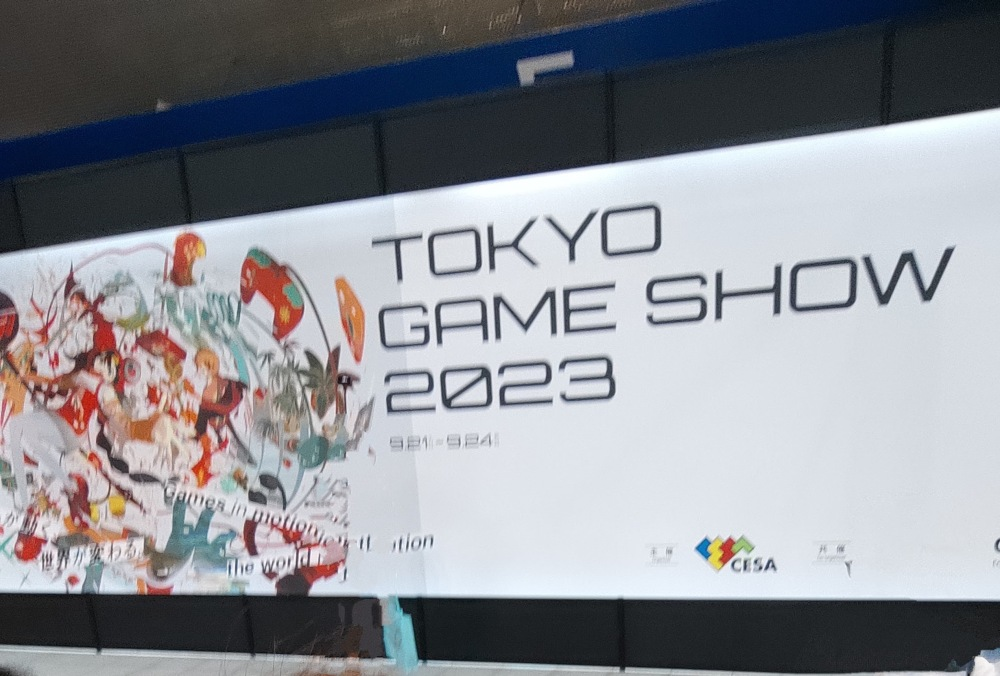
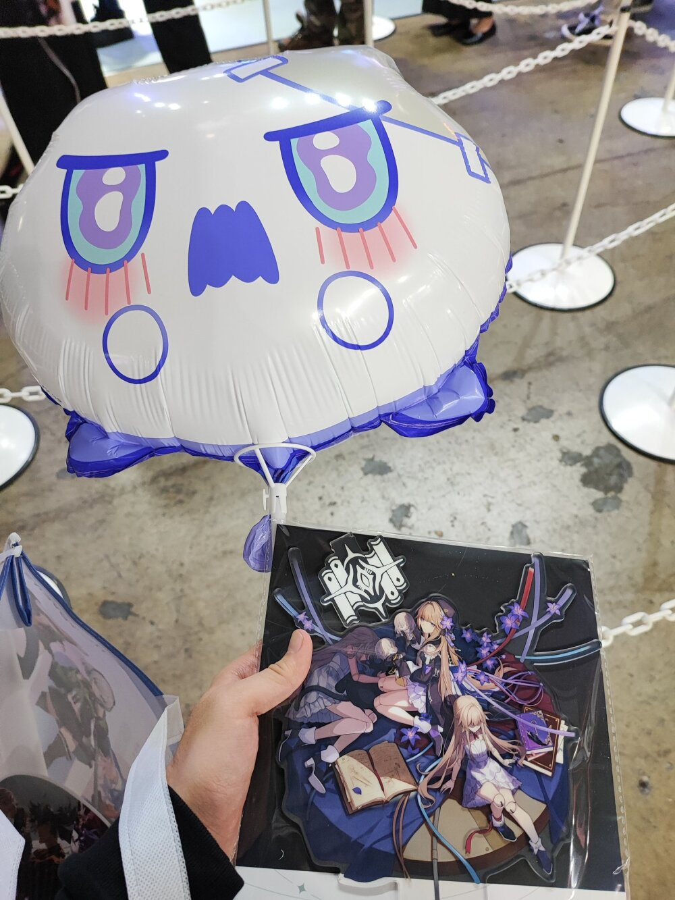

お久しぶりです！記憶が正しければ、これは3週間ぶりの開発日記になるはずです。

更新の間隔が空いてしまい、申し訳ありません。[前回の記事](https://safehavn.dev/blog/2023-09-20-tgs/)で告知した通り、SAEKO: Giantess Dating Simが東京ゲームショウに出展することになり、その準備で忙しく動き回っていました。本当に、私の人生の中でも、トップクラスに忙しい毎日だったのではないかと思います......。

文章を書くのは好きですし、この開発日記についてもできるだけ毎週更新を続けたかったのですが、時間の都合で断念してしまいました。大きなイベントも終わり、今週からは気ままな開発ペースに戻るはずなので、ふたたび毎週更新を目指して頑張っていこうと思います。

#### 東京ゲームショウに出展しました

今回の話題はなんといってもこれ！東京ゲームショウに出展しました。

たくさんの人にSAEKOをプレイしていただき、ポジティブなフィードバックもたくさんいただきました。本当にありがとうございます。

私は木金の2日間だけ参加したのですが、正直すごく怖かったです。ビジネスデイチケットを持って京葉線へと向かうことすら怖く、幕張メッセに着いてからも、頭ではHYPER REALのブースに向かわなければと分かりつつ、わざと遠回りして他のホールに向かったり......結局、自分のブースにつくまで1時間くらい幕張メッセをさまよいました。情けない人間。

でも、HYPER REALのブースに行ったら、既にSAEKOのデモ機の前でプレイしてくれてる人がいて、デモの最後の一文まで、飛ばさずに全て読んでくれていました。これだけ素敵な作品が目白押しのゲームショーという空間で、自分たちの作品を選んで頂き、しかも最後までプレイしていただいているというのはとても嬉しく......なんというか......貴重な体験でした。

その後も、ブースには多くの方にお越しいただきました。本当にありがとうございます。私は人見知りで、とても直接感想を聞くなんてことはできず、不審者のように他のゲームや天井や床に目をやりながら、プレイしてくれている人の背中をたまにチラチラと盗み見てました。緊張が極限に達すると、無言でSAEKOの展示機を離れ、他のブースやホールへと逃げていきました。

東京ゲームショウの期間中、いくつかニュースサイトのインタビューを受けることができました。こちらもありがとうございます。記者の方にSAEKOをプレイしていただき（そのあいだ私は虚空を見つめている）、そのあと質問に答えました。特に何の準備もしていなかったのですが、記者の人たちはみんな本当に聞き上手で、気持ちよく色々なことを話したような気がします。聞かれてもいないことまで。

書いていただいた記事やレビューについて。まずは貴重な労力を割いて文章を書いていただき、本当に嬉しいです。恐る恐る半目で確認したところ、ゲーム内容について好意的に書いていただいているものばかりで、感謝しかありません。

一方で、課題として上げられている部分についても、私が今後改善したいと元々思っていた部分がほとんどでびっくりしました。欠点を指摘できるくらい、SAEKOを真剣にプレイしていただいたということです。感謝しかありません。今回の出展はもちろんゴールではなく、最終的な目標は製品版を少しでも良い状態でリリースすることなので、ネガティブな意見はむしろ制作の糧になっています。繰り返しにはなりますが、改めてお礼を述べさせてください。

それから：TGSの期間中、YouTubeの配信にもお邪魔させていただきました。貴重な体験でした。ありがとうございました（顔出し声ありで恥ずかしいので、リンクは貼りません。ごめんなさい）

#### Ebitengine ぷちconfに参加しました

[Ebitengine ぷちConf \#1](https://gocon.connpass.com/event/292391/)というイベントにも参加し、SAEKOの開発について10分程度の発表をさせていただきました。また、Ebitengineの猛者たちと交流することができました。懇親会では恥とプライドをかなぐり捨て、SAEKOの実際のコードを見せながら、「まじでどう書いたらいいですかね......」みたいなリファクタの相談もしましたが、結果かなり良いアドバイスをいただきました。ありがとうございます。貴重なご助言のおかげで、SAEKOのバグは今後1/100くらいに減ると思います。

スライドを作ったり、発表した中ですごく悩んだことがあります。それは、芸術は完成した作品が最も大切で、プロセスを誇ってはいけないというkyp個人の思想です。理想の作品を作るということが何よりの目標で、ゲームエンジンはそのための手段として、現在の開発状況に最も適したものを選択したいと考えています。そのため、Ebitengineのイベントで発表することは、特定のゲームエンジンでゲームを作る、というような手段の固定につながるような気がして、少し恐れていました。

今後のゲーム制作でもEbitengineを使い続けるかは、正直分からない部分もあります......次の作品ではしれっとUnityを使ってるかも。でも、SAEKOの開発をここまで進めて感じたメリットだったり、現状苦しんでることを発表できたのは、知識の共有としてすごく良い経験だったのではないかと思っています。今後も開発は続きますので、Ebitengineコミュニティの皆様、どうかよろしくお願いいたします。

#### おわりに

ということで、今週は本当に色々なことがありました。ハードなスケジュールでしたが、たくさんの人に会うことができ、SAEKOのプロジェクトが沢山の人に応援されていることを感じました。本当にありがとうございます。

来週以降はスケジュールも落ち着くので、がむしゃらに開発を進めるのではなく、じっくり「SAEKOはどんなゲームになるべきか」みたいなことを考えようと思います。優雅に、深煎りのコーヒーとか飲みながら。

#### 余談

東京ゲームショウへの参加はビジネスデイだけで、土日は東京を離れていました。えっと、その......鈴鹿サーキットでF1日本グランプリがあって、前々からチケット取ってて、どうしても見に行きたくて......。

で、鈴鹿に行ったついでに、そのまま京都まで遠出しました。我らがピクセルアーティスト、[koh](https://twitter.com/koh9083)に会うためです。元々大学生時代は2人とも京都に住んでいたのですが、卒業後に私(kyp)が東京に引っ越し、SAEKOの開発が始まってからほぼ会えていませんでした。

木屋町のパブに行き、他のお客からできるだけ遠く離れたテーブル席を選んで、東京ゲームショウの感想とかを話しました。それから、たくさんお酒を飲みました。芸術論とか、性癖の話をしました。親睦が深まりました。いぇい！
