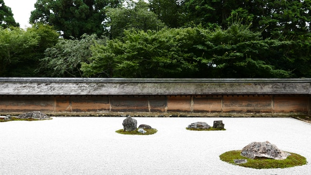
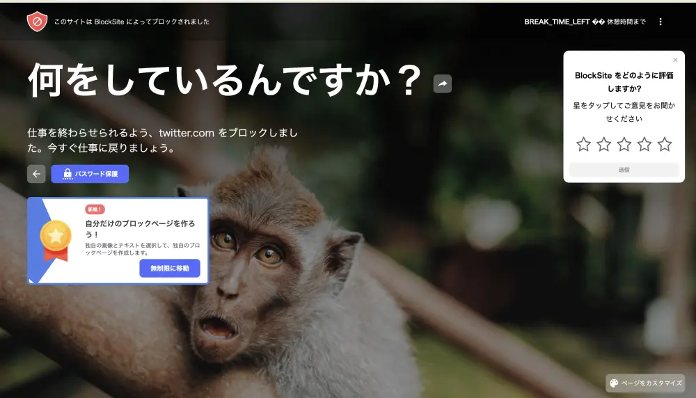

みなさまこんにちは！1週間ぶりの開発日記です。東京ゲームショウが終わってそろそろ2週間ですが、私はまだまだリラックスモードです。リラックスというか......まあ、進捗がない、というだけで......リラックスしていたかというと......

私は禅の世界に挑み、そして敗北しました。

#### 仏に会えば仏を殺せ、父母に会えば父母を殺せ

東京ゲームショウでは、10分〜15分程度のデモを用意し、HYPER REALのブースで展示していました。プレイしていただいた皆様、本当にありがとうございます。

出展が決まった8月末から1ヶ月、このデモの開発はかなり突貫工事で行われました。締め切り重視といってもいいかもしれません。イベント開催日という明確なデッドラインがあり、クオリティを捨ててでも、会場に何かしらの成果物を持っていく必要がありました。さもなければ、「新刊落ちました」みたいな紙の貼られた、空っぽのブースが幕張メッセに誕生してしまうことになるからです。

結果的には、なんとか1つビルドを用意することができました。大いに安心する反面、心の底では常に悩んでいました。「今のシステムはこれでいいんだろうか？」「もっと他のゲームデザインもあるんじゃないだろうか？」みたいな。

そして、イベントが無事に終了しました。

締め切り重視だったこともあり、現状、SAEKOのコードはかなりぐちゃぐちゃになっています。幸い、現在は特に大きな締め切りもありません。この時間を生かして、じっくりゲームのコードを書き直し、製品版に向けて拡張性の高いシステムを作り直そうとしています。

せっかく作り直すので、ゲームの仕様やデザインも1から考え直すことにしました。UIとか、シンプルに改善したいと考えている部分もありますし、シナリオの分岐やパラメータは「もっと良いシステムがあるんじゃないか」みたいに漠然と考えています。

ただ、現状これだというアイデアはありません。

アイデアを出すためにどうすればいいか？私は目を閉じ、坐禅することにしました。外部の情報をシャットアウトし、自分の中の感性を研ぎ澄ませます。仏に会えば仏を殺し、父母に会えば父母を殺すように、一度作ったデモの成果すら徹底的に否定しました。前提と固定観念を捨て、理想のゲームシステムを悟るまで待ちます。

......

悟りませんでした。部屋は読みかけの漫画だらけだし、Steamにはたくさんの面白いゲームがあるし、目を閉じてじっと瞑想できるはずがありません。デモの欠点に向き合うのはつらいです。というわけで、今週は雑念に負けて終わりました。いい休暇でした。

来週からは、もう少し生産的な手段でゲームシステムを考えていこうと思います。だーっとアイデアをメモ帳に書き出し、面白そうなアイデアを組み合わせてみる。脳内で良さそうだったら、実際にゲームプレイの1%くらいをWordとかExcelで作ってみて、面白そうだったらシステムとして詳細化する、みたいな。

具体的な内容は見せられないと思うので、しばらくこの日記は地味〜になると思いますが......ご容赦ください！

#### おまけ: 禅の成果

坐禅は失敗しましたが、唯一成果と言えるようなものはあります。それは、SNSで時間と精神力を使いすぎない方法を見つけたことです。Chromeの[BlockSite](https://chrome.google.com/webstore/detail/blocksite-block-websites/eiimnmioipafcokbfikbljfdeojpcgbh?hl=ja)という拡張機能を使うと、特定のサイトへのアクセスを遮断することができます。

この拡張機能のフォーカスモードをオンにすることで、作業中にTwitterを開いてしまう現象を強制的に断ち切ることができます。恥ずかしながら、気づくと手がブラウザに「tw...」って入力してることがあって、そのたびにサルの目線で冷静になれました。

<figure>
    
    <figcaption>そんな目しないで</figcaption>
     
  </figure>

ということで、Twitterの反応が諸々遅れることがありますが、何卒ご容赦ください。もちろん今後もTwitterの更新は続けますが、もし私たちに伝えたいことがある場合には、[Discord](https://discord.gg/3U7H7CjgxP)で呼びかけていただくのが一番確実だと思います。

特に伝えたいことがない方は、また次回の日記でお会いしましょう！
