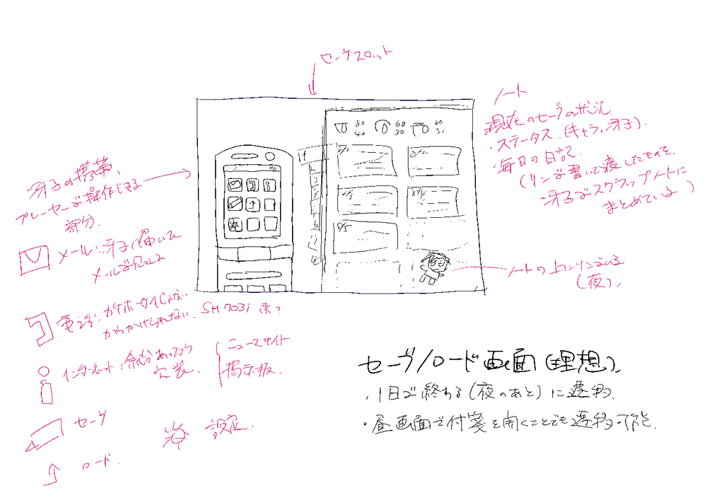
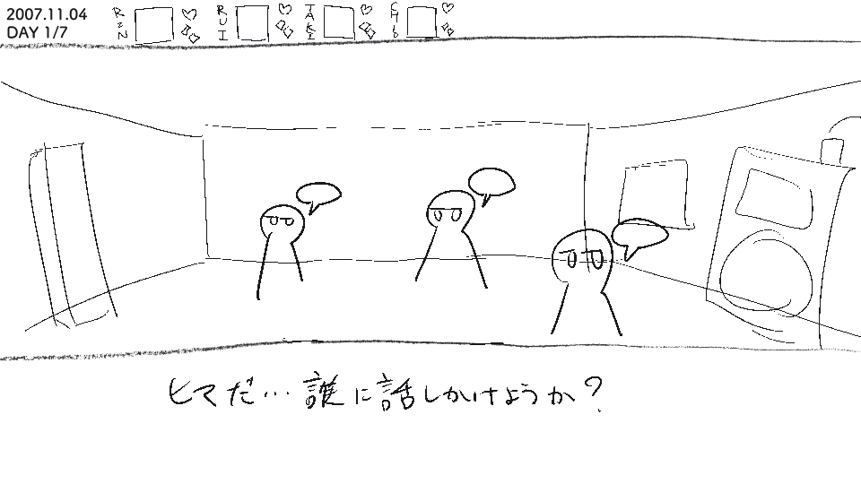

みなさんこんにちは！SAFE HAVN STUDIOのkypです。今週も開発日記をお送りいたします。

#### ゲームデザインがやっと決まってきた

[前回の記事](https://safehavn.dev/blog/2023-10-03/)では、TGSが終わって一息ついていること、そして製品版の完成に向けて、ゲームデザインを一から練り直していることをお伝えしました。そして、先週の記事ではなかなかアイデアが出ず、苦戦している様子をお伝えしたのですが......

今週は、やっと納得のいくゲームデザインができました！

いまは仕様として書き出したゲームデザインをもとに、短いプロトタイプの文章を作る作業をしています。プロトタイプを書いてみて、この仕様でいい感じのシナリオを書けそうということが分かったら、いよいよ本格的な実装作業に移ります。移れたらいいな。でも、いま書いている印象でいえばいい感じです。

新しい仕様について、この記事に書ける範囲で書いてみると、まず、

**ゲームには巨大な女の子が出てきます。**

え？知ってる？あー、そうかも、それは意外、まあ、あとは......

**1日は3つのシーンの繰り返しで進みます。小人との会話（昼パート）、冴子との会話（夜パート）、そしておやすみ画面（仮称）です。**

昼と夜のパートについては、これまでのデモに存在したものです。ゲームショーの記事や、実際のデモで既にご覧になった方もいるかもしれません。

今後新しく追加する「おやすみ画面」は、機能的には物語のセーブやロードをする画面となります。でも、それだけだと無機質で寂しいので、冴子のガラケーもいじれるようにしたいと思っています。

......えっと......はい......私はVA11 HALL-Aが大好きです......。

実際には、上のメモを見たメンバーからの素晴らしいフィードバックによって、実際に作る画面はもう少し「SAEKOらしい」ものになる予定です。「SAEKOらしい」というのは、つまり、もう少しフェチということなんですが......具体的な内容については、今後また別の機会に紹介させてください！

**昼パート、夜パートもシステムを練りまくります**

これまで昼パート、夜パートという個別のパートはできていて、例えば昼は体力とアイテム、夜は選択肢という形で個別のギミックは用意されていました。一方で、それぞれのギミックはあまりシナリオを左右するものではなく、昼と夜のあいだの繋がりも示せていませんでした。

製品版の仕様を考えるにあたって、一番悩んだのがこの部分です。というのも、これまでSAEKOは仕様書などを作らずに開発が進められてきたので、「こんなんあったら面白そう」という要素が局所的に存在している状態だったからです。バラバラで作ったギミックを、どうやってストーリーやシステムに紐付けるのか。まずは、現在の仕様を書き出し、「今はこういう仕組みだよね」という理解から始めました。

その現在の仕様をもとに、もっと良くするためにはどうすればいいかを考え続けます。書き出したおかげで、頭が整理されていてやりやすかったです。その結果、ようやく１つ納得感のあるデザインができてきました。

詳細については、今後の日記で実装しながら紹介できたらと思います。が、仄めかしておくと、昼のアイテム選択も、夜の冴子との会話も、それぞれただ指示された通りに進むのではなく、プレイヤーの意思が介在できるような自由度を持たせたいと考えています。その自由な選択の結果、昼の行動が夜の会話に影響を与え、夜の選択肢が昼の小人の生活に影響を与え......という具合にストーリーが動いていく仕組みにしたいです。

自分はわりと一本道のゲームが好きなので、ギミックで自由度を上げることについては悩んだ部分もあります。正直、作りきれるかなとも。ただ、ある程度の自由をプレイヤーに与え、悪い選択をすれば悪いことが起こるという緊張感をもたせることで、プレイヤーに「いま、自分が小人として生きている」という没入感を味わってほしいです。エンディングの種類は少ないと思いますが、もう少し違った側面で、プレイヤーの選択が反映できる仕組みが作れたらいいなと思っています。

#### おわりに

というわけで、光明が見えてきたところで今週の開発日記は終わりです。悩みまくっていた頃に新千歳行きの飛行機を取ってしまったので、来週は北海道に行きます。ドライブを楽しみます。いぇい！
