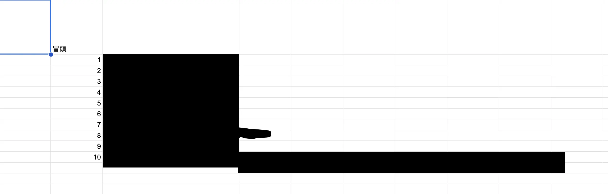
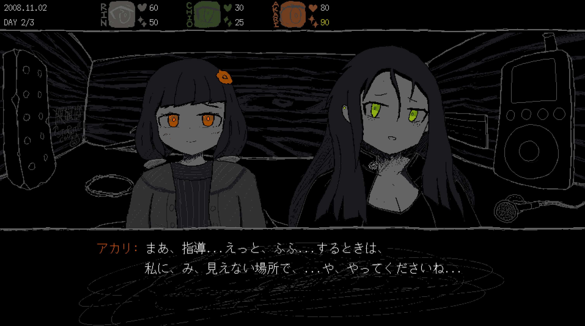

お久しぶりです！SAFE HAVN STUDIOのkypです。今週の開発日記をお届けします。

[前回の更新](https://safehavn.dev/blog/2023-10-12/)は20日前(10月12日)だったので、少し間が空いてしまいました。半月も空くと、何をしたのか忘れてしまいます。なので今週はさらっとした記事です。

決してサボってたわけじゃ...ないはず...たぶん...

## ストーリー書きまくり

ここ１週間、本編用のシナリオを書き始めています。シナリオといっても、書いているのは実際にゲーム内で使用するスクリプトではなく、あくまでプロットです。ゲーム本編には昼と夜のサイクルがあるのですが、プレイ時間から逆算して、ちょうど10日間のシナリオを書きたいと思っています。その10日に収まるように、1日ごとにプロットを埋めていきます。

正直、なかなか慣れないです。これまで書いた文章やシナリオは全て勢い任せで、実際に文字を打ちながら気分でオチを考えてきました。その方法に慣れきっているせいで、箇条書きのプロットたちを見ても、右脳からはアイデアが浮かんできません。

それでも、シナリオの全体像を書き出しておいたほうがいいことは分かっています。シナリオの矛盾や欠陥を見つけたり、限られたプレイ時間をバランス良く配分するためには、絶対必要。左脳がそう言ってた。だから、やっぱり、プロットを作る必要があります。あー、うー、がんばる、あー。

結局。現実逃避として、こっそりシナリオの序盤のト書きを始めてしまいました。プロローグの演出とか、一度書いてみたくて。左脳、ごめん。計画的に作業するって約束、また守れなかった。実際書いてみて、うん、少なくとも言葉に詰まったりはしなかったし、読み返してもなかなか、自分のなかではいい感じの文章ができているような気がします。

具体的なセリフを書いた副次的効果として、キャラクターの性格とか設定もだいぶ具体化してきました。

これまでのデモでは、小人のキャラデザは全て僕が1人でやってきたのですが、ネタ切れだし画力ないし、正直つらかったので、今はチーム内のグラフィッカー、kohに手伝ってもらっています。僕がシナリオを書き、設定を箇条書きで書き殴り、それをkohに渡すとキャラクターの設定画が帰ってきます。便利（ありがとう）！

既に何人かのキャラクターは出来上がりつつあるので、今後折に触れてこの開発日記にも載せていけたらと思います。

## デモについて

ここ数回の記事でお伝えしている通り、SAEKOはいま仕様を練りまくっている状態で、以前TGSに出したものとは少し違うゲームシステムを採用しようと考えています。

もともとデモには、製品版の前日譚となる1時間くらいのシナリオを書いていて、素材も7割くらいは出来上がっていました。TGSでは、その前日譚の冒頭2シーンを展示していました。

ただ、仕様変更により、体験版は一旦動かなくなりました。ゲームシステムが変わったことでスクリプトや選択肢の構造が変わり、元のスクリプトを動かすためには「移植」のような作業が必要になるからです。

作業を行えばその分時間がかかり、本編の実装が遅れてしまいます。どうしようか悩んだのですが、今のところ、体験版として独立した前日譚を出すのは諦めました。代わりに、体験版は単に製品版の冒頭を抜粋する形で出そうと考えています。こうすると、体験版のクオリティアップは製品のクオリティアップに上がるし、正直、作業量が減って楽だからです。（ちゃんとした理由もある、体験版を気に入ったユーザーが製品にシームレスに入れるとか、シナリオが違って幻滅することがないとか、そういう、ほら！）

せっかく作ったシナリオや素材を使わないのは勿体ないと思うので、今後、何らかの形で出せたらいいなとは思っています。DLCとか？でも、あまり欲張り過ぎたら未完成で倒れそうです。なので、今は本編の完成だけを目指して頑張ろうと思います。

## 今後の展望

あと最後に、ここ最近は仕様決めで色々模索していたのですが、新しい仕様をメモとして書き出し、パブリッシャーのえらい人たちにお見せしました。もちろん改善点や保留中の場所もありつつ、全体的には、「この仕様で開発を始めよう」という合意が取れました。

なので、今月(もう11月!)からは仕様で悩む時間は終わり、ここからは本格的に実装を進めていきます。シナリオやプログラムはもちろん、絵や音楽も作り始めて、この開発日記もきっと成果だらけになるはず（なったらいいな）！引き続きよろしくお願いいたします。
