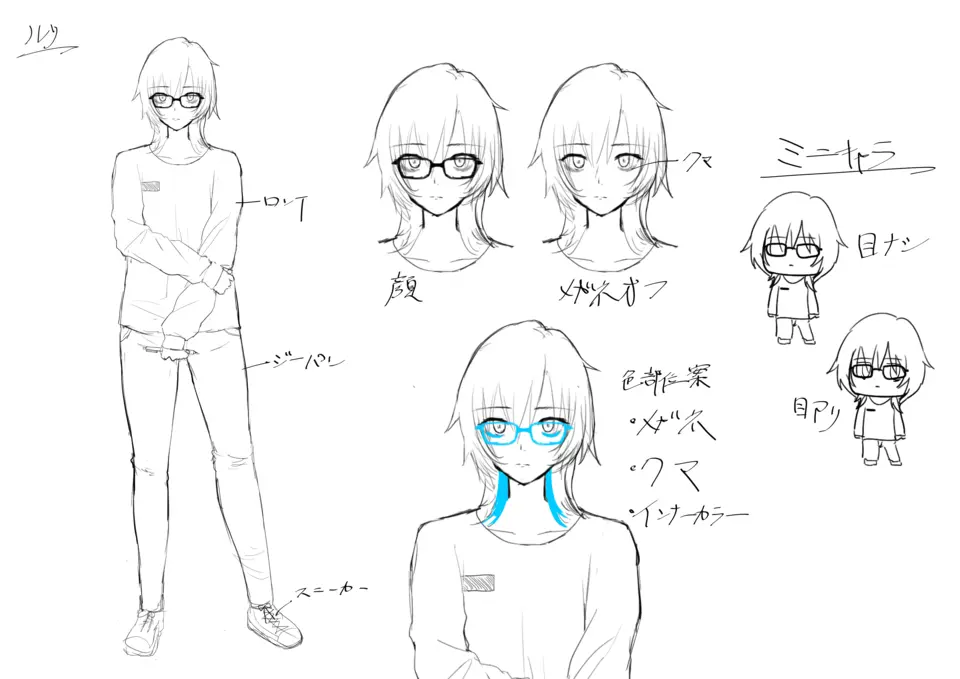
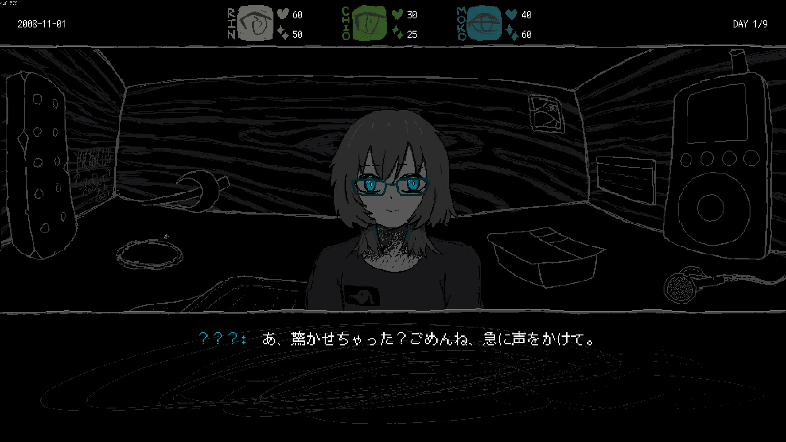
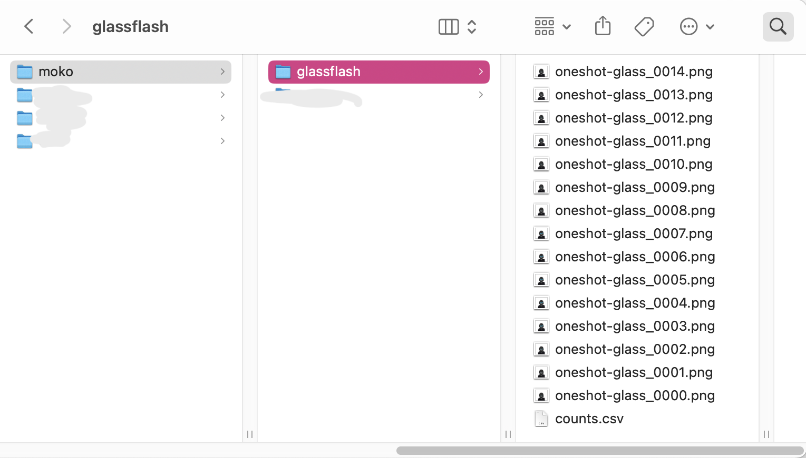
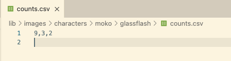

今週の開発日記です。さっき目薬を差すのに失敗して、まぶたがびしゃびしゃになりました。ぐわー

個人的な近況報告：[Au5](https://www.au5music.com/)の来日公演を見に行きました。ずっと昔からメロディックなダブステップを作っているアーティストで、有名な曲がいくつもあり、2010年代にYouTubeを見ていた人ならどこかでこの人の曲を聞いたことがあると思います。

自分の好みはもう少しハード系というかミニマルなビートなのですが、それでも大音量でエピックなドロップを聴くと感動します。Au5自身の過去曲や最近の曲だけでなく、Akira Complexの作品も流してくれていたみたいです。予習不足で、その場では周りが盛り上がってる理由が分からなかったのですが...あとで知って納得しました。エモいしすごい。

#### シナリオ執筆(2)

[前回の記事](https://safehavn.dev/blog/2023-11-01/)でお伝えした通り、ゲームのシナリオ、特に本編全体のプロットを集中的に書いています。

細かい部分は埋まっていないものの、シナリオ全体の大きな出来事と、エンディングの内容はなんとか書き終わりました。あとはスプレッドシートとにらめっこして、ありそうな矛盾をつぶしたり、細かい間の出来事を埋めたりしていくはずです。

うーん...とはいえ、実際にシナリオを書き始めてみると、書いている途中に新しいアイデアが浮かんだり、キャラクターが思っていたのと違う性格になってしまったりして、全然違う話になっちゃったりします。いまはそのたびにプロットのほうを更新しています。

プロットについて書きたいことは沢山あるんですけど、発表前だと何を書いても変な先入観を与えてしまいそうです。「伏線を大事にしたい」って書いたら伏線を探されそう。「会話を大事にしたい」って書いたら、逆に伏線は放置されたり...？

うーん、難しい、もっと書きやすいことを書こう！

#### 新キャラ描き始め

書きやすいこと。上に挙げた本編のプロットに沿って、新しいキャラクターの立ち絵を描き始めています。１つは勢い余ってTwitterにも掲載しました。

<figure>
    <blockquote class="twitter-tweet">
Sorry for being offline recently, but we're dedicating all our effort to the game✨ <a href="https://t.co/SzvHxqiNFP">pic.twitter.com/SzvHxqiNFP</a>
— SAEKO: Giantess Dating Sim (@saekogame) <a href="https://twitter.com/saekogame/status/1721835842573111782?ref_src=twsrc%5Etfw">November 7, 2023</a></blockquote> 
  </figure>

本編のキャラクターについては、kohにキャラクターの特徴を伝え、それを元にラフなキャラデザを作ってもらっています。

美しい絵。ですが、これも最終的に立ち絵を書いている私の手にかかるとこうなります。

...君、ずいぶん雰囲気違うね？

これは私がデフォルメ風の絵しか描けないのと、kohに設定資料を与えてから、例によってプロットが変わりまくったのが原因です。性格だけでなく、この子に至ってはキャラの名前すら変更されています。

そして、アニメーションについて。

仲間の小人と話すシーンでは、ちょいちょいコミカルなアニメーションを入れていきたいと思っています。海外のビジュアルノベルだったり手書きアニメーションが好きで、少しでも雰囲気が寄せたいというのが理由です。あとほら、ずっと何かしら動かしてたら...多少絵が下手でも...言い訳できそうだし...

プログラムとしては、表情が切り替わるときに、一度きりのアニメーションが流せるような実装を入れました。例えば、上の表情差分は全体が15枚の画像からなるのですが、内訳は以下のようになります。

1.  メガネがクイってなるアニメ...9フレーム
2.  メガネをクイってしたあとの、目が開いてるアニメ...3フレーム
3.  メガネをクイってしたあとの、まばたきするアニメ...2フレーム

表情が切り替わると、そのキャラの立ち絵は一度だけ(A)が再生され、そのあとは(B)のループ、そして一定の間隔ごとに(C)が流れます。

ゲームファイルとしては、これらは4ケタの数字がついた連番画像と、1つの`counts.csv`というCSVが入った、`lib/images/moko/glassflash/`というディレクトリで管理されています。

`counts.csv`はこんなことが書かれただけの簡素なファイルです。

これだけ！すると、プログラムが9フレーム、3フレーム、2フレームをそれぞれ(A)(B)(C)のフレーム数として解釈し、あとは狙い通りの立ち絵が再生されるようになります。アニメーションが長くなったら数字を変えるし、(A)がない表情であれば`0,3,2`のようにします。

元々、(A)(B)(C)は別々のディレクトリで管理していました。その場合、(A)のフォルダに入ってる画像は全部(A)のやつなので、枚数を記録する必要はありません。最初はそっちのほうが便利だと思いましたが、クリスタだと大体(A)(B)(C)は1つのタイムラインでプレビューしています。そのまま連番でガーっと書き出して。あとからフレーム数を文字で書き換える、というほうが一々分けて書き出すより便利そうだったので、こんな形で実装し直しました。

こんな感じで、自分の作業フローに合わせて自由に実装できるのは、Ebitengineや薄めのゲームエンジンにしかない良さかもしれません。開発日記にも書けるし。

...というわけで今週は以上です。また次週の記事でお会いしましょう！
