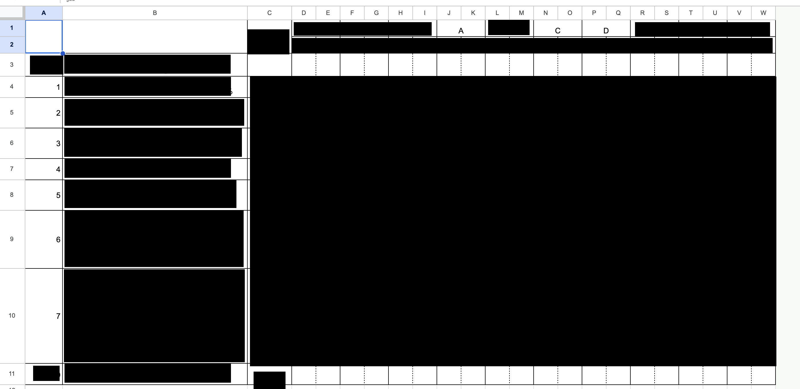

    <h4>機密指定</h4>
    

      情報保安ならびに戦略上の理由により、SAFE HAVN
      STUDIO（以下、当団体）は本記事の一部に現時点で公開すべきでない内容が含まれていると判断した。
    

    

      規定により、本記事は一部の機密情報に隠匿処置を施した上で公開される。なお、機密指定並びに隠匿処置は暫定的なものであり、当団体が別途指定する機密解除日以降は通常通りの閲覧が可能となる。
    

  

こんにちは。急激に寒くなりましたが、皆様は無事に過ごされているでしょうか？この日記を書こうと決めてから、私は2時間布団の中でYouTubeを見ていました。

......アルゴリズムの面白そうな部分はだいたい使い果たして、あとは知らないお笑い芸人の大喜利動画ばかり流れてくるようになってきたので、起き上がって文章を書きます。あーーーーー

#### シナリオ執筆(3)

ここ数回の開発日記でお伝えした通り、最近はプロットやゲームシステムの設計にだいぶ苦しんでいました。しかし、最近やっと、ようやく、しっくり来るゲームシステムと、エンディングまでのプロットが出来上がりました。周りの人たちに見せてもわりと好評で、まあ、正直、自分でもかなり納得しているというか、自信があります。

<figure>
    

      <iframe src="https://store.steampowered.com/widget/2492120/" frameborder="0" width="646" height="190"></iframe>
    

    <figcaption>
      SAEKOウィッシュリスト登録受付中！今世紀最高（予定）のインディーノベルゲーム！Steamストアページをいますぐチェック！
    </figcaption>
  </figure>

なぜ、思うようにプロットが組めなかったのか。悩んでいたときは全然分かりませんでした。オープニングはあり、キャラクターはいて、途中に挟まるエピソードやエンディングもある。なのに、間を埋めるようなシナリオは思いつかず、不自然なバラバラの文章が残る。

今になって考えると、エピソードが思いつくのにシナリオ全体が作れないというのは、そのシナリオの中軸となる部分が固まっていなかったからだと思っています。「これはプレイヤーが何をするゲームなのか？」という質問の答え。背景の部分、「どんな設定のゲームか」という静的な設定ではなく、具体的な筋書きに関わる部分、「プレイヤーが何をし、何を感じるゲームになるのか」という動的な動機です。

......自己啓発書みたいな文章で目まいがする。Xの「もっと読む」で出てきそう。

 

一般論を書こうとすると苦しいので、自分の話をします。プロット制作で苦しんでいる最中、私はそんな自己啓発書的な思考には一切至らず、バラバラのエピソードを眺めながら途方に暮れていました。「可愛い女の子に縮められて飼われる」というテーマははっきりしてるし、いくつかエピソードも考えてある。もう自分がやりたいことは十分わかっているはず、なのに書けない、みたいな。

ただ、あるときベッドの中でこんなことを思いました。オープニングとかエンディングから途中を考えるのはムズすぎる。起承転結とか、無理。代わりに、途中の最も典型的でシンプルなゲームプレイから考え始めてみよう。今思うと、この思いつきが天才的でした。自分で自分を天才と言った。恥ずかしい。

SAEKOでは、「途中の最も典型的でシンプルなゲームプレイ」はどんなものにするべきか。まず考えたのは、主人公には██████████████体験をしてほしいということでした。██████████████████。█████████、███████████████████。それを繰り返していくうちに、主人公はやがて██████████████████████、冴子と███████████████――。█████████████████████████、████████████というのは原案の笛地先生の作品でも描かれていたテーマだし、このゲームプレイは非常にしっくりきました。しかもそう、これこそ「プレイヤーが何をし、何を感じるゲームなのか」という質問に対する答えになっています（ここでやっと、今までそれが曖昧だったことに気づきました）。

そして、この答えに沿うように、ゲームデザインも新しく考え直しました。今まで展示してきたデモでは「体力」「魅力」の2パラメータがあり、それぞれを冴子の許容範囲内に収めることで小人を生き延びさせる、というシステムになっていました。しかし、これは「██████████」ために作られているシステムです。

そこで、████████というテーマに沿って、このパラメータも考え直しました。まず、「██」というパラメータはこれまで曖昧でしたが、 「█████████████」を表すと明確にしました。「██」は███████ことで増加します。えっと......███████████████から。そして、███████████████████████████████████。

とはいえ、それだけで███████████プレイヤーも少ないでしょうから、ある程度プレイヤーに決められた行動を強要するよう、まず冴子の████を定めました。「冴子は████████、███████████████████」という設定です。█████████████████████████、███████████████、███████████████████████。

そして、小人のパラメータをもう1つ追加しました。「███」です。これは█████████████████████ためのシステムで、███████████████、いわゆる██████████████████、プレイヤーは████████████冴子に█████。███は、下がることはあっても上がることはありません。そして、████████████████いることがあります。このため、プレイヤーは「████████████████████████」という判断を迫られることになります。

ここまでお読みいただいて分かる通り、プレイヤーは███████████████████、█████████████████。...こう書くと、███すぎてびっくりします。実際、チームの仲間に見せるときも戦々恐々でしたが、結果的には、非常に良い感触を得られました。「████████！」みたいな。

そして、「██████████」という関係性が具体化したことから、エンディングまでの道筋も非常にしっかりと定まりました。████はさらに進行し、████████████するのか？それともどこかで█████████████、███████████████████？█████結果、冴子は██████████と考えるか？

 

ということで、ゲームの大枠ができました。冒頭にも書いた通り、少なくとも現状はすごくいい感じのアイデアになっている気がします。あとは文章やシステム、絵、音楽のクオリティを確実に高めていき、表現したかったアイデアをきちんと形にすること――それができれば、まあ、わりと、うん、良いゲームができるんじゃないかな〜と思います。がんばる。うおおおおおお〜〜〜〜〜〜
