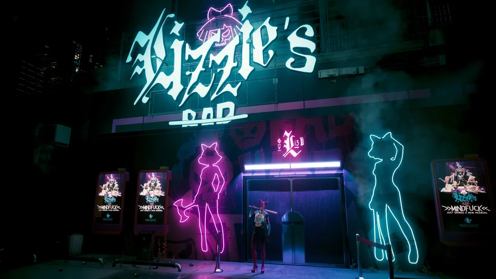
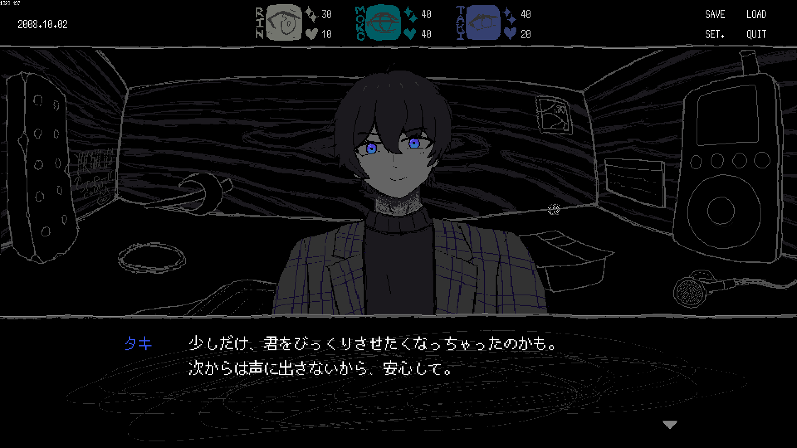
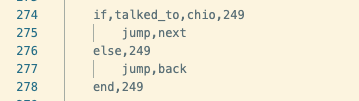

今週の開発日記です。最近はCyberpunk 2077をやり直しています。Phantom Libertyが出たついでに、最初からやり直そうと思って積んでたものです。記憶が薄れたおかげで、あらゆるミッションを面白く感じます。グラフィックも綺麗で、いつまでも見ていられそう。

やはりリジーズ・バーが好きです。ピンクのネオンが綺麗で、外観も可愛い。凶器持ってる女の子、本当に好き。こういう場所が、現実にもあったらいいなと思います。

まあ、あっても入る勇気がないですね。だから、家に引きこもってゲームをしています。あと、それ以外の時間では、自分でゲームを、つ、作ったり、......

## 黙々と開発中

今週は順調に作業できました。先週までにゲームシステムとプロットが決まったので、そのプロットをもとにシナリオを書いたり、簡単な分岐を実装したり。

kohの全面支援を受けながら、初めてイケメン系の立ち絵を描いたりもしました。めちゃくちゃリテイクしました。自分で自分に。目が育つにつれ、今後も何回か描き直すことになると思います。

<figure>
    
    <figcaption>
      UIも、少しずつ改善中 (huge thx to
      <a href="https://twitter.com/k_maztani">@maztani</a>])
    </figcaption>
  </figure>

分岐について。SAEKOが使っている[Ebitengine](https://ebitengine.org/ja/)はミニマルなライブラリなので、Ren'Pyのrpyファイルのように、シナリオ用の外部ファイルといったものがありません。スクリプトの文法を考えるのも、その実装もすべて自分で行う必要があります。構文木や文脈自由文法といった、高級な概念は一旦忘れましょう。SAEKOでは、行によって長さが全く異なる、自由すぎるフォーマットのCSV（？）をスクリプトとして使っています。

書きやすい文法にしたい気持ちはあるのですが、実装の易しさとの両立は難しいです。両者のバランスでいつも悩みますが、いつも実装の易しい方向に倒れます。１行や１列記述が増えるのは、初めて書く１回だけ苦しめばいいですが、難しい文法を実装してしまえば、将来に渡ってその複雑さに悩まされ続けることになるからです。なんとなく、Goの思想に近いような気もします。

例えば、if文はこんな感じです。if,else,endに共通のIDを割り振る必要があります。面倒ですが、こういったIDが存在しないと、ネストやスタックといった難しい概念を考える必要が出てきます。ここでは、実装の簡単さを優先することにしました。

実際、書く側の不便はそれほど大きくありません。シナリオを書くときは、ほとんどの時間が一度書いた文章の推敲にあてられます。いっかい書くだけで済むスクリプトの構文が増えても、さほど影響はありません。

自分の場合、こういう日記のような文章でも、ゲームのスクリプトでも、最初に書いた文章のほとんどが完成まで生き延びられません。最後まで書き終えたあとに最初から読み返すと、大抵は何もかもが気に入らず、ほとんどは原型が残らないくらいまでに修正されます。特に、ゲームのスクリプトはgitで管理しているので、書き直したときの差分が分かります。もーすごいです。

今週は、製品版の初日（最初の30分くらい）のシナリオを書き終えることができました。僕のライティングはここからが長く、シナリオ以外のグラフィックとかプログラムを実装しながら、何度も執拗に文章を書き直すことになります。そして、どこかで力尽きます。そしたら文章がFIXになり、どれだけ後悔しても遅いのですが、そもそも飽きるほど同じ文章を読んだせいでもうその欠点にも気づけません。好評発売中！

  

限られたボリュームで、ゲームのプレイを一通り体験できるものをバーティカルスライスといい、バーティカルスライスが遊べるビルドのことをα版と呼ぶらしいです。当面は、このα版の完成を目指して開発を進めていきます。地味な作業になりそう。日記に書けることがあるか心配です。

もし何も書けることがなかったら、ナイトシティのおすすめの場所でも書いていこうと思います。

  

余談：この記事はスティーブン・キングの[書くことについて](https://www.amazon.co.jp/dp/B0B2P79DK2)というエッセイを読んだ直後に書きました。影響を受けまくりました。文章も良い感じになってたらいいな！
