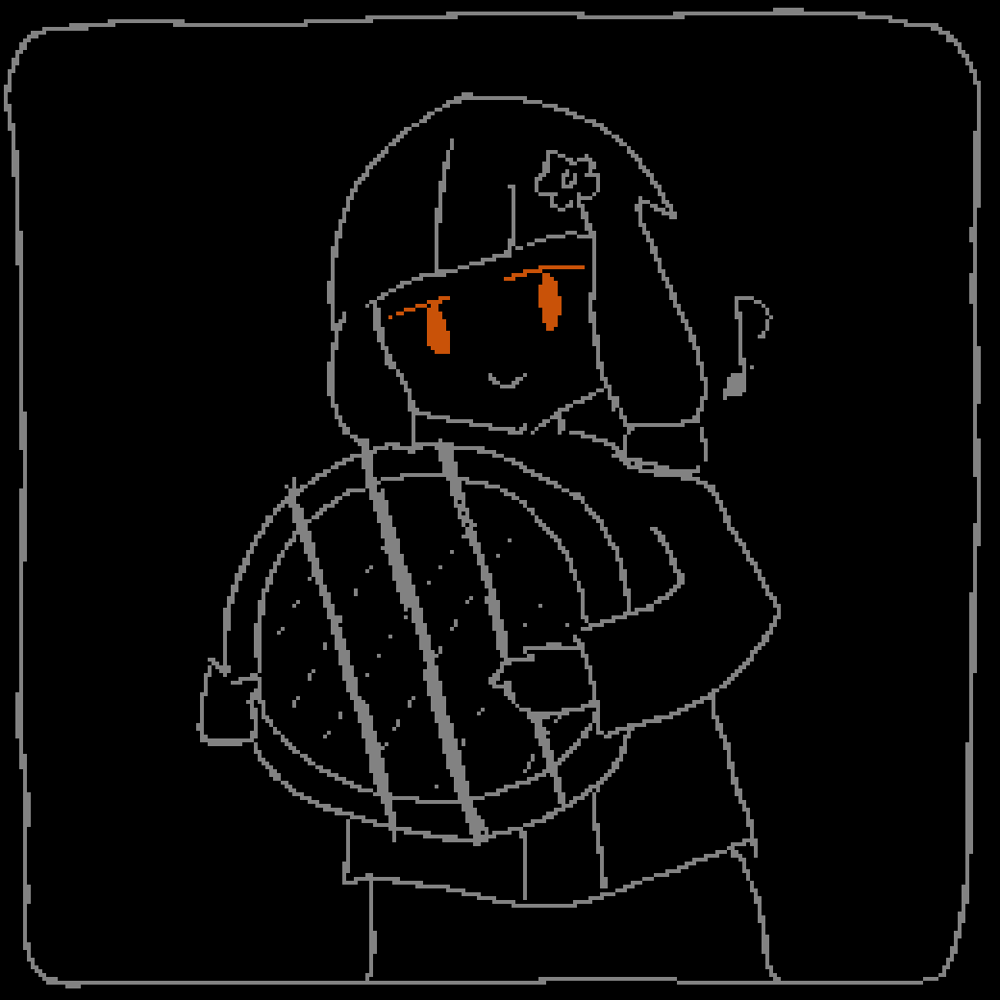
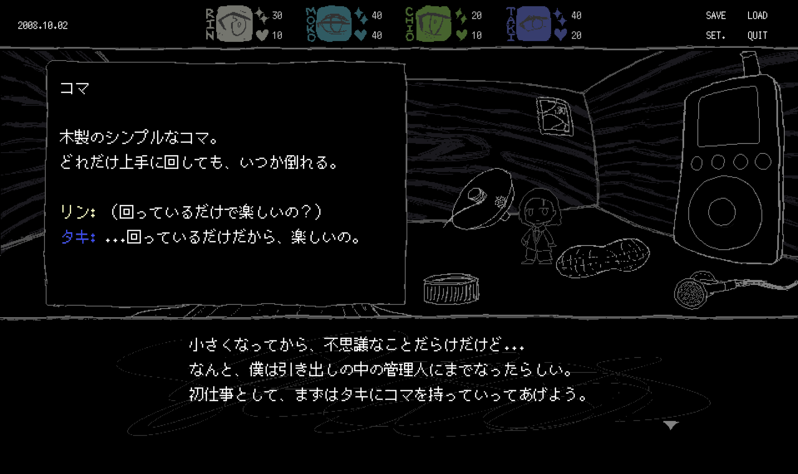

今週も、SAEKOのα版を開発しています。α版は、ゲームの典型的なプレイを体験できるビルドです。SAEKOでは、シナリオの1日目がプレイできるビルドを作ろうとしています。

9月の東京ゲームショウの時点で、通しでプレイできるビルド自体は出来ていました。ただ、現在はほぼ1からコードを書き直しています。10月以降に新しいゲームデザインを考え直した結果、スクリプトの構造やパラメータといった基礎的な部分から書き直すことになり、変更箇所が大きかったからです。これまでのコードがだいぶ汚かったので、そのリファクタも兼ねています。  
（余談：Goは静的型付けでパッケージの依存関係も明確なので、だいぶリファクタ作業がやりやすいです。PHPやRubyで同じ作業が必要だったらと思うとぞっとします）

プレイ時間が長くなるにつれ、実装の複雑さも増えています。分岐や、ルールとリソースの変更など、考慮しなければいけない状態の数が増えていくからです。特に、SAEKOの場合は、まだ詳しく言えないんだけど、まあ、普通のノベルゲームより管理することが多くなる予定です。

プログラムの複雑さが増えるのはまだいいのですが、スクリプトやテキストファイルの複雑さは悩ましい問題です。

SAEKOではこれまで、どんな形式のテキストもCSVファイルで管理していました。Excelやスプレッドシートで読み込んで編集できるので、非プログラマの翻訳者に共有したり、自分でちょっとした字数の集計を行うのにも便利だからです。

ただ、分岐はCSVだと扱いづらいです。例えば、「特定のオブジェクトに対してフレーバーテキストがある。分岐により、各フレーバーテキストにはn通りのバージョンがある」というのをCSVで表現しようとすると、行はアイテム、列は各フレーバーテキストになります。そして、分岐の数だけ、複数のテキストが横並びになります。「フレーバー4」みたいな、美しくない列ができます。でも、一部にn=1のオブジェクトがあったら？n=2以降の列は空欄で埋める。nが増えたら？CSV全体に列が追加されます。うー...

というわけで、一部のテキストをJSONファイルに移しました。プログラマとしては直感的な選択だと思います。階層構造や配列があり、分岐を表すのに便利です。でも、翻訳には不便そう。翻訳の時だけ一時的にスプレッドシートを作って、手作業で解決したりするのかな...

  

シナリオの大変な部分が終わって、ゲーム全体の見通しが立ってきました。自分でも必要なイラストの素材を作りつつ、グラフィッカーのkohにも新しい差分や絵を頼んでいます。ゲーム内で初出しにしたい素材が多く、あまり事前に公開できないとは思いますが、気合十分です。後世まで残るゲームになったらいいな〜とか考えています。

  

余談。今週は集中力が続かず、あまり作業時間を取れませんでした。原因は明らかで、金曜日に社会の人間関係でいっぱいお酒を飲んだからです。お酒も、お酒にまつわる場所の雰囲気も好きなんですが、翌日以降のダメージがすごいです。

（書くか迷ったけど）社会の飲み会で、可愛い女の子と交流のできるお店に行くことがあります。自分だけきっと露骨にテンションが低く、申し訳ないです。他人と話すのが苦手なのと、性癖がねじ曲がりすぎているせいかと思います。このスニーカー可愛いな、とかは思うんだけど......

そういう体験をするたびに、「何が楽しいか」は人によってぜんぜん違う、ということを思います。僕の場合、他人の創作物を見たり、自分で創作をするのは超楽しいです。特に、その創作がユニークで人をぎょっとさせるものの場合、楽しみは格別になります。逆に、人と話すのは基本的に苦手です。特に、相手が通常サイズの人間である場合。

超個人的な話で失礼しました。忘年会シーズンだけど、今年は忘れたいことなんてない！絶対に一次会で帰ります！
