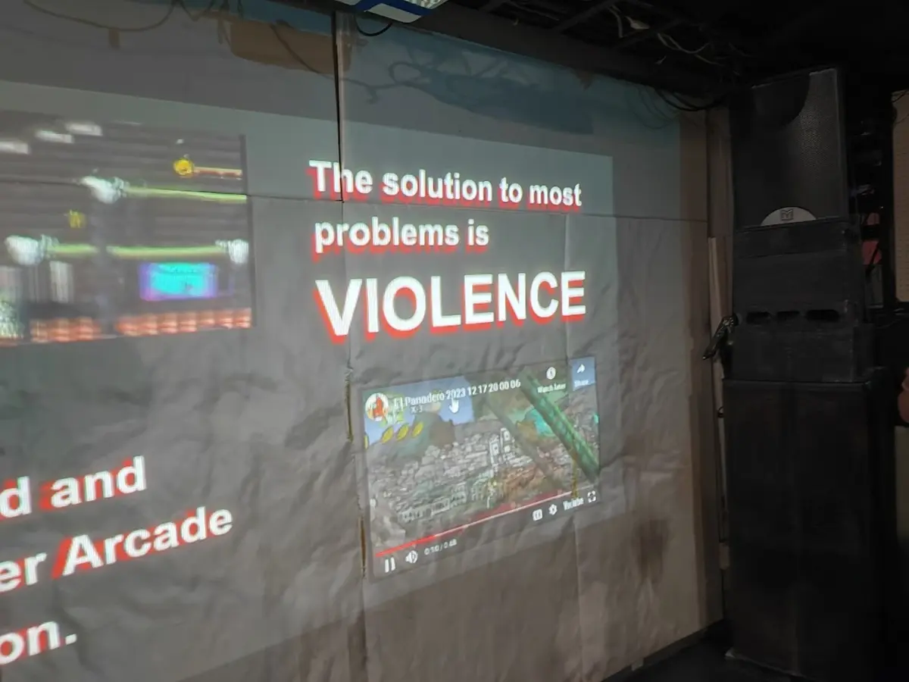
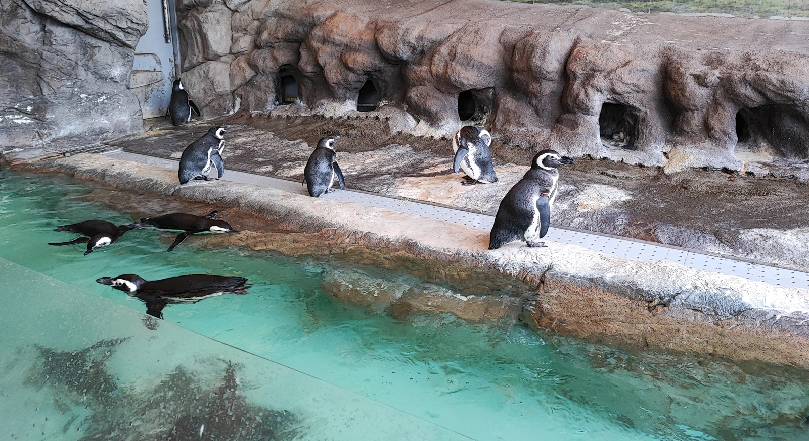
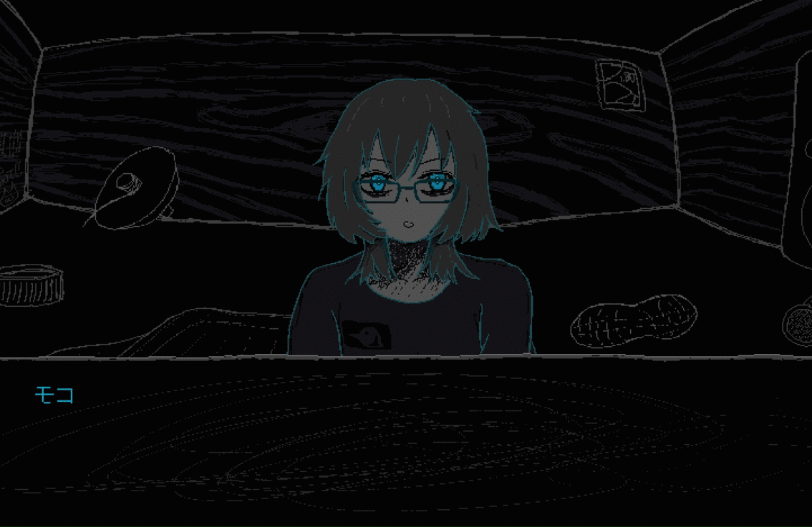
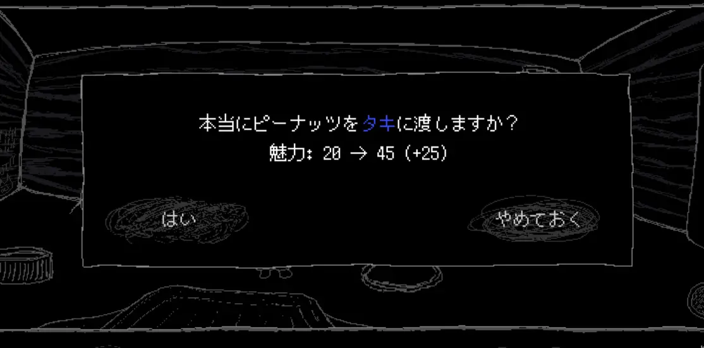

半月ぶりの開発日記です！ここ数日はいろいろイベントがあって、自分の中の社交性を総動員しました。色々と話したいことはあるんだけど、まずは：

<figure>
    
    <figcaption><a href="https://store.steampowered.com/app/2313180/El_Panadero_The_Baker/">El Panadero -The Baker-</a>のプレゼン。面白い発表でした（ゲームも独特の雰囲気で面白そう）</figcaption>
  </figure>

　昨日、Tokyo Indiesに行きました。6月にプレゼンをしてから、約半年ぶりです。前回は知らない人だらけで緊張していましたが、さいわい色々と話しかけてもらえて、けっこう顔見知りができました。なのに、やっぱり私は今回も超緊張していて、なぜかというと......

<figure>
    <blockquote class="twitter-tweet">
      

        Tokyo Indies was fun. Lots of people played the game and even
        found new bugs. Ain't that neat......... Shoutouts to the
        lil group we assembled for dinner and booze later in the night
        <a href="https://t.co/DZyEQ6ecOu">pic.twitter.com/DZyEQ6ecOu</a>
      

      — kiri (@kiririn51)
      <a href="https://twitter.com/kiririn51/status/1737549504537403810?ref_src=twsrc%5Etfw">December 20, 2023</a>
    </blockquote>
    
  </figure>

　Kiririn51さん！

　私はSukeban Gamesが大好きです。インディーゲームを作りたいと思った、直接のきっかけもVA11 HALL-Aだったりします。なのであらゆる箇所で影響を受けていて、「SAFE HAVN STUDIO」というサークル名もVA11 HALL-AのBGMの曲名から取っています。

<figure>
    <iframe style="border: 0; width: 100%; height: 120px" src="https://bandcamp.com/EmbeddedPlayer/album=2706423874/size=large/bgcol=ffffff/linkcol=f171a2/tracklist=false/artwork=small/track=2353956847/transparent=true/" seamless=""><a
        href="https://garoad.bandcamp.com/album/va-11-hall-a-second-round"
        >VA-11 HALL-A - Second Round Garoad</a
      ></iframe>
  </figure>

　というわけで、まじで、私の超憧れの人です。うまく話せなかったらどうしようと思って、行く前はとても緊張していましたが、実際に会ったらとてもフレンドリーな方で、ほんとうに......話していて楽しかった。色々あって、午前２時まで秋葉原のベンチでチューハイを飲みました。ほとんどが雑談で、たくさん笑ったし、たくさん感心させられたし、それから若干......深いような？......話もしました。退勤後のメイドが好きとか。

　それから、会場ではKiririnさんをふくめ、何人かの方にSAEKOのデモをプレイしていただくことができました。ポジティブなコメントが多く、とてもとても嬉しかったです。今回お見せしたものはプロトタイプ的なビルドで、今はさらにさらにパワーアップしたものを作っているつもりなので、早く誰かに見せたいです！

　あと、今週はIndie Developers Conferenceというイベントもありました。こちらでも沢山の方にお会いしました。ありがとうございました！

#### 開発日記

　何回か出て気づいたけど、イベントに出るというのは諸刃の剣です。思い出ができるし、長期的には出たほうが幸せになれるんだけど、短期的にはちょっと苦しくもなります。なぜかというと、他の人のゲームがいっぱいあって、見て、どれもすごくカッコよくて、それに比べると自分のゲームは、ああ、あああ......。（それはそうと、Kiririnさんの開発中のデモはまじカッコいい。完成をめちゃくちゃ楽しみにしています）

　まあ、自分で好きなゲームを作ってるんだし、作業のモチベはむしろ追い込まれて上がることもあるんですが、ただ、他人に進捗を見せるのが書くのが急に恥ずかしくなります。え？最近？えっと......まあ、オレなりに色々頑張ってる、かな。うん。じゃあ、また......。

　勇気を振り絞って書きます。

　この２週間はプログラムを組んだり、見た目の改善に取り組んだりしていました。まずは会話中の口パク。

　ビジュアルノベルでも口は動かない作品は多いと思うのですが、小人たちとのシーンはシンプルなかわりによく動く絵柄にしたいと思って、簡単な口パクを実装することにしました。誇張気味の表現ですが、個人的には気に入っています。

　それから、ゲームシステムと一緒にUI表示も少しずつ実装しています。これまでのデモにはなかった、ちょっと複雑なメニューも実装したりしました。でもこれは仮実装なので、変更になるかも。SAEKOの開発では、まず私(kyp)が一旦実装したものを、maztaniやkohといった他のメンバーにデザインをレビューしてもらいながら進めています。UIは大切な部分なので、積極的にいろんなパターンを試していきたいです。

#### 勇気が枯渇しました

　以上！今週の進捗は終わり！あと昨日はしゃぎすぎて疲れた！めちゃくちゃよく眠れました。

　開発日記を書くたびに思うのですが、想像の10倍くらい早く時間が進んで怖いです。休んでいるつもりはないのに、気づいたら年末になっています。一応、1月末には最初のビルドを完成させることになっています。達成できるかな？かなり不安。

　とりあえず、年末年始はひたすらディスプレイの前で過ごします。良いお年を！
