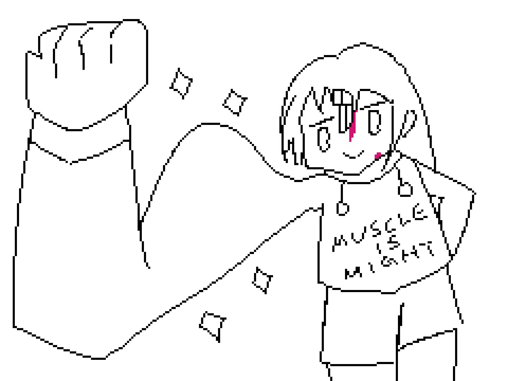

こんにちは！SAFE HAVN STUDIOのkypです。

2ヶ月前からジムに通っています。これまで運動とは縁のない人生だったので、初めてのことだらけです。マシンの使い方すら分からず、最初は全てに苦労していましたが、徐々に慣れてきました。回数も増え、重量も上げられるようになってきています。

駅に近いというだけで選んだジムは、実は国内でも有数の「ハイレベルな」ジムだったらしく、館内には最強のマッチョたちが闊歩しています。日焼けした肌、筋肉の影。怖くなって、ときどき隅っこのエアロバイクに移動します。マッチョは自転車を漕ぎません。周りのマシンは空きだらけで、ここだけゆったりとした空気が漂っています。

ペダルを漕ぎながら、考えます。2023年が始まったときには、想像すらしていませんでした。あの運動嫌いの自分が、12月にはジムに通っているなんて。

ジムを楽しめる人間は、特殊なトランス状態に陥っています。だって、運動なんて、短期的にはただ痛くてつらいだけだから。それでも鍛えるのは、身体を強くすれば明るい未来が訪れると信じてるからなんでしょうけど......そもそも、私に明るい未来なんて、ありえる？

サドルにまたがったまま答えます。まあ、少しはありえるかも。

  

今年の1月に会社を辞め、3月から現実逃避としてゲーム制作を始めました。4月後半に（恐る恐る）ピクセルアーティストのkohを誘い、そしていま作っているゲーム――『SAEKO: Giantess Dating Sim』の雛形を作りました。6月、Tokyo Indiesでそのプレゼンを行い、そこから全てが変わりました。

大きな反響とともに、いくつかお誘いをいただき、そこからHYPER REAL様のパブリッシングが決まって、9月に東京ゲームショウでデモを展示しました。そこでもポジティブな反響を得て、たくさんの人に自分の創作物をプレイしてもらったり、ニュースサイトのインタビューも受けたりなんかもしました。正直、変な感覚。夢を見てるみたいな、別の世界に来ちゃったような。よくわからない感情になって、幕張メッセを裏側から抜け出し、よくわからない空中庭園を通ってよくわからない駅から帰ったのを覚えています。

SAEKO: Giantess Dating Simは暗いゲームです。暗い衝動から生まれ、暗い感情をエネルギーに開発されています。もちろん、作品としてはそこに私達メンバーの芸術表現が加わるわけですが、それでも根底にある動機が、暗い、個人的なモチーフであることは変わりません（分かりやすくいえば性癖なんだけど、まあ、ちょっとくらいかっこつけさせて......）。いろんな人にプレイしてもらえたら嬉しいけど、とはいえ、いろんな人がプレイできるように内容を薄めたりはしないつもりです。

コンセプトトレイラーをご覧になった人や、TGSでデモをプレイした人、あるいは製作途中で粗だらけのビルドを送り付けられたパブリッシャーの人にも、こんなゲームが刺さってくれたのは驚きでもあり、かつ、嬉しいです。好きなものを勝手に作っていて、それでこれだけ注目され、応援される。これほど嬉しい出来事はありません。褒められるたびに、天にも昇るような気分になります。

一方で、SAEKOはまだ開発中のゲームです。実際にゲームが完成する日まで、1つも安心できません。開発は順調に進んでいて、自分としての手応えはありますが、それでも発売までにはいくつもの壁があります。受け取った言葉を支えにしつつ、自分の暗いエネルギーも失わず、いくつもの障壁を越えていく必要があります。しかも、発売した後のことは......誰にもわかりません。

つらくないわけじゃないけど、でも、楽しいです。度を越した不安定さも、誰かのギャンブルを眺めるみたいな感覚。年越しの時期ですが、来年がこんなに楽しみなのは初めてです。来年は、頭の中に残っているアイデアを全部詰め込み、SAEKOを完成させる。売る。売れたら宴を開き、売れなくてもヤケで宴を開く。売れたら経済について話し、売れなかったら芸術について話しましょう。宴が終わったら、次のゲームに取り掛かります。超楽しみ。

......で、そんな楽しみな1年を味わうには、もっと丈夫な身体を育てといたほうが良いかも。そう思って、エアロバイクのペダルを踏み続けています。

  

最後に！今年、特にゲーム制作を始めて以降、あらゆる手段で私たちを支えてくれた全ての方々に深く感謝いたします。いただいた言葉や行為を、少しでも良い作品で返せるよう、来年は1年を通して頑張っていきます。ありがとうございました。そして来年の私たちにご期待ください！
