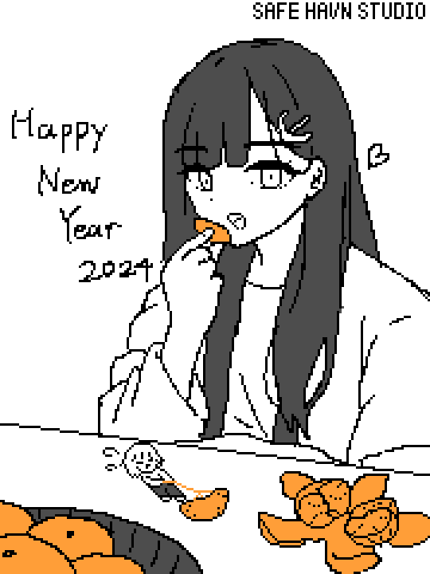
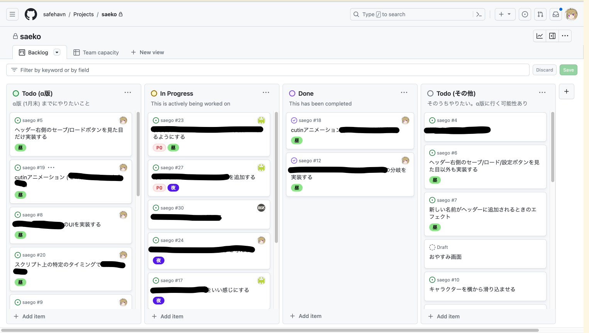

2024年の最初の日記です。まずは、あけましておめでとうございます！

新年祝いということで、kohに冴子のイラストを書いてもらいました。お正月らしい冴子の絵というだけでなく、SAEKOならではの遊び心もたくさん散りばめられています！

イラストを描いてもらうとき、以前は「巨大娘の表現としてこういうのが『良い』んだけど......」と細かく伝えていたのですが、最近は「この表現のほうが『良く』ないですか？」みたいに他のメンバーから案が上がってくることが増えてきました。そして実際に『良い』ことが多いです。メンバー全員に、性癖が根づき始めています。

ただ、新年とはいえ日本では年初から大変な出来事が多く、おめでたい雰囲気は感じられなかったかもしれません。私個人としても、体調を崩している日が多く、お正月は主に寝そべって本を読んだりしていました。箱男、ただ男が箱に入ってるってだけの話じゃないのね......。

#### 進捗（ここに書けること）

1月末を目標にα版を作っているということは度々書いてきましたが、ついに、α版のスコープ内のプレイが一通り完成しました。ビルドを書き出し、開発メンバー全員で遊んでいます。全体のシステムやシナリオにはけっこう満足していて、あとは不満点を解消したり、足りない箇所を実装したりしていく作業が中心になりそうです。

不満点や、足りない箇所。現時点の実装では、これがめちゃくちゃ多いです。直したいところだらけ！

多すぎて、自分でも何したらいいか分からなくなるし、やりたいことを言葉にできないから、他の人にも頼めません。良くないな〜と思って、問題点を書き出すことにしました。まずイシューからはじめよ。

手元にできているビルドをプレイしながら、頭の中の「理想のビルド」と比較します。理想と比較しているので、ダメなところだらけです。そのダメなところの改善を、とりあえずToDoとして書き出しておきます。自分の場合は、20分程度のビルドで25個のToDoがありました。

あとはそのToDoをいくつかのステージに分類します。いわゆるカンバン形式です。仕事だとめちゃくちゃに優先度付けされたカンバンに出会うことがありますが、自分たちの場合はミニマルに、「ToDo(α版までにやる)」「開発中」「完了」「ToDo(その他)」の4つだけに分けることにしました。

整理し終えた感想。やることが明確になっただけでなく、現在の状況について随分楽観的になれたような気がします。目の前のビルドが「理想とはいろいろ違う微妙なゲーム」から、「理想とは25箇所が違う微妙なゲーム」に変化して、逆に25箇所直せばいいということが分かったからかもしれません。それさえ直せば理想のゲームができる！

なお、ToDoの書き出しにはGitHubのProject機能を使いましたが、これはエンジニアなので既に使っていたというだけの理由です。非エンジニアであればTrelloなど、似たようなことができるタスク管理アプリが他にもあると思います。

あと、カンバンを導入していい感じになったのは、今ちょうど「ゲームのシステムがある程度固まってきて、理想もはっきりしてる」というフェーズだったからかなと思います。これより前だと、やることが多すぎて爆発するとか、理想がふわっとしてて蒸発するとかしそう。

#### 進捗（ここに書けないこと）

他の作業も絶賛進行中ですが、特に冴子との会話シーンについて。TGSのビルドを遊んでいただいた方には、なんとなくお分かりいただけると思うのですが、今までのビルドだと、絵やビジュアルとしてはカッコよくても、ゲームとしては微妙になる点が多々ありました。

それをゲームとして面白く、かつ理不尽ではないものにするために、システムを修正したり、それに沿って新しい絵を追加したり、という作業をしています。作り直しが多く、「ちょっとした機能でしょ」と思って作ったもので、一気に遊びが改善したり、逆に微妙なこともあります。立ち絵とダイアログがあって、選択肢をクリックすると分岐して、といういわゆるノベルゲームのシステムからは離れたシステムなので、先人たちの知恵が使えないということが背景にありそうです。

試行錯誤をした結果、現在の成果はわりといい感じになってるけど......ネタバレだらけで......見せられなさそう......見せたいけど......そんな感じ。

ということで、今年もよろしくお願いいたします！
