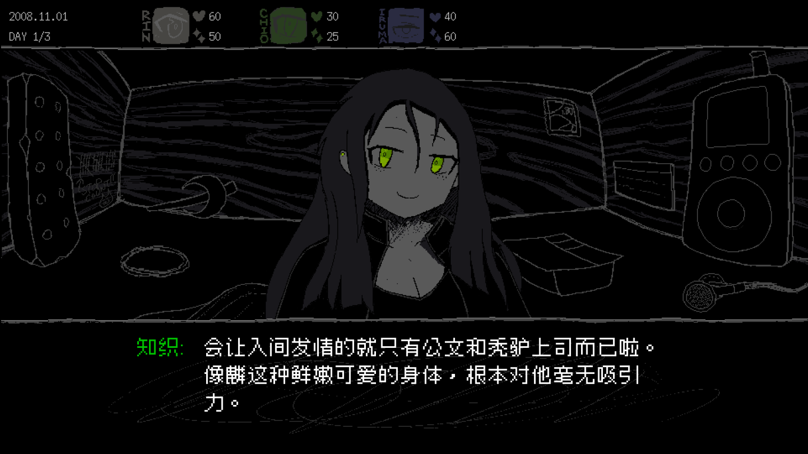
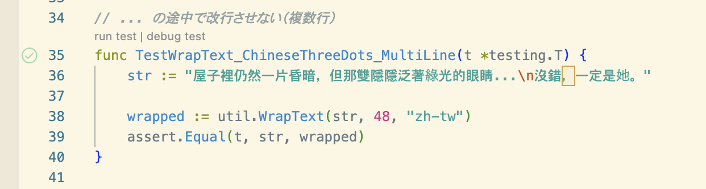

皆さんこんにちは！SAFE HAVN STUDIOのkypです。今年2回目の開発日記をお送りします。

#### 台北ゲームショウにSAEKOが展示されます

最初のニュースはこちら！今週の1月25日から、台北で開催されるTaipei Game Show 2024にSAEKO: Giantess Dating Simが展示されます。これまで通り、パブリッシャーのHYPER REALさんのブースでの試遊が可能です。

<figure><blockquote class="twitter-tweet">
日本新發行商 HYPER REAL 即將參加台北國際電玩展！ 我們將抽獎送出一日門票給三個人：  參與方式 1⃣關注 <a href="https://twitter.com/HYPERREAL_jp?ref_src=twsrc%5Etfw">@HYPERREAL_jp</a> 2⃣轉貼此貼 ※截至 1月22日（星期一）23:59  三款獨特的遊戲將在 A23 展台等待您的體驗，還有 lain 插畫家安倍吉俊的合作明信片送給大家～<a href="https://twitter.com/hashtag/TaipeiGameShow2024?src=hash&amp;ref_src=twsrc%5Etfw">#TaipeiGameShow2024</a> <a href="https://t.co/QdV1CZLmAQ">pic.twitter.com/QdV1CZLmAQ</a>
— HYPER REAL (@HYPERREAL_jp) <a href="https://twitter.com/HYPERREAL_jp/status/1748236674599899254?ref_src=twsrc%5Etfw">January 19, 2024</a></blockquote> </figure>

遊べるのは、昨年9月の東京ゲームショウで展示したものとほぼ同じビルドです。そのため、開発日記でこれまで伝えてきた内容とはやや違うものになり、特にUIやシステムは不足ぎみな部分があるかもしれません。ただ、製品版と世界観（性癖）は変わらないし、実際にリリースされるゲームには含まれないシナリオが体験できる予定なので、「なんかレアだな〜」くらいに思っていただけると嬉しいです。

それから、台北ゲームショウにあわせ、簡体字・繁体字による中国語のローカライズも実装しています！

自分のゲームで中国語が動いてるのを見ると、とても嬉しいです。中国語圏の文学とか絵、それにもちろんゲームも、好きなものがたくさんあるからです。あと個人的には、正方形の漢字が並んでいる様子がボックス建築みたいでかっこいいです。以下は繁体字中国語による冴子との会話シーンですが......なんか、日本語とは違うかっこよさが、あるような？

ただ、実際のローカライズ作業ではシステム側にバグが多く、何度も手戻りがあって申し訳なかったです。テキストの制御を自前で組んでいるために、新しい言語を追加するときにはけっこう手作業が必要になるのですが、自分が分からない言語の作業だと、コピペをミスりまくる・ミスっていても気づかないということがたくさんありました。指摘した内容が直っていなかったり、指摘した内容を直したら別の変な部分が生まれたりする状況のなか、根気強くLQAを続けてくださった中国語ローカライズ担当のflankoiさんに深く感謝します。

そして、次のことを痛感しました。スクリプトの制御は必ずバグる。そして、自分の知らない言語でそのバグを発見するのはすごく難しい。

何度目かの最修正でうんうん唸っている最中に、頭の中で低い声が響きました。「どうしてテストを書かないんだ？」なぜか脳裏には[アスキー文字で描かれたライオン](https://speakerdeck.com/twada/quality-and-speed-2022-spring-edition?slide=2)がいて、憎々しげに僕を睨みつけています。

というわけで、スクリプト周りにテストを追加しまくりました。今後は、スクリプトの文法がちょっと変だったり、選択肢の実装に不備があったりしても書き終わった瞬間に気づけるから、バグに気づいたり直したりする時間をだいぶ減らせる......はず。

テストを書けるようにプログラムを直すのは、けっこうソフトウェアアーキテクチャっぽくて楽しい作業でした。今後、EbitengineのLT会とかで発表できたらいいな。

#### その他の進捗

ほかにも、冴子との会話シーンのゲーム性を良くするために、あんな演出やこんな演出を作ったりしました。プレイ時の味わいを損ねたくないので、ここではあまり具体的に書けないんですが、少しずつ良くなり続けている......と思います。

あと、前回の開発日記で取り上げたGithubのカンバンとは、少し距離を置き始めています。たしかに、あれはToDoを管理するのにすごく便利なんだけど、これだけはっきりやるべきこととか優先度が決まってると......なんというか......仕事って感じがする。

創作活動には色々な方法があると思うけど、僕は圧倒的に衝動側の人間で、作りたいときに作りたいものを作るのが楽しいです。なのに、ToDoで「Aをやる」「そしたらBをやる」「そしたらCを......」って決まってると、途端にやる気がなくなって、あくびとため息が止まらなくなります。過去の自分に、命令されてるみたいな気がするからでしょうか？

直したい内容とか忘れにくいし、消すまではいかないけど......やっぽり、少し距離を置くべきかもしれない！できるだけ、そのときの衝動を尊重して、「作っていて楽しいところから作ろう！」という方針でやっていこうと思います。

#### おわりに

さむい！僕も台北行きたい！終わり！
