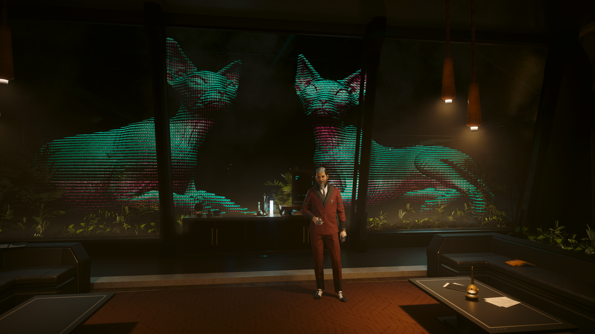
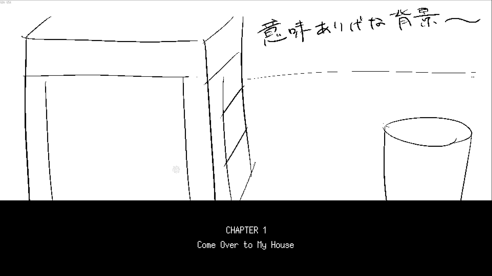

1月最後の開発日記です。ふと思ったんですが、最近、ゲーム作り以外何もしてない気がします。仕事とか、ジムに通うとかはあるんだけど、それ以外だと、何かしたっけ......？

えっと......Cyberpunk 2077が楽しいですね。寄り道しながら進めてるから、まだDLCクリアすらできてないんですが、すべてのクオリティが高くて本当にすごいです。1日1時間ずつくらい進めています。

それで、あとは......えーっと......ゲームを作っています。

#### α版(?)を提出した

この日記で、「1月末までにα版を出したい」ということをたびたび言っていました。そして、今日は1月31日！1月おわり！

というわけで、ついにパブリッシャーにα版を提出しました。α版とは、製品完成に向けて、一通りのシーンがプレイできる凝縮版みたいなものです。SAEKOでも、製品版のゲームシステムに沿って、ゲームの冒頭30分くらいがプレイできるものを作りました。もちろん、未実装の部分もあります。例えば......チャプター画面のプレースホルダーとか。

チャプター名とか、オープンワールドのクエスト名には謎の魔力があります。ずーっと、かっこいい名前について妄想しちゃう。短くて、オマージュが許されて、文脈から多少ズレてても許されるからでしょうか？

電車に乗ってる時とかも、Soundcloudでかっこいい曲名を探したり、脳内の候補を暗唱して響きを確かめたりします。ほんとうは、その時間でプログラムのこととか考えたほうがいいのは分かってるんだけど......でも......やっぱり、楽しいし......。

ともかく、脳内のたゆみない妄想によって、SAEKOはシナリオが書けてないのにチャプター名だけ決まってたりします。第1章は「Come Over to My House」。気に入った！うちに来て妹とファックしていい！

<figure>
    <iframe width="560" height="315" src="https://www.youtube.com/embed/KTnM_ub8g-M?si=73xETjkl8q6-upMu" title="YouTube video player" frameborder="0" allow="accelerometer; autoplay; clipboard-write; encrypted-media; gyroscope; picture-in-picture; web-share" allowfullscreen=""></iframe>
    <figcaption>音量注意</figcaption>
  </figure>

チャプター表記を作って、これまでバラバラに作っていたシーンを通しでプレイする。それだけのことでも、既存のシーンが全然違うように見えて、エフェクトとかテンポ感をたくさん見直すことになりました。あとは、システムの不満とかも、出てきたりして......。発見した不満を、その場でできるだけ解消しようとした結果、今回もけっきょく午前2時とかにビルドを出すことになりました。

現状のビルドを改めて見ると、発表時から作り直したゲームシステムは相当よくなってるし、シナリオもだいぶ面白くなっていると思います。やることも明確で、終わりまでの道筋もだいぶ見えています。

一方で、α版をプレイしていると、「ふーん、このゲームはこんなもんか」みたいな声が頭の中から聞こえてくることがあります。自分の頭の中に住んでいる最も下劣な人格で、普段から、他人のゲームや創作物を嬉しそうに辛口批判しています。

あるときは作者の勇み足な挑戦を鼻で笑ったり、あるときは「このモチーフは●●の二番煎じだな」みたいなことを嬉しそうに脳内でつぶやいたり。目的を完遂できなかった中途半端なゲームデザインを、同情ヅラしながら「やりたいことは伝わってくるんだけどな......」みたいに毒づいたりもします。最悪です。

自分のゲームに対しては不思議と無口だったのですが、全編通してのテストプレイ中、彼がついに立ち上がりました。ゲームとしての体裁が整ったおかげで、他の人のSteamゲームと勘違いしたのかもしれません。赤の他人に批評する感じで、彼はいくつか破壊的なコメントをしました。でも制作者は同じ脳に住んでいます。丸聞こえです。最悪。苦しい。

うるさい！創作の人格たちが大声で怒り始めると、慌てた彼はごにょごにょと何かを言い残しました。どもり気味の小声。それは彼なりのアドバイスで、破壊的で失礼な一方、たしかにと思わされることもありました。

あー......えっと......これ、何の日記？

#### 今後

というわけで、テストプレイ中にちょっと破壊的なアイデアが浮かんだりしました。Done is better than perfect ですが、とはいえどうせ苦労してゲームを作るのなら良いものにしたいので、破壊的なアイデアも検討していきたいです。詳細については、後ほど紹介できたらいいな。

それから、α版を提出したので、今後の開発はゲーム全体のエンディングまでを通しでプレイできるβ版に移ることになります。しばらくはシナリオを書き進める予定です。作っていて、ノベルゲームであればシナリオが最後まで揃っていたほうが全体のイメージがしやすいと感じたためです。それに、一気に書いたほうが、整合性とか勢いとかが揃う気がする。

あと、ゲーム本編の開発以外にも準備しているものがあります。これは来週あたりに披露できるはずなので、ここではまだ秘密！おわり！
