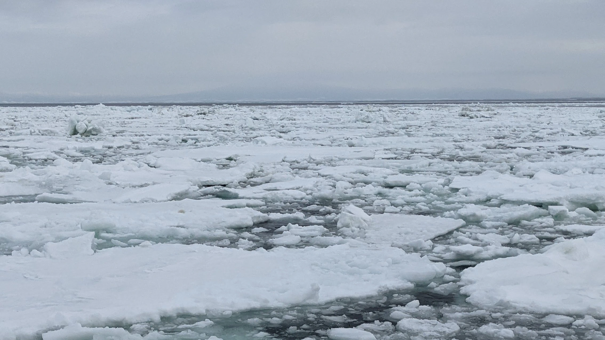
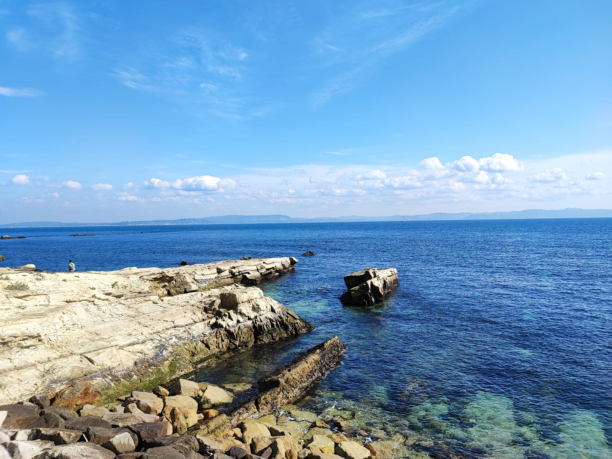

お久しぶりです、SAFE HAVN STUDIOのkypです。2月最初の開発日記をお送りします。2月！花粉！助けて！

今後数ヶ月の記事は、すべて鼻詰まりや目のかゆみと戦いながら書くことになります。誤字や悪文を見つけても、優しい目で見守っていただけますと幸いです。

#### SAEKOのホームページを公開しました

2月の一番大きいニュースはこれ！[SAEKO: Giantess Dating Simのウェブサイト](https://saekogame.com/)を公開しました。

<figure><blockquote class="twitter-tweet">
目を覚ますと、巨大な少女があなたを見下ろしていた――。 SAEKO: Giantess Dating Simのウェブサイトが公開されました。ぜひご覧ください！ Our brand new website is up online now! Info available in English, so check it out! <a href="https://twitter.com/hashtag/saekogame?src=hash&amp;ref_src=twsrc%5Etfw">#saekogame</a>  SAEKO: Giantess Dating Sim<a href="https://t.co/Tp3dyGeOWt">https://t.co/Tp3dyGeOWt</a> <a href="https://t.co/MeW43hBYrn">pic.twitter.com/MeW43hBYrn</a>
— SAEKO: Giantess Dating Sim (@saekogame) <a href="https://twitter.com/saekogame/status/1754079013696659718?ref_src=twsrc%5Etfw">February 4, 2024</a></blockquote> </figure>

まだWebサイトをご覧になっていない方がいれば、ぜひ[saekogame.com](https://saekogame.com/)からアクセスしてみてください。冴子の圧倒的な存在感と、ちょっと不気味な世界観を表現しつつ、テキストはシンプルで読みやすい良いWebデザインになったのではないかと思います。

この開発ブログをはじめ、これまで日本語では色々投稿できていましたが、英語でのまとまった情報はSteamの説明文くらいしか提供できていませんでした。今回、公式ウェブサイトを制作し、英語にも対応させたことで、英語圏の人に「まずはこれを見てね」といえる貴重な発信源ができたのではないかなと思います。デモの翻訳に引き続き、ウェブサイトの英訳を担当してくださった[kc](https://twitter.com/npckc)さんに深く感謝いたします。

  

裏話。今回のWebサイト公開は、もともとゲームの公開当初からやりたいと思っていたことでした。Twitterのアカウントを作ると同時くらいに、[saekogame.com](https://saekogame.com/)のドメインだけを取得して、それからYouTubeのPVやSteamへのリンク集として公開もしていたのです。

どうせなら、もっと凝ったコンテンツを作りたいと思うこと数ヶ月。Webエンジニアの端くれとして、いつか自分でやろうと思っていたのですが、なかなか手が回らずにいました。まあ、ほら、ゲーム自体の開発が忙しくて......。

そんな状況だったにも関わらず、いま目の前にSAEKOの公式サイトがあるのは、弊スタジオメンバーの[maztani](https://twitter.com/k_maztani)にWebデザインだけでなく実装までの全工程をやってもらえたからです。Git・GitHubのオンボーディングだったり、困った時のググり方を伝授したりしましたが（「とにかく[MDN](https://developer.mozilla.org/ja/docs/Web)を参照せよ」）、実際のHTML/CSSはすべてmaztaniに書いてもらいました。見た目もコードもクオリティ抜群だし、本当に感謝しています。

あ、それから今回のサイト公開に合わせて、[プレスキット](https://maize-enthusiasm-338.notion.site/17d95c6fe03a487eb8f7e9d01370e648)というのも用意しました。プレスのかたにはキット役に立つはず。

### ストーリーを書く

その他の作業！[前回の記事](https://safehavn.dev/blog/2024-01-31/)で触れたとおり、ゲーム冒頭を作り込むα版が終わったので、その続きのシナリオを書いています。もともとプロットは用意していたのですが、プロット通りに書くというのが難しくて、うんうん唸りながら作業しています。

最近思うんだけど......ゲームのシナリオは、芸術的な言い回しとかを考える右脳的な感性も大事なんだけど、それ以上に左脳をフル回転させる必要が大きいような気がします。文章を書くというより、理詰めで、制限だらけのパズルの解法を記録していくイメージ。

エンディングが決まっていて、使える手段と回数も決まっていて、物語全体内でのそのシーンの役割も決まっている。だから例えば、１つのシーンを書くのに１０個くらいの制約があって、制約のどれにも反しないエピソードの案をうんうん唸りながら考える。そしてその案を、エピソード自体の出来というより、前後との矛盾や全体との効果を考えながら削っていく、みたいな感じ......？

でも、実際の文章はパズルとして書いてる一方で、プレイしてる人には絶対にパズルとして読んでほしくないという気持ちがあります。まず自然に書かれたシナリオがあって、パズルをパズルたらしめた、ゲーム上の制約はできるだけ意識されないでほしい。没入感の妨げになるから。

ということは、この日記ではシナリオをパズルっぽく書いてることを隠したほうがいい......？あー......

別のどうでもいい問題。自分はゲームを作るとき、雑談配信や長めの自転車レースをBGMに作業する習慣があるのですが、文章の場合はそれができません。音声が聞こえると、どうしてもその言葉やリズムに引っ張られてしまうからです。

ということで、無音のまま作業を進めるんだけど......そうすると、集中が切れまくる！特に、さっき書いたように、シナリオはパズル的側面があって、どうしても机の前で考え込む必要があります。無音の室内。どうしても思考が飛び散って、気づくとスマホを開いています。休憩開始！

......集中力のある時間帯\[いつ？\]を上手に利用しながら、少しずつ執筆を進めていこうと思います。

### 近況報告

最後に、ゲーム以外の報告をします（書きたいだけ）。

今年に入ってから、休日はほぼ家に閉じこもっていたので、先週末は意を決して遠出しました。東京から1時間くらい電車に乗れば、三浦半島に海を見に行くことができます。天気に恵まれたこともあり、とても気持ちよかったです。

あと。先週はゲーム制作以外の仕事がたいへん忙しく、毎日じわじわ苦しんでいました。忙しいだけならまだ良いんですが、苦手というか、非常に心が折れるタイプのタスクで......。働いてるあいだはずっと、サーバールームでおしっこを漏らしたらどうなるんだろうとか、耐震耐火構造の建物に数十メートルの足でローキックを食らわせたいとか、そういう妄想ばかりをしていました。そして、そんな妄想をしているので仕事は進まず、さらに長い時間働く羽目になりました。うう！

布団の中でいろいろ考えた結果、やっぱり創作が心の支えです。SAEKOを作り始めてから、少しだけ前より自信を持って言えるようになってきて、本当に感謝しています。人生は短い、苦しみも尽きない。ならせめて、苦しんで通ったあとに、自分がこれを作ったんだぜって言えるものが残ってたほうがいい！

がんばる！おわり！
