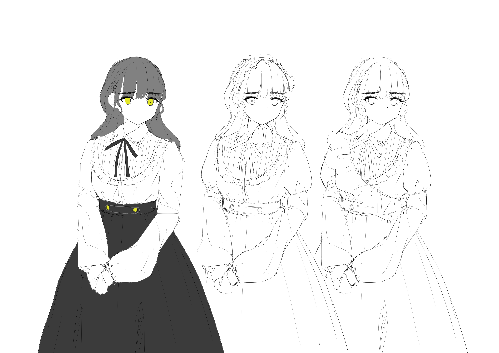

２月後半の開発日記です。２月といえば......花粉！

これを書いているいまも、鼻の穴は両方ともふさがっていて、口を開けてどうにか息を吸っています。いつも思うけど、仮に花粉ではなく本物の毒物だったとして、防衛として鼻の穴をふさぐというのは違うような気がします。だって、呼吸は止められないんだし。セキュリティのために表門を閉じたら、勝手口から入るようになってもっと危険、みたいな？

思考があちこちに飛びます。誰か助けてください。

#### ゲーム開発

現在は、ゲームの序盤〜中盤くらいまでのシナリオを書いています。大まかなプロットしかなかった部分を、会話やエピソードとして具体化していく作業です。そして、ある程度書き上がった部分については、イラストレーターのkohにも共有し、登場するキャラクターのデザイン案を考えてもらったりしています。

シナリオの執筆は楽しい作業ですが、とても考えることが多く、あとでボツになることもあります。推敲とかのミクロなレベルではなく、エピソードやプロット単位での書き直しです。直近でも、エピソードを１つ書き終わり、それを元にキャラクターデザインまで考えてもらったあとから、全体のバランスの都合でキャラクターの造形からやり直す羽目になりました。デザインもやり直しです。ごめんなさい。

去年読んだ[スティーブン・キングの本](https://www.amazon.co.jp/dp/B0B2P79DK2)で、「状況設定まで作ったら、あとはストーリー自身のなりゆきに身を任せる」みたいな記述がありました。自分も、そうやって作られた文章が好きです。フックの世界観から、１つ１つの出来事は自然につながっていく。終盤に劇的な伏線回収があるわけではないけど、それゆえに作り物という感じがしない、みたいな。

でも、ゲームのシナリオだと、なりゆきに身を任せるのは難しそうです。まず、ストーリーとシステムの順番。システムはストーリーとリンクしててほしいけど、ゲーム作りではまずシステムを最初に作る必要があるので、その時点でどんなストーリーになるかがある程度決まっている必要があります。

そして、具体的なダイアログを書き起こしていくのも、論理パズルを解く感覚に近いです。ゲームとして、たくさんの制約があるからです。エピソードを書くときも、自由に浮かんできた展開を書くというより、制約のなかでパーツを組み立て、実験し、ハマったパーツ同士を接合してどうにか文章にしている感覚です。

SAEKOの大まかなシナリオはプロットとして書き起こされ、キャラクターやパラメータの一覧はスプレッドシートにまとめられています。１つのエピソードを書き終えたあと、スプレッドシートを見ながら、ゲーム全体として矛盾がないか、そして、登場人物や展開が偏りすぎていないか確認します。終盤に出す予定のキャラのことも計算に入れつつ、男女比が想定と違わないかとか（私の場合は放っておくと全員女の子になる）、性別によって性格が偏りすぎていないかとか（内気な女の子も、強い女の子もどっちもいる状態を作れてるかとか）。書くと簡単に見えるけど......これが、難しい！

でも、１つ１つのくだらない会話とか、可愛いキャラクターとか、フレーバーテキストや細かいオマージュとか、そういうものを考えるのはとても楽しいです。読む分にはあまり論理パズルを感じず、自然で勢いのあるストーリーとして仕上がっていたらいいなと思っています。

#### おわりに

今回の開発日記は以上です。ストーリーの進捗が多くて、記事としては地味な内容ですが......うーん......何か、他に書けることあるかな......

あ、最近親戚から生のホタテ10kgが届いて、貝をさばいて可食部を取り出す、みたいな作業をしました。ホタテは貝を閉じて死ぬので、その隙間からナイフを挿れて閉殻筋を切断し、支えのなくなった殻をぱっくりと開け、エラやら内臓やら生殖腺やらのおいしくない部分を捨てて貝柱やヒモを取り出します。貝を開いたときは、鮮やかで複雑な構造の内臓を誇っていた生き物が、さばいて可食部を取り出し、水で洗って余計な粘液やらを取り去っていくと、皿の上には寿司屋で見るような白い貝柱だけが並んで、もとからそういう姿で作られた工業製品みたいに見えてきます。その徹底的な改変作業に、最初はわずかな罪悪感を覚えたのですが、次第にそれも消えてあとは仕事として処理できるようになります。数十枚のホタテを連続で捌いていくうちに、内臓や生殖腺の色彩は目に馴染んで、それは最初から人間に解かれるためのパズルだったような気がして、いかに早く貝殻を切断するか、いかに大きな貝柱を取り出せるかに関心が移っていくのです。

何の話？今週の日記は以上です。
