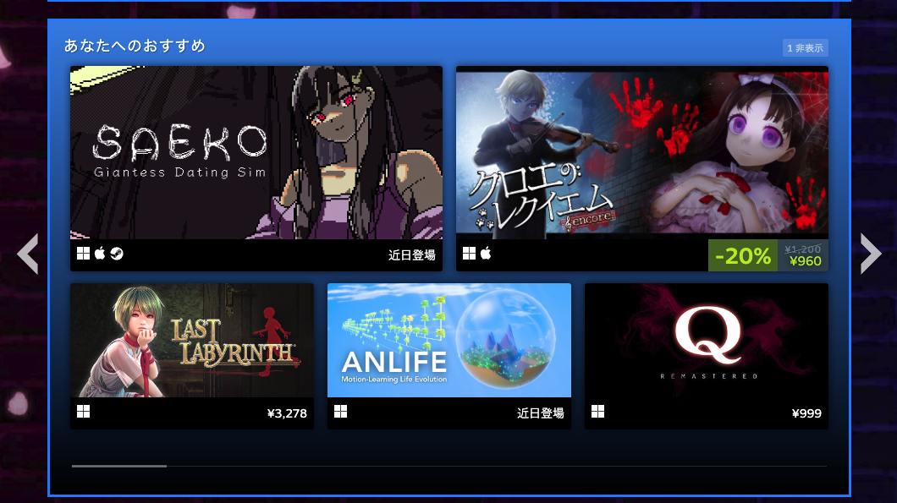
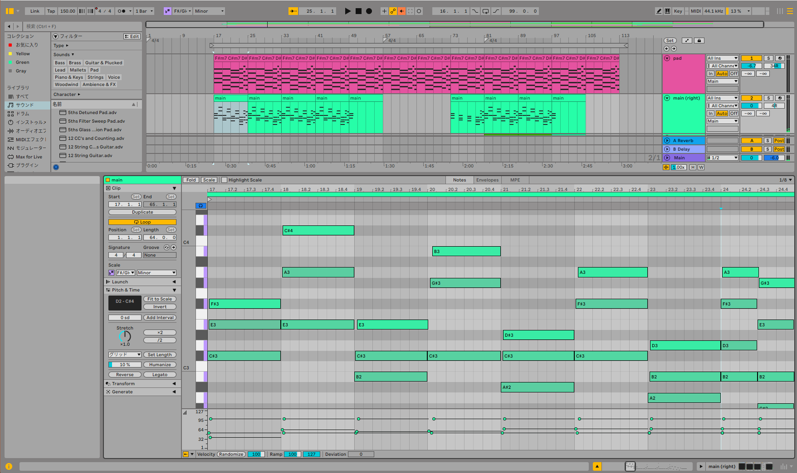
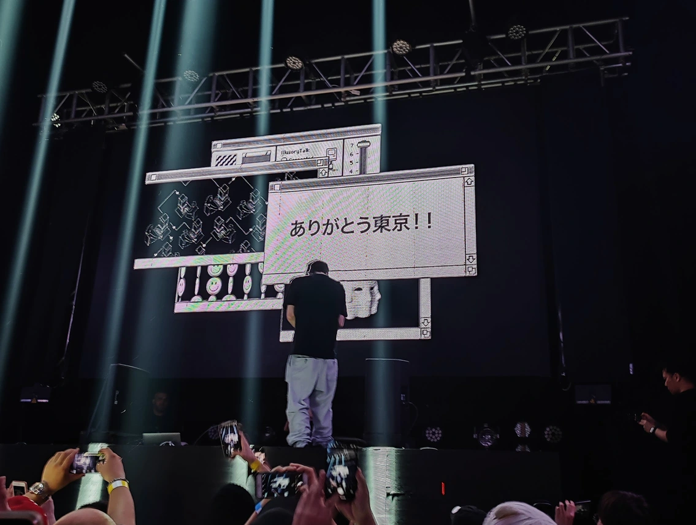

SAFE HAVN STUDIOのkypです。2週間ぶりの開発日記をお送りいたします！

#### GDC2024 MADE IN JAPAN GAMES MARKET

<figure>
    <blockquote class="twitter-tweet">
      

        Steamで日本のゲームを世界へ発信する特集イベント「GDC2024 MADE IN
        JAPAN GAMES MARKET」開催<a href="https://t.co/IrbCQyRGMB">https://t.co/IrbCQyRGMB</a>  特設ページでは『Refind Self:
        性格診断ゲーム』や『カニノケンカ・ニ』『SAEKO: Giantess Dating
        Sim』などを紹介。3月18日からセールも開催へ
        <a href="https://t.co/NscisA0wgL">pic.twitter.com/NscisA0wgL</a>
      

      — 電ファミニコゲーマー (@denfaminicogame)
      <a href="https://twitter.com/denfaminicogame/status/1765285878958788991?ref_src=twsrc%5Etfw">March 6, 2024</a>
    </blockquote>
    
    <figcaption>SAEKO!?</figcaption>
  </figure>

久々にニュースに載りました。サンフランシスコで開催される[GDC](https://gdconf.com/)と連動して、Steamで日本製ゲームのイベントページが作られ、そこに載せていただいているみたいです。すごい。

<figure>
    
    <figcaption>
      <a href="https://store.steampowered.com/sale/JETRO_GDC2024">Steamのイベントページ</a>にも、人によってはSAEKOが並んでたりします
    </figcaption>
  </figure>

へー、主催は日本貿易振興機構っていう独立行政法人なんですって。えっと、あーーー、大丈夫？大丈夫だよね、たぶん。なんか、行政ってつくと怖いんだけど……

確定申告だけは絶対に忘れないようにします。

#### 引き続きシナリオを書いています

ニュース以外の実作業！引き続き、ほとんどの時間はシナリオを書いています。SAEKOは3〜4時間のゲームになればいいなと思っているのですが、その半分くらいのテキストができてきました。あとは後半ですが、特に終盤の筋書きはほぼ出来ているので、あとはそれを具体的なテキストに落としていく作業になりそうです。

ここ何回かの開発日記で、シナリオは自由な創造というより論理パズルに近い、みたいなことを書きました。

実際、論理パズルだなとは今も思っているのですが、中盤まで書いてくるなかで、パズルにもだいぶ慣れてきたというか、問題の解き方が分かってきたな〜という感覚があります。解法: 一旦雑な案を書き出してみる。コメントで「ここは微妙」って残し、全てを諦めて外に出かける。ぼーっと歩いてるあいだに脳のサブルーチンが勝手に解法を出してくれる（ことがある）

ゲームが中盤に進むにつれ、ゲームシステムとの整合性みたいなものも見えてきました。だいたいのゲームはシステムを先に組み、テキストはそのシステムに沿った形で埋める、っていう順番だと思うんですが、SAEKOはシステムもシナリオも同じ人間(kyp)が書いているので、テキストに合わせてシステムを変えるみたいなことができます。そして変えまくっています。

実際には、システム全体をガラッと作り直すというより、「このシステムはシナリオ上の◯◯という意味をもたせよう！」みたいな細部の解釈を変えることが多いです。これは、ハマるととても気持ちのいい作業です。

曲でも絵でも小説でも、自分が好きな芸術作品の特徴に「すべての要素に意味がある」というのります。１つのメッセージを届けるために、すべての要素が協働してるみたいなの、かっこいい！やりたい！なので、例え開発中の後付けであっても、ゲーム性の解釈を話の展開に合致させられると、すごく良いカタルシスを得ることができます。

もちろん、本当に「すべての要素に意味がある」と判断するのは、発売後に遊ぶプレイヤーです。ゲーム内の要素に浸かりすぎていて、自分では矛盾とか不整合とかは見つけられないだろうし……。リリース後、「システムとシナリオが合ってない」みたいなことを言われたら、この記事は削除されます。

#### バックログ実装

シナリオの作業の最大の弱点は、作業中にBGMや配信を流せないことです。耳から情報が入ると、脳内の発想が邪魔されるような気がするからです。なので、１日テキストを書く日は無音のまま、鋼の集中力だけで机に座り続けることになります。

つらいです。つらいので、見たい配信を見るためだけに、あえてシナリオ以外の作業を進めることがあります。例えば、ずっと必要だな〜と思いつつ放置していた、バックログ機能を実装したりしました。

<figure>
    <blockquote class="twitter-tweet" data-media-max-width="560">
      

        バックログ実装中（失敗）
        <a href="https://t.co/5ypWMO0YZk">pic.twitter.com/5ypWMO0YZk</a>
      

      — SAEKO: Giantess Dating Sim (@saekogame)
      <a href="https://twitter.com/saekogame/status/1765656026744025277?ref_src=twsrc%5Etfw">March 7, 2024</a>
    </blockquote>
    
  </figure>

あっ間違えた……

<figure>
    <blockquote class="twitter-tweet" data-media-max-width="560">
      

        👍
        <a href="https://t.co/zJWgkUztas">pic.twitter.com/zJWgkUztas</a>
      

      — SAEKO: Giantess Dating Sim (@saekogame)
      <a href="https://twitter.com/saekogame/status/1765667756110762207?ref_src=twsrc%5Etfw">March 7, 2024</a>
    </blockquote>
    
    <figcaption>笑える不具合は大好き</figcaption>
  </figure>

なにげにシナリオが少し映っています。今後数ヶ月以内には、もう少しちゃんとした形でお出しできるかと思いますので、気長にお待ちいただけると嬉しいです、、、！

#### その他

Ableton Live 12がリリースされましたね。追加機能がすごく嬉しくて、気づいたらゲーム内のBGMが2つ出来上がっていました。

色々アツい機能がリリースされたみたいなんですが、個人的には、ピアノロールにスケールを重ねてくれる機能が大変助かります。自分はシンセサイザーが好きなのですが、音楽理論にはあまり詳しくなくて……。特に、[トレイラー](https://youtu.be/ToAAwQMhyNU?si=M5Pvw1TC12yqqytB)で使ったメロディはF#マイナーという普段全く使わないスケールで書いてしまい、判読不能になっていたので、この機能のおかげでまた解釈できるようになったのは嬉しい限りです。

<figure>
    
    <figcaption>
      コード進行も分からなくなるのでMIDIクリップの名前に書いています
    </figcaption>
  </figure>

#### おわり

その他！今回は私(kyp)の進捗がメインになってしまいましたが、今後はSAFE HAVN STUDIOの他の開発メンバーにも環境の変化があったりして、さらにゲーム開発に打ち込める時間が増えそうです。今年ももう3月まで来てしまいましたが、なんとか年内に良い作品をお出しできるよう頑張っていきます。

あと、超個人的な話題: [G Jones](https://www.gjonesbass.com/)という好きなアーティストの来日公演に行くことができて、もうめちゃくちゃ感動しました。サウンドもビジュアルもすごくユニークで、Bass系の流行りとはぜんぜん違うのに、一度ライブが始まると全員がその世界観に引き込まれるっていう……やばかったです。良すぎて、芸術っていいなあとか思いながら帰りました。

<figure>
    
  </figure>

おわり！
