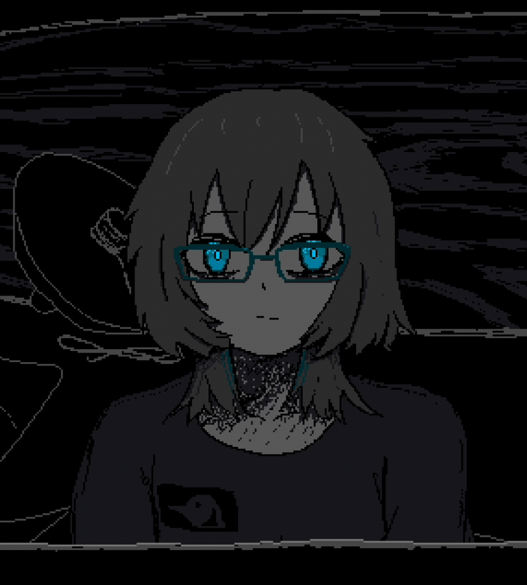
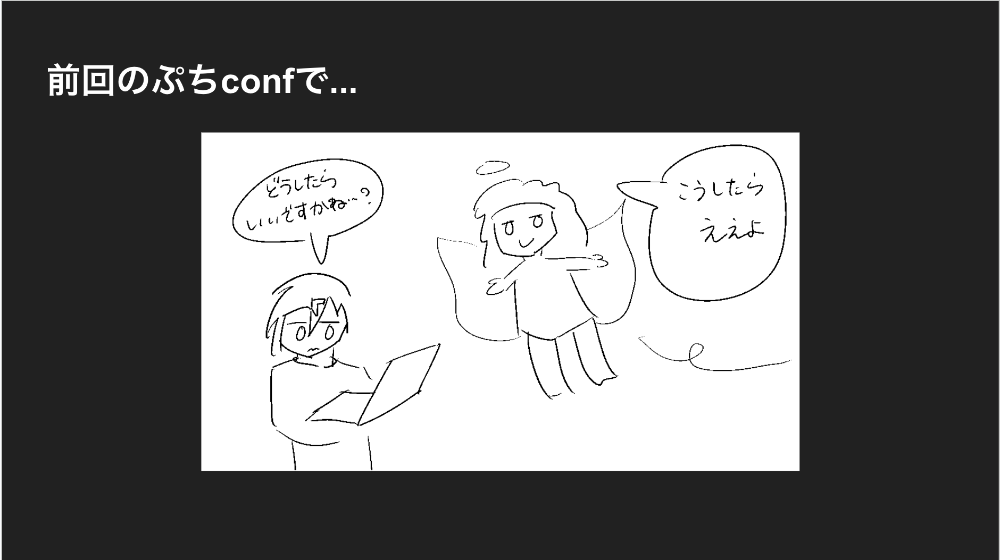

SAFE HAVN STUDIOのkypです。今回も開発日記をお送りします。

#### 進捗（書けない）

この記事は2週間に1回更新しています。何人かのクリエイターさんがそうしているように、週報のほうが習慣化しやすく、読むほうにとっても忘れづらくて嬉しいかなと思うのですが、私はそうしていません。微妙な頻度で、ときどき自分でも「あれ、今週って日記書くんだったっけ？」みたいに頭をひねっています。

1週間に1度だと、書くことがなかなか見つからないんですよね......。進捗自体が見つからないというより、進捗の性質上見せられるものが少なかったりします。今週の作業はすべて新規の立ち絵、けっこういい感じに描けた気がする、でもどの立ち絵もネタバレになるから見せられない、みたいな。

そして、今回は2週間に1度でもそれが起きました。

とはいえ、進捗自体はわりとあります！何人かのキャラクターの立ち絵ができたり、Ableton Live 12の力を借りてずっと悩んでいたBGMが形になったり。

シナリオも半分ぐらい書き終えたのち、序盤に立ち戻っていくつかの描写を変更したりしています。シナリオの改善は、欲を言えばいつまでも続けられそうなのですが、そろそろ「これ以上は後戻りしない」という覚悟を固めるべきなんでしょうね......。近いうちに、序盤のテキストはFIXしてしまおうと考えています。

それから、本作でピクセルアートを担当している[kohが退職してフリーランスになったので](https://twitter.com/koh9083/status/1768928826200121821)、ものすごい勢いで冴子関連のグラフィックを描いてもらっています。ほぼ毎日新しい絵が見られるので、幸せな日々です。

これまではどうしても時間の制約があって、リテイクとかのコストが大きかったので、僕がほとんど設定やテキストを固めたうえで絵の依頼をしていました。でも、今後は週に何回かコミュニケーションを取りながら作業ができるようになったので、気軽に新しいアイデアを入れたり、あるいは絵をまず作ってから文章を追加する、みたいなこともできるようになるかも。なるはず！

#### Ebitengine ぷちConf#2 に出る

今週の金曜日、[Ebitengine ぷちConf#2](https://gocon.connpass.com/event/306765/)というイベントにkypが出ます。Ebitengineという、SAEKOの開発に使っているゲームエンジンのLT会兼交流会です。私はSAEKOの開発を通して得た、「プロジェクトの最初はとりあえずこんなパッケージ構成にすると良さそう」という知見？感想？を話します。

まだ参加枠に余裕があるみたいなので、この記事を読んでいてGo言語でのゲーム開発に興味がある人がいたら、ぜひ申し込んでみてください。会場は渋谷のDeNA本社です。ものすごく柔らかいソファがあります。

#### おわり

最近眠りが浅くて、思っていた1時間くらい前に起きてしまうことが多いです。でも、頭がシャキッと覚醒しているわけではなくて、単に眠る方法が分からないみたいな感じ。インディーゲーム開発者は睡眠を削っているイメージだけど、自分はどうしてもそれができなくて、眠いと集中できないし、アイデアは浮かばないし、なのに脳のネガティブな部分だけは活発化して、自分のいま考えてることやしていることについての悪口をずーーーっと言ってきます。

GLaDOSの思考を抑え込むために、『Portal 2』でAparture Scienceのエンジニアが作ったWheatleyとかSpace Coreみたいな感じ。脳に悪口専用のモジュールが取り付けられて、それが脳本体の思考を妨げようと常にネガティブな言葉だけを発し続けます。

「じゃあ、お前は優秀なGLaDOS気取りってことか？」悪口コラプション・コアが脳内で騒ぎます。「一人じゃ５次方程式だって解けないくせに」

「解けなくたっていいでしょ」私は言って、ポータルガンで月面に悪口コアを放り込みます。ポータルが閉じて、コアの言葉は聞こえなくなる。嘘。これを書いてる最中も、すぐに耳元に新しいコアができて、今度はこの寓話の微妙さを囁いてきます。「SAEKOの開発日記でなんでこんなポエム書いてるんだ？」たしかにと思いながら、これも月面に送り込みます。今ごろ月面は悪口コアだらけで、宇宙の欠点とか地球は良かったみたいな話で盛り上がっているはずです。

えっと......まあ......そういう感じで......睡眠だいじ。たっぷりめに寝る。終わり！
