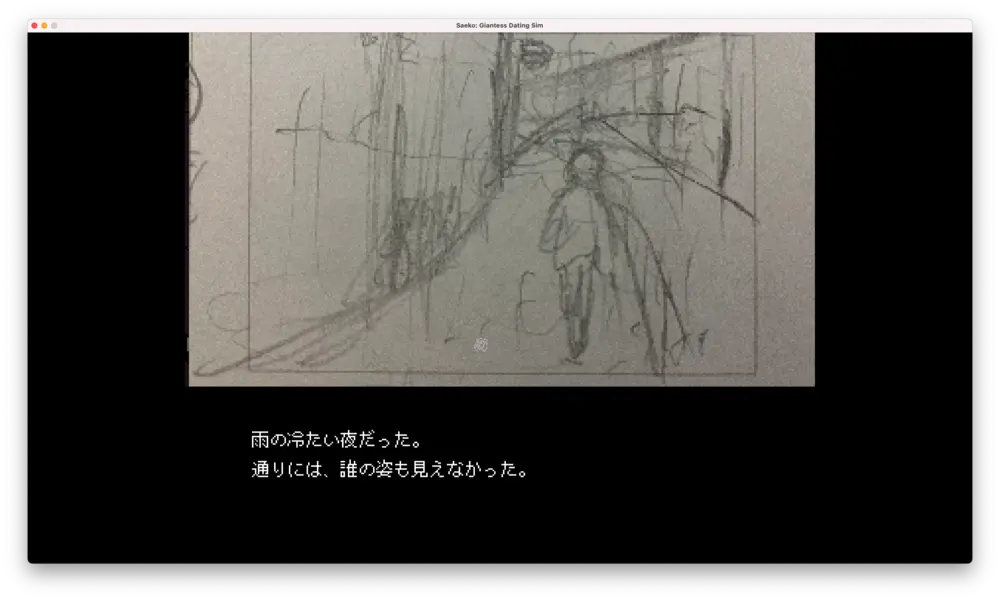

SAFE HAVN STUDIOのkypです。これを書き始める数分前から、左目がびくびく震え始めました。ついに何かの能力に覚醒したかと思ったんですが、単純に疲れ目の症状らしいです。悲しい。これを書き終えたら音楽でも聴いて癒やされようと思います。

#### 告知とか

そういえば。エイプリルフールということでSEKIROのパロディをしました。以前から「SAEKOとSEKIRO、名前似てない？」というフィードバックがたくさんあって、今回それにお答えした形です。

<figure>
    <blockquote class="twitter-tweet">
      

        SAEKO: Shrinkers Die Twice
        <a href="https://t.co/HzAWcykyZH">pic.twitter.com/HzAWcykyZH</a>
      

      — SAEKO: Giantess Dating Sim (@saekogame)
      <a href="https://twitter.com/saekogame/status/1774452843937980588?ref_src=twsrc%5Etfw">March 31, 2024</a>
    </blockquote>
    
  </figure>

軽い気持ちでやったのですが、思いの外反響があり、[ファミ通にも記事として取り上げられました](https://www.famitsu.com/news/202404/01338478.html)。びっくり。

自分はあまりアクションゲームは得意ではないし、SAEKOとSEKIROも字面そんなに似てるかな〜と思ったんですが、言われ続けているうちに確かに似てるような気がしました。そしてパロりました。面白そうだったから。いぇい。

肝心のSEKIROは......「死」の画面を何度も見させられて、ぐわーってなって、それ以降はまあ......その......えーっと......ご想像に任せるといった感じなのですが、SAEKOの開発が落ち着いたらまたやります。ほんとです。やる。必ず。たぶん。だからこのことは少し内緒にしてください。お願いします。

<figure>
    <blockquote class="twitter-tweet">
      

        SAEKO: Giantess Dating Sim が
        <a href="https://twitter.com/hashtag/INDIELiveExpo?src=hash&amp;ref_src=twsrc%5Etfw">#INDIELiveExpo</a>
        のオフィシャルセレクションに選定されました。5月25日の放送内でゲームが紹介されます。いぇい！
        <a href="https://t.co/uLNFk48jsG">pic.twitter.com/uLNFk48jsG</a>
      

      — SAEKO: Giantess Dating Sim (@saekogame)
      <a href="https://twitter.com/saekogame/status/1776912918740718069?ref_src=twsrc%5Etfw">April 7, 2024</a>
    </blockquote>
    
  </figure>

あ、あと。今年5月のIndie Live Expoで、SAEKOが紹介されるみたいです。放送内で、15秒ほどの短いPVが流れるような感じだと思います。嬉しいけど、どういう雰囲気の放送になるんでしょうか。不安です。

#### 開発

告知以外の出来事。開発は進んでいます。特にkohが精力的にイラストを描いてくれているので、ビジュアル面は非常に強くなりつつあります。新しい絵を見るたびに（性癖的な面で）私は非常に強い衝撃を受け、椅子の上で卒倒したりしています。

ビジュアルが積み上がっていくにつれ、「こんな自分の性癖100%のものを世に広めていいのだろうか」みたいな謎の羞恥心が生まれ始め、最近はその葛藤とも戦っています。「これはエロすぎるんじゃない！？」みたいな。でも、kohやパブリッシャーに聞いても「そう？」って感じでした。たしかに肌の露出はないし、何かセクシュアルな行為をしてるわけでもないし。でもその、なんというか、雰囲気がエロくて。自分だけ、みんながヤンジャンとかで捨てる貞操観念のままで生きているのかな......？*(注: そんな人はこんなゲーム作らない)*

原因としては、最近kohと話していくなかで、SAEKOのエロの方向性が見えてきたことだと思います。SAEKOは、まあエロいゲームではあるんだけど、一般的なグラビアみたいなエロではありません。

巨大娘という題材だからこその、一般のエロとは少し違う「ツボ」があって、そして最近のイラストではそれを突かれまくっています。その結果、私はテストプレイするたびに極度の疲労を覚えているのですが、たぶんこれは自分の心が動かされまくっている証拠です。このツボを突きまくれば、ユニークで美しくて、しかも自分にとっては一生特別になる作品ができる。いや、その......エロい意味だけじゃなくて......美意識的な、aestheticsな側面でもね！

この文章を書くのもだいぶ恥ずかしかったけど、「すごい作品ができそうなので、鋼の意思で頑張る」という意思表示で頑張りました。尖り続けます。不退転の意思！ただ、すごくパーソナルな話でもあるのでめちゃくちゃ恥ずかしく、書きながら何回も全削除しました。まあその......頑張る......頑張るんだけど......ミーティングのたびに性癖の開示をしている私を、これからも生暖かい目で見守ってください。

#### その他

ここからもポエム。今日は１つ締切があって、序盤のシナリオをFIXして提出しました。ずーっとちまちま直してたけど、いよいよこれでお別れです。まだ良くなったかもという気もしつつ、やっと手を離れてくれた安心感のようなものもあります。

音楽でも絵でも、「ここから先は自分でいじったってもう良くならない」みたいなラインがあると思います。細かいミキサーの数値をいじりつづけるとか、ひたすら塗りのピクセルを塗り直すとか。じっと見てると直すべきところがあるように見えるけど、直したら直したで違う感じになって、客観的には良くも悪くもなってなかったり。

だからこそ作品を完成させて先に進むことが大切なんですが、ゲームは開発期間が長いし、しかも自分はプログラムを書いて何百回もテストするから、そのたびにシナリオの修正ができてしまいます。そして、修正し続けてました。

結果的に良くなったかというと......微妙かも。最終的にパブリッシャーの人に客観的な意見をもらって、それで増えすぎた説明をばっさり削ったりしました。あまり同じ文章を読みすぎると、やっぱり感覚が狂う。何回か通しで直したあとは、外部のアドバイスをもらうまで全く触れないくらいが良さそうだな〜と思いました。これから書くシナリオに向けて、いい教訓ができました。

ところで、なんで序盤のシナリオをFIXしないといけないのでしょうか？えーっと......その答えは......今後の発表をお楽しみに（よろしくお願いしますでもあまり期待しすぎないでたぶん5月中には何かわかるはず）
