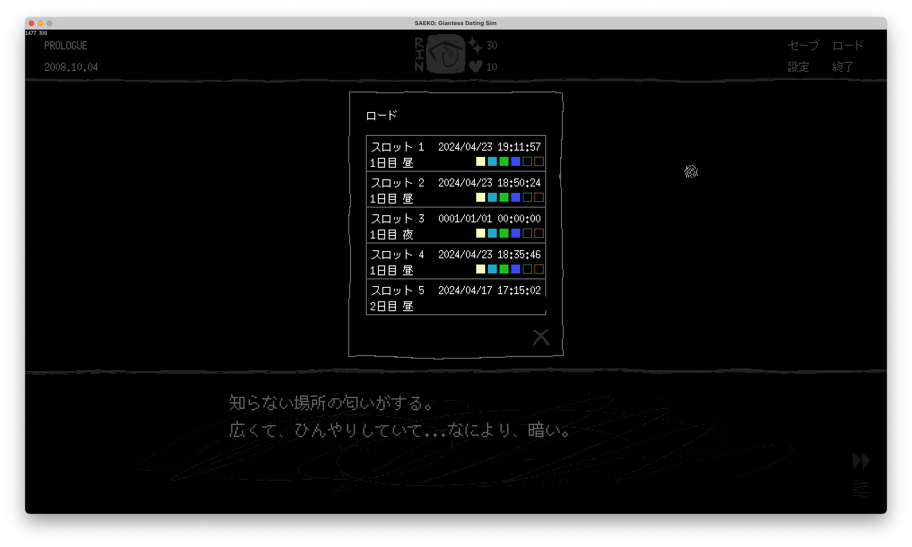
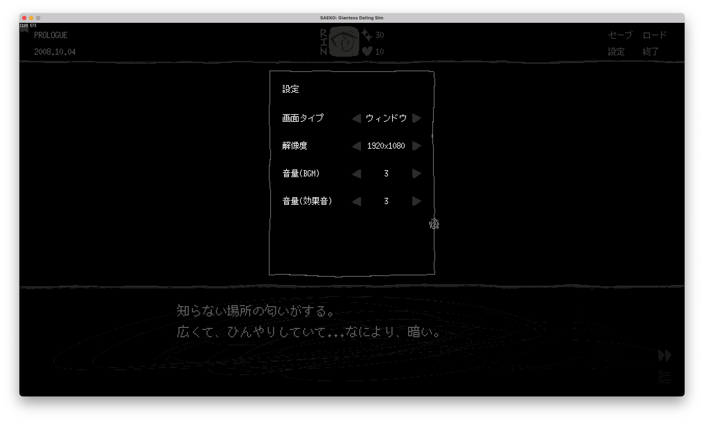
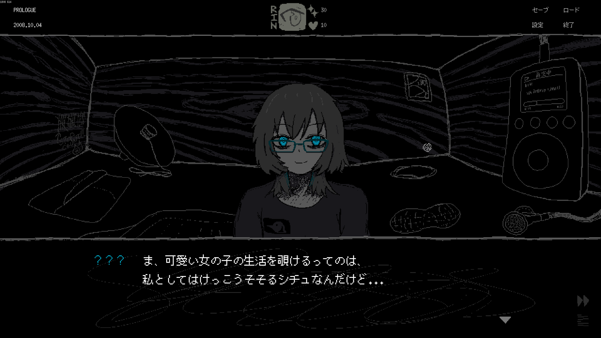
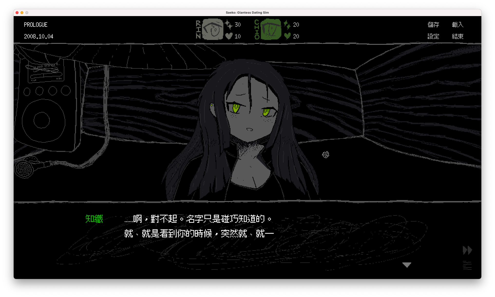

みなさんこんにちは、SAFE HAVN STUDIOのkypです。2週間に1度、独特のテンポで更新される開発日記をお送りいたします。日記ってなんだろう。

#### ゲームダンジョン 出る

SAEKO: Giantess Dating Simですが、5月4日に東京の浜松町で開催される[東京ゲームダンジョン5](https://tokyogamedungeon.com/)に出展します。謎の洋画GIFが流れてくるあのイベントです。

<figure>
    <blockquote class="twitter-tweet">
<a href="https://twitter.com/hashtag/%E6%9D%B1%E4%BA%AC%E3%82%B2%E3%83%BC%E3%83%A0%E3%83%80%E3%83%B3%E3%82%B8%E3%83%A7%E3%83%B35?src=hash&amp;ref_src=twsrc%5Etfw">#東京ゲームダンジョン5</a>  「紳士とルール」篇🫣<a href="https://twitter.com/hashtag/%E3%82%B2%E3%83%A0%E3%83%80%E3%83%B35?src=hash&amp;ref_src=twsrc%5Etfw">#ゲムダン5</a> <a href="https://t.co/P9SUyCrioh">pic.twitter.com/P9SUyCrioh</a>
— 東京ゲームダンジョン | 2024年5月4日(土)、東京・浜松町で開催！ (@TG_Dungeon) <a href="https://twitter.com/TG_Dungeon/status/1778945159805456646?ref_src=twsrc%5Etfw">April 13, 2024</a></blockquote> 

    <figcaption>小学生のみんなごめん</figcaption>
  </figure>

今回も、SAEKOはHYPER REALのブースで展示用ビルドをお出しする予定です。ぜひお越しください！ゴールデンウィーク後半ということで、比較的参加しやすいイベントかな〜と思います。

私も、イラストレーターのkohと一緒に会場を回ってみるつもりです。あまり長くいると脳が他作品との比較を開始して凹んでしまうので、無理のない範囲で。当日の会場にて、もし脳みその壊れてしまった人間が倒れ込んでいるのを見かけたら、そのときは優しく接してあげてください。

#### 開発（ニッチな話）

その他。前回[序盤のテキストをFIXした](https://safehavn.dev/blog/2024-04-09/)のに続いて、現在はゲームとしての体裁を整えるために必要な実装を進めています。ロード/セーブとか、設定画面とか。

まあ、うん……見た目は地味だし、普段ゲームしてるときにはほとんど意識しないんだけど、そのわりにやることは多くて大変な作業でした。特にロードとセーブは、考えることが多かったです。締め切り直前にやってたら絶叫コースだったかも。だから、締め切りに余裕がある今のうちに進められてよかったなと思っています。

あと、設定項目。フルスクリーン/ウィンドウは簡単に切り替えられたんですが、画面解像度を変えるのはかなり大変でした。アンチエイリアスのかかった通常の絵やフォントであれば、画面が大きくするのにただ画像を拡大するだけで済むと思うのですが、ドット絵やビットマップフォントは画像の拡大率が整数倍でないと輪郭が汚くなるからです。

SAEKOを作り始めたとき、そんなことを私は全く意識せずにいたので（「いまどきフルHD以外で遊ぶやつなんている？」）、内部解像度を960x540pxとして素材を作り始めてしまいました。そして、この状態で解像度を1280x720pxに変更すると、元画像の1ピクセルは現実の1.33ピクセルになります。クリスタのニアレストネイバー法みたいな感じ。思ってるより汚くはない！だけど、うーん、やっぱりちょっと汚いかも……。

私の体力がいまの100倍くらいあったら、異なる解像度に応じて2種類のアセットを書いたりできるんですが、体力はありません。でも、一部のアセット、特に文字の輪郭が微妙に崩れているのは超気になります。そこで、現在のビルドでは2つの方針を立ててこの解像度対策をすることにしました。

1.  画像アセットは960x540px単体とし、それ以外の解像度ではできるだけニアレストネイバー法で「精細な」画像を提供する。例えば、2560x1440px（WQHD画質）のときは、ゲーム自体の内部解像度を2560pxに設定して、画像の1ピクセルがスクリーンの2.66...ピクセルに1回の操作で拡大されるようにする。（ゲームの内部解像度を例えば1280x720pxしか用意しないと、960x540pxの画像を内部解像度の1280x720pxに変換する→荒くなった輪郭を2560pxの画面に2倍拡大で表示する みたいになって、粗さが必要以上に強調されてしまう）
2.  テキストサイズはどの画面でも整数倍で表示されるようにする。例えば960x540pxの画面で2倍に拡大されていた文字は、1280x720pxにそのまま拡大すると2.66...倍になり、汚くなる。この場合、画面全体との相対的な大きさを変えても、整数倍で表示されるように優先する。例えば960x540pxで2倍拡大されていた文字は、1280x720pxのとき3倍で表示されるようにする。

……なんか分かりにくい文章になった気がする。まだこの記事を読んでいる方はいるのでしょうか。貴重な時間を使わせてごめんなさい。

1,2を実現するのに、内部でちょっとしたレイアウトシステムみたいなのを作ったりもしました。想像以上に大変な作業だったんですが、結果にはわりと満足しています！

（ちなみに、HD, フルHD, WQHD...は640x360の約数になってるので、最初から内部解像度640x360pxで作っていればこういう問題は発生しないです。でも、そうするとどうしても情報量が減るので、瞳の中の表現とか、荒い線の感じとかが出せない悩みがあって...互換性ガン無視で960x540pxを選びました。HD画質の住人たち、ごめんなさい）

 

それから、この作業と同時に、思い切って[text/v2](https://zenn.dev/eihigh/articles/ebitengine-text-v2)に移行しました。画像と似たAPIで扱えたり、表示位置の操作などが直感的になっていてサイコーです。ビットマップフォントの描画が難しいという問題があり、[bitmapfont/v3](https://pkg.go.dev/github.com/hajimehoshi/bitmapfont/v3)をあわせて導入したのですが、中国語フォントが足りない旨をEbitengine作者のHajime Hoshiさんに言ったら翌日にはパッケージに簡体字/繁体字のビットマップフォントが追加されていました。サイコーです。ありがとうございます。

#### おわりに

思ったより技術寄りの話になってしまいましたが、今回の話はここまで！

他にも色々やった気がするんですが、うまいこと書けない気がします。でも、ここ１〜２週間はいろんな人とやり取りしました。アイデアを検討したり依頼を出したり、そんな感じ。今後、もう少し形になってきたら、発表できるんじゃないかな〜と思います。楽しみ。

それでは、次回の開発日記をお楽しみｎ、ｇｋぁ＠ｐｇかｇかｓ０ｇかｓ「ーｋｇｈ、ま、まって――

 

 

 

 

 

 

平和な開発日記はここまでだ。これより、私の性癖の話をする。

 

 

 

 

 

 

#### 性癖の話

いや……なんてことはない……いつもどおりのポエムなんだけど……え、えーっと……

[前回の開発日記](https://safehavn.dev/blog/2024-04-09/#:~:text=%E3%81%8B%E3%80%82%E4%B8%8D%E5%AE%89%E3%81%A7%E3%81%99%E3%80%82-,%E9%96%8B%E7%99%BA,-%E5%91%8A%E7%9F%A5%E4%BB%A5%E5%A4%96%E3%81%AE)でもちらっと触れたんですが、ビジュアルが積み上がっていくにつれて、「こんな好み100%のゲームを世に出していいんだろうか？」みたいな葛藤を密かに感じていました。「これはエロすぎるんじゃない！？」みたいな。

開発を進めていくにつれて、そういう羞恥心はどんどん強くなってきて、ゲームを作る際にも無意識にブレーキがかかるようになっていました。フェチ過ぎる文章を書けなかったり、「一般的にはこういう構図のが好かれるかな」とか思ったり。

 

……で、そのブレーキは壊すことにしました。ごめんなさい。もう後戻りはできません。ここからは、下り坂でひたすら加速していきます。

 

SAEKOはもともと自分のかなり個人的な衝動（性癖）に従って作り始めた作品で、よって他人の受けなんて気にしてませんでした。でも、作品としての露出が増えたり、ゲーム開発者の知り合いが増えるにしたがって、なんとなく周りの人の目を気にするようになっていきました。「フェチ抜きでも感動できる作品を作ろう」とか思ったり。テキストやデモを提出する際にも、パブリッシャーに「これエロすぎないですかね？」みたいな確認をしたり。たぶん、心のどこかで性癖丸出しの作品を作ることに抵抗があったんだと思います。

だけど、最近ふと気づきました。それは、たぶん良くないことなんじゃないかって。SAEKOに期待して関わってくれてる人の大半は、アーティスティックな作品が好きだし、例えばTwitterはしてもエロ二次創作イラストはいいねしない（信じられない！）。だけど、そういう人が自分の面倒を見てくれてるからいって、自分に同じように振る舞ってほしいと考えているわけではない。むしろ、特殊な好みを持ってる人が、好き勝手特殊なものを作るのが見たいと考えている。だから、私は檻の中で縮こまってるんじゃなくて、むしろ好き勝手暴れまわったほうがいい。そのほうがみんな喜ぶし、自分だって本能のままに好きなものを作れるんだから。

…という感じ。これからのSAEKOの制作では、他の人の目を気にするのをやめて、先鋭化した尖りまくった作品を作っていきます。もちろん、良くない形で暴走するのは怖いから、チームメンバーに「まじで狂い始めてたら止めて」って言ってあるけど。既に何個か、これまで恥ずかしくて目を背けてきたアイデアを具体的に動かし始めていますが、今のところ、まだ止められていません。

 

めちゃ長くなった！めっちゃポエムですまん！要するにリミッター外すってこと！おわり！
