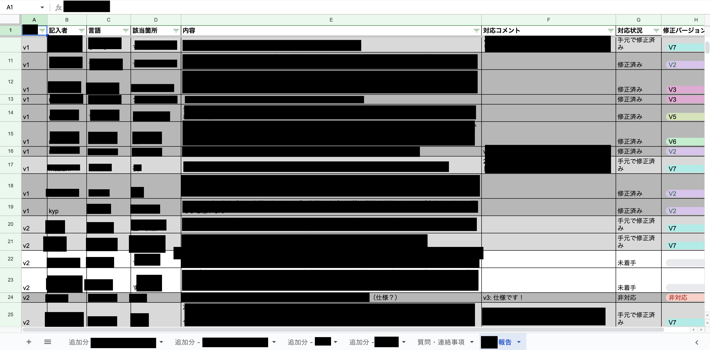

    <h4>機密指定</h4>
    

      情報保安ならびに戦略上の理由により、SAFE HAVN
      STUDIO（以下、当団体）は本記事の一部に現時点で公開すべきでない内容が含まれていると判断した。
    

    

      規定により、本記事は一部の機密情報に隠匿処置を施した上で公開される。なお、機密指定並びに隠匿処置は暫定的なものであり、当団体が別途指定する機密解除日以降は通常通りの閲覧が可能となる。
    

  

    <h4>機密解除</h4>
    

      当団体の指示により、本記事の機密指定は2024年6月18日をもって解除された。
    

     
    

      解除理由:
      <em>2024年6月11日を以て、体験版についての機密指定が解除されたため。</em>
    

  

皆さんこんにちは。SAFE HAVN STUDIOのkypです。3週間ぶりの更新となってしまいましたが、今回の開発日記をお送りいたします。

#### デモが出ます

さて、この日記は隔週更新なので、本来は先週の火曜日に出す予定だったんですが、1週間お休みさせていただきました。理由は、ちょうど体験版ビルドの締め切りが先週あたりにあったからです。めちゃくちゃ忙しかったです。火の車、死の行進、エナドリの缶タワー、そんな感じ。

これまでもゲームイベントなどに出展するためのデモは作ってきましたが、今回はSteam上で不特定多数に頒布されます。Steam！現実的な話をすれば、ウィッシュリストやその後の露出にすごく直結するイベントらしいし、感情の面でいっても、これまでSAEKOのことを応援してくれていた人に、初めて具体的な何かをお返しできる機会です。というわけで、少しでもクオリティの高いものを出そうと、気合を入れて......

......入れすぎた。これまでのSAEKOの開発では、作者がいちばん作りたい部分（巨大な女の子とか小人とか）ばかりに注力していて、それほど性癖ではないけどゲームとして必要な部分は後回しになっていました。具体的には、設定画面のUIとか、セーブ・ロードの仕組みとか。好きな部分を作っているときには、そういう「あって当たり前でなかったら困る」的な要素はすっぽり頭から抜け落ちているのですが、実際に体験版としてのリリーススケジュールが固まり、そろそろLQA用のビルドをFIXしなきゃいけないという段になると、急に「セーブ機能無しでリリースするのは恥じゃないか？」みたいな考えが脳裏から離れなくなります。

というわけで、LQA開始の1日前くらいにガッと実装しました。そして、バグりまくりました。

<figure>
    
    <figcaption>
      QA用のスプレッドシート。バグ報告でいっぱい 
      <em>2024/6/18追記: ここの内容は公開するとデモ内で放置されたバグがバレそうなので秘匿します</em>
    </figcaption>
  </figure>

それから。UIの実装が、翻訳用のテキストを提出したあとになってしまったせいで、実際にはバグの対応だけでなく、「やっぱこのテキストも欲しいんだけど（泣）」みたいに翻訳者の方に泣きつくことになってしまいました。３〜４回くらい。たびたび数十文字ずつの追加依頼が来て、きっとかなり面倒な対応だったと思いますが、最後まで追加テキストを訳出してくださった翻訳者のお2人（npckcさん・flankoiさん）には頭が上がりません。本当にありがとうございました。

スケジュールを組むときの教訓：ゲーム開発には見えないタスクがたくさんある。しかも勝手に増える。爆発的に。

 (2).zip")

本編のリリース時には同じ轍を踏まないよう、気をつけていきたい所存ですが……さっきふとスケジュールを確認したら、「6月末　本編のテキストだいたいFIX」って書いてありました。え、6月末ってあと1ヶ月ない！？それで本編！？む、無理じゃない！！！！！？？？？？？

頑張ります。

#### おわりに

さて、デモのリリースに向けて、この3週間はかつてないほど机の前に座っていました。デモを少しでも良く見せるために、UIだけでなく、絵や音楽も新しいものを作ったり。本来なら、そのへんの新しいコンテンツについてもこの日記で触れていきたいのですが、忙しすぎて忘れた！何をやったかも、何を感じていたのかもあまり覚えてないです。「ここが火星にならないかな〜」ってことくらい？火星は自転周期が24時間37分と地球よりわずかに長いので、締切直前に火星に移住することで作業時間をわずかに多く取ることができるのだ。

おしまい！
