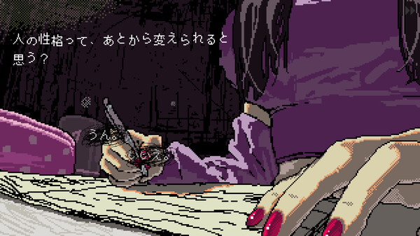
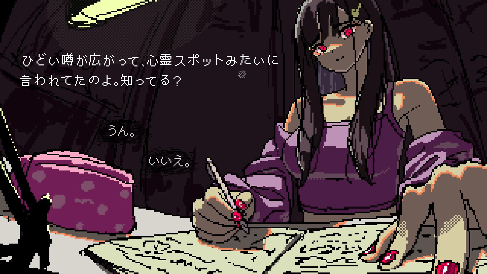
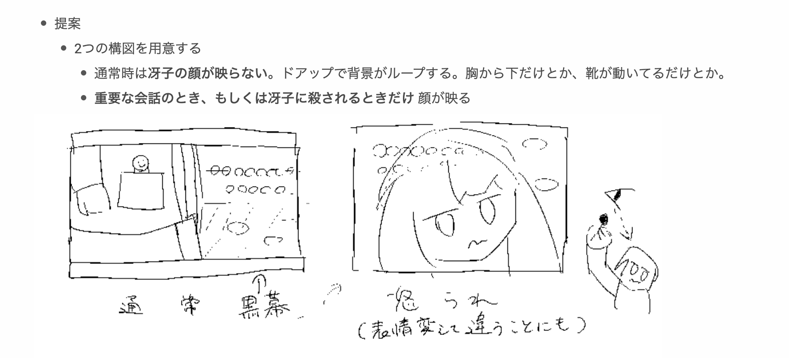
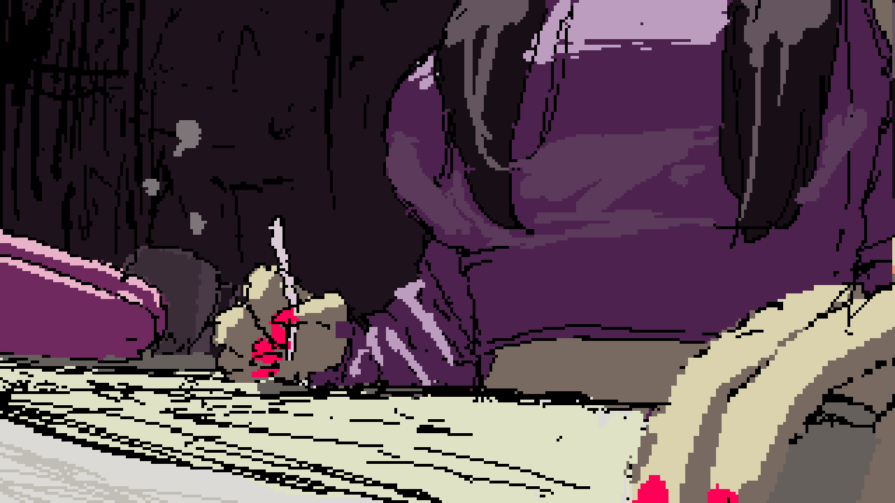
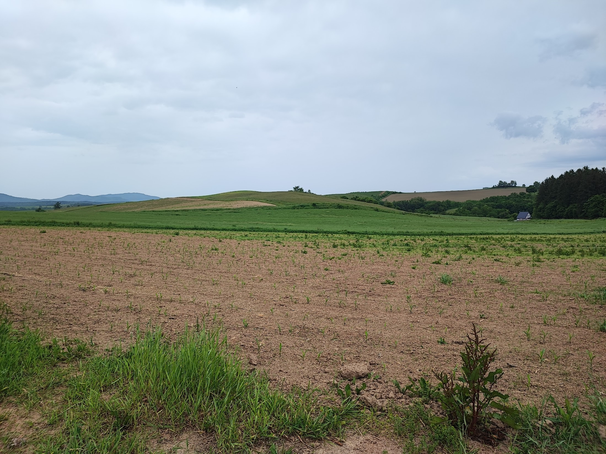

こんにちは！SAFE HAVN STUDIOのkypです。今回の開発日記をお送りします。

#### SAEKOの体験版を公開しました

<figure>
    <blockquote class="twitter-tweet">
      

        DEMO OUT NOW DEMO OUT NOW DEMO OUT NOW 
        <a href="https://t.co/L1Mbn3lBBt">https://t.co/L1Mbn3lBBt</a><a href="https://twitter.com/hashtag/saekogame?src=hash&amp;ref_src=twsrc%5Etfw">#saekogame</a>
        <a href="https://twitter.com/hashtag/steamnextfes?src=hash&amp;ref_src=twsrc%5Etfw">#steamnextfes</a>
        <a href="https://t.co/otMK5t74ld">pic.twitter.com/otMK5t74ld</a>
      

      — SAEKO: Giantess Dating Sim (@saekogame)
      <a href="https://twitter.com/saekogame/status/1800355603363287142?ref_src=twsrc%5Etfw">June 11, 2024</a>
    </blockquote>
    
  </figure>

ちょうど1週間前の火曜日に、SAEKOの体験版を[Steamのストアページ](https://store.steampowered.com/app/2492120/SAEKO_Giantess_Dating_Sim/)で公開しました。あわせて、このブログにも[デモについての記事](https://safehavn.dev/blog/2024-06-11-demo/)を書いています。

プレイしてくださった方々、本当にありがとうございます。公開してからの感想、ファンアート、配信など、いずれも開発者の想定を上回る量をいただきました。驚くとともに感謝しています。体験版の内容が内容なので、感想は賛否両論くらいのものを想像していたのですが、今のところは「好評」「圧倒的に好評」くらいもらえてそう。ありがとう！製品版のときも頼んだぞ！

配信について、私(kyp)には「自分の作品を他人がプレイしている様子が見られない」という呪いがあるので、基本的に見れていません。怖いから。ただ、他のチームメンバーは私より強い心を持っていて、主にkohが配信を巡回しまくり、有用そうなフィードバックや面白かった感想をこっそり教えてくれています。まじ感謝。収集してくれた感想を見る限り、どの配信も盛り上がっていて、かつゲームに対しての感想も好意的なようで、これも感謝しかありません。

ちなみに！体験版の公開は永続的なものではなく、どこかのタイミングで非公開に戻ると思います。ダウンロードしたけどまだプレイしていない的な人、ぜひ体調の良いタイミングでプレイしてください！お願いします（泣）

#### 体験版について（裏側の話）

せっかくの開発日記なので、体験版の開発について書きます。

これまでイベント出展では、昨年の9月の東京ゲームショウに出展したのと同じビルドを半年以上使ってきました。少しずつ、イベントビルドと実際の体験版の差が大きくなっていったのですが、これはSteamで体験版を出すときにドカーンとインパクトを出したいと考えたためです。

インパクト、出た気がする。どう？

イベントビルドのスクリーンショットやプレイ動画を見ると、現在の体験版とは、ほとんど全ての部分が違うことに気づくと思います。UIやアートワーク、それにゲームシステムなど。実はシナリオも違います。もともと去年の段階では、「製品版と異なる、スピンオフのような短いシナリオを体験版として公開したい」と考えていたのを、制作の事情で単純に「製品版のシナリオ冒頭を体験版として公開する」と決めたからです。

UIやいくつかのアートワークの変更は、単純な改良として進めました。ただ、いくつか大きく悩んだ改修があり、その一番大きなものは夜画面（冴子との会話シーン）の構図です。今回の体験版を出すにあたって、ここの感想はけっこうドキドキしながら見守っていました。

この変更はわりと遅めに行ったもので、今年の3月くらいに、開発がある程度進んできて、既に既存の構図で色々な差分ができていたので、すごく怯えながら提案した記憶があります。こんな感じで、怪文書を添えて。

実際、この変更はかなりリスキーでした。発表当初からSAEKOを追ってくださっている方々、まさにその既存の構図を気に入ってくださっていたからです。そして、新しい構図はかなり攻めています。可愛い女の子と話しているのに、画面にはその顔すら映らない。見えるのは身体の一部分だけ。

自分としても、思いついた瞬間は「ゾーン」みたいなのに入っていて、これでゲームが良くなるって信じてたんですが、実際kohにアイデアを見せたり、パブリッシャーに共有したりするときは、かなり自信なさそうにしていたと思います。

そして、描いてもらったイラストがこれ。ヒャッハー！

実際の体験版の構図は、これともさらに違います。なぜかというと、ここから画面の一部をさらにクロップしてもらったからで（ゲーム版はより極端に下だけが映っている）、その後も塗り方やら動きやらの全てに対してあーでもないこーでもないと意見を出した記憶があります。結果、お互いに意見を出し合いながら、十数回くらい修正を繰り返しました。

大変な作業でしたが、一方でこれは「SAEKOの美意識とは一体何だろう」みたいなことについて徹底的に言語化する良い機会になりました。その内容については、どこかで話す機会がありそうなのでここでは伏せておきますが、すごく有意義な時間だったと思います。

出来上がった現在の構図は、個人的には満足のいくものでした。それでもやはり、一度公開したビジュアルを大きく変える恐怖はあって、アニメーションやUIが一通りできたあとも、はたしてプレイヤーに受け入れられるかは常に不安でした。結果的には、色々な人の感想を見る限り、変更はプラスに受け止められたようです。今はすごく安心してるし、勇気を出して変更して良かったな〜と思っています。

#### おわり

体験版にはいろいろな新要素を詰め込んだので、いつまでも書き続けられそう。でもこの辺でやめておきます。製品版発売までに書くことがなくなってしまうから！

体験版の好評のおかげで、製品版の開発では余計な心配をすることなく、当初考えていた通りの方向性で開発を進められています。体験版から方向性の修正はしないまま、承転結の部分を作り込んでいく感じ。

個人的な話。体験版の締め切りが近く、LQAやらバグ修正やらで追い込まれていた時期に、衝動的に新千歳空港行きの飛行機とレンタカーを予約していました。出発は体験版公開予定の数日後。予約したあとには、なんてことをしてしまったんだと少し後悔したのですが、今はとても感謝しています。北海道のドライブ、すごい楽しかった。

部屋にこもってゲーム開発をしているとき、インターネットは見ないようにしようと常に思っています。手が勝手にスマホを開いちゃうんだけど。でも、北海道の山道を運転していると、楽天モバイルは圏外だし、そもそも物理的に手がハンドルから離せないし、久々に現実の世界に没入できました。太陽の光。道の形。そして自然。速度制限の標識を除いては、人間の悪意を感じるようなものはそこにはなくて、畑とか牧場とか、それに道路そのものだって、目に映るのは誰かの数十年の努力の証だけ。黙々とハンドルを握りながら、「悪意とか冷笑は発せられた瞬間に消える、だがポジティブな創造物はいつまでも残り続ける......」みたいなことを一人で考え続けていた気がします。やや恥ずい。

ま、まあ！数日間の旅行で、現実との繋がりみたいなのを取り戻せたのはすごく良かったと思う！いまは自宅に戻ってきて、スマホも遠ざけられるようになってきたし、ここからは製品版の完成に向けて頑張っていきます！アディオス！

おわり！
