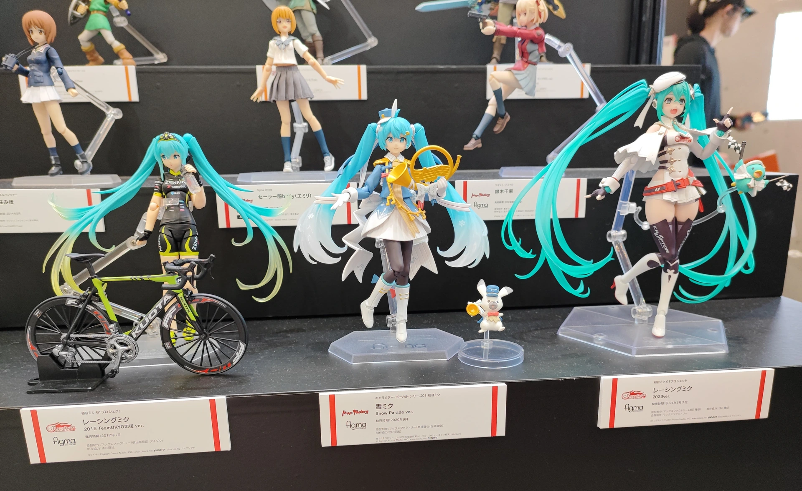
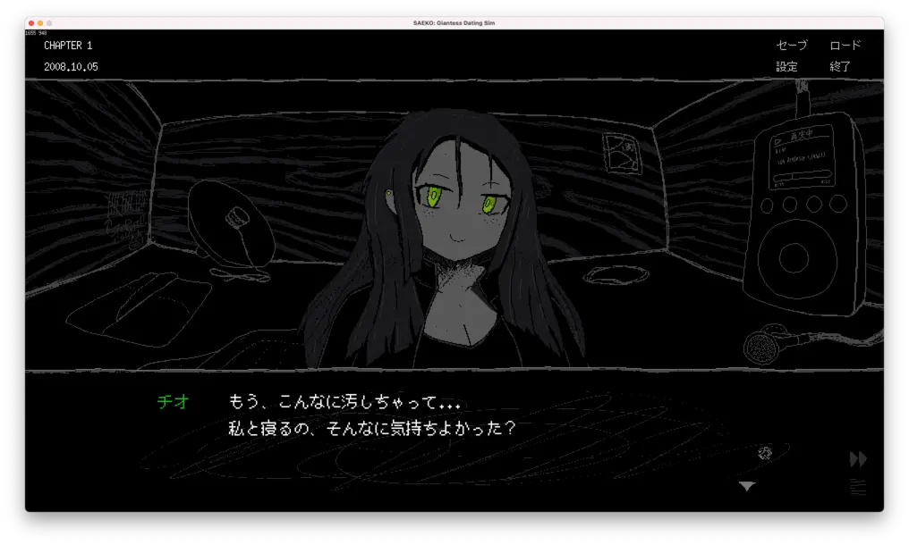
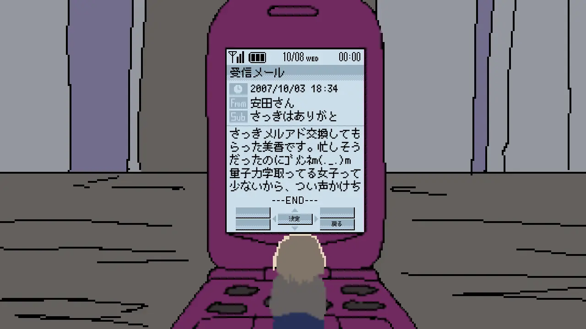

SAFE HAVN STUDIOのkypです。今回の開発日記をお送りします。

#### Tokyo Sandbox

<figure>
    <blockquote class="twitter-tweet">
      

        Tokyo Sandbox！
        <a href="https://t.co/cdYAP8DHFd">pic.twitter.com/cdYAP8DHFd</a>
      

      — kyp (@_newkyp)
      <a href="https://twitter.com/_newkyp/status/1804408185777983885?ref_src=twsrc%5Etfw">June 22, 2024</a>
    </blockquote>
    
  </figure>

6月22日に秋葉原で開催されたインディーゲームイベント、Tokyo Sandbox 2024にパブリッシャーのHYPER REALが参加し、SAEKOもデモの試遊機を展示しました。タイミングとしてはちょうどSteamで体験版を公開した直後で、多くの方に展示をプレイしていただいたり、あるいは既にご自身でプレイされた方から感想をいただいたりしました。改めて、参加者の皆様に感謝いたします。

ちなみに。当日、会場となったベルサール秋葉原では[Smile Fest 2024](https://www.smilefest.com/smilefest2024/)というグッドスマイルカンパニーの展示会もやっていて、こちらは会場の外にまで長い列ができるほどの盛況ぶりを見せていました。入場無料。めちゃ気になる。いや、とはいえ自分のゲームが展示されてるんだし、インディーゲーム開発者としては少しでも多くのゲームをプレイしてインプットを得るべきだし、今は長時間並んでまで可愛いフィギュアを愛でている場合ではない......！

負けました。とても可愛かったです。

#### 本編の開発やってる

6月11日のデモ公開から3週間ほどが経ちました。想定以上にたくさんの方にプレイしていただいており、改めて感謝しております。

Twitter・Discord・YouTubeなど、デモ公開直後はエゴサするたびに新しい投稿が増えている状況で、正直リリース直後はエゴサの鬼と化していました。ただ、そろそろ本編の開発に戻らなければいけません。そのため、現在は[AppBlock](https://appblock.app/)などあらゆる手段を借り、1日のごく限られた時間にだけSNSを見るようにすべく、懸命にFOMO（取り残される恐怖）と戦っています。

今の開発について。

6月中は主に本編のシナリオを書いていました。現時点で、エンディングまでのテキストを一通り書き終えています。

ただ、これはあくまでゲームに実装する前の素案みたいなもので、ゲームとして考えると足りないテキストがあるし、「// TODO: ここの雑談面白いやつに変える」みたいな未来への無茶振りまであったりして、とても100%完成とは言えません。それから、テキストとしては良い文章でも、実際のゲームに組み込むと長ったるいとか、ゲームシステムと矛盾するとかで修正が必要になるので、FIXにはまだ時間がかかるな〜という感じです。全体の完成度でいうと、だいたい60%〜70%でしょうか。

一方、シナリオを書く作業はとても楽しかったです。正直、「このゲームおもしれ〜〜〜」って思った。特に、中盤・終盤のシナリオは、これまで大まかなプロットだけを組んでいた部分なのですが、それが実際のキャラクター同士の会話だったり、ゲームシステム上の選択にうまく当てはまると、書いていて変な脳汁が出てきます。手が勝手にキーボードを叩いてる感じ。もちろん、テキストのFIXに向けてはまだまだやることがあるし、当初考えてた締切を守れるかも正直怪しいのですが、少なくとも今書いているものの肌感覚はだいぶ良いです。

結局のところ、シナリオの良し悪しは読み手の主観による部分が大きいので、万人にオススメできる何かができるとは思わないんだけど......少なくとも、体験版のテキストを気に入ってくださった方々にとっては、本編はさらに満足の行くモノになるんじゃないかと思っております。

あとは、SAEKOの舞台となる2000年代の雰囲気を出しつつ、読んでて楽しいフレーバー要素を追加するべく、デモには無かった全く新しい画面を作りたいな〜とも考えています。こちら現時点では画面の構想だけですが、今後数週間で実装にも入れるはず。頑張る！

#### おわり

というわけで、今週の開発日記は以上です！エゴサしまくっていた割には生産的だった気がします。これでエゴサを封印したら、きっと、次回はすごいことになるかも。

最後に！SAEKOの体験版をプレイしていただいたり、ウィッシュリスト登録してくださった方々に改めて深く感謝いたします。先日、[30000ウィッシュリスト突破](https://news.denfaminicogamer.jp/news/240617l)のニュースが出ましたが、現在の数字は......まあ......30000以上の何らかになっています。

創作物の良さと数字は関係ないと思うし、日頃は数字なんてどうでもいいと思いながら作っているのですが、その一方で、数字が伸びると、色々やりたかったことがやりやすくなるのかな〜と思っています。また、プレイ切り抜きのRT数とかならまだしも、ウィッシュリスト数は「作品を良いと思ってくれた人の数」に近似していると思うので、そういう意味でも後押しをもらっていてすごい嬉しいです。

この後押しを力にして、今後も誘惑に負けること無く、ゲーム開発を進めていこうと思います。例えば7月頭ということで、Steamのサマーセールもあったけど、どんな誘惑にも負けることなく......なく......

<figure>
    <blockquote class="twitter-tweet">
      

        向き合う
        <a href="https://t.co/44r20ijJr6">pic.twitter.com/44r20ijJr6</a>
      

      — kyp (@_newkyp)
      <a href="https://twitter.com/_newkyp/status/1807802456430289256?ref_src=twsrc%5Etfw">July 1, 2024</a>
    </blockquote>
    
  </figure>

為すべきことを為す。おわり！
