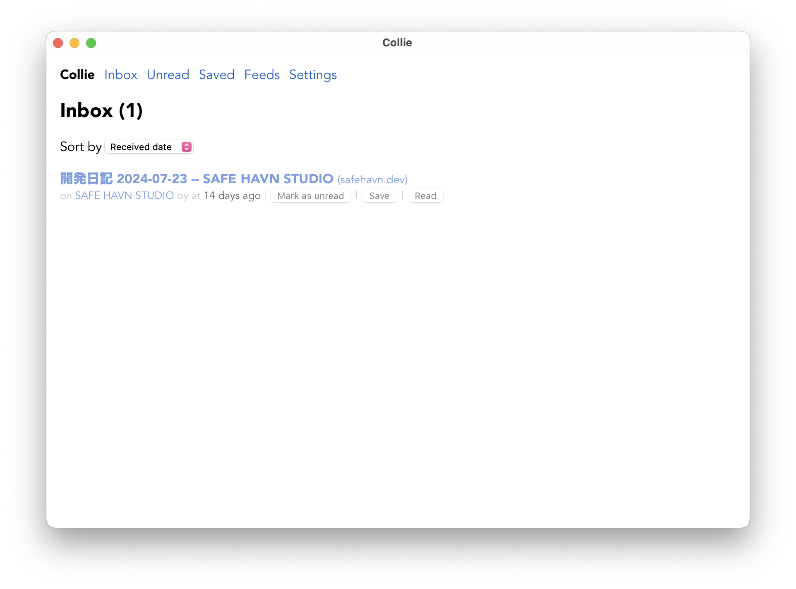
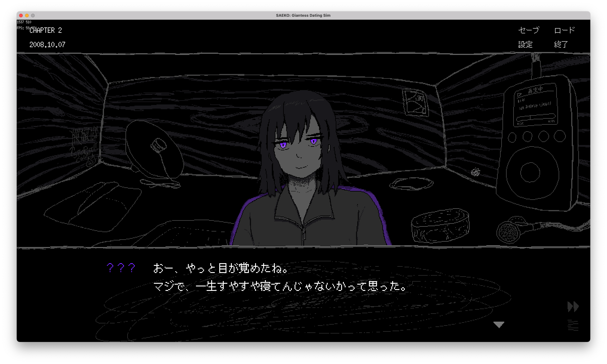

kypです。SAFE HAVN STUDIOに所属しています。開発日記をお送りいたします。

#### RSS対応した

本題に入る前に：このサイトがRSSに対応しました！RSSはいにしえのインターネットの技術で、お気に入りのウェブサイトを登録すれば、そのサイトやブログの更新通知を受け取れるようになる仕組みです。これがあれば、「TwitterやDiscordは使えないけど、[safehavn.dev](https://safehavn.dev/)の更新があればすぐに気付けるようにしたい」という需要にも対応できます（そんなことある？）。

RSSで通知を受け取るには、RSSリーダーと呼ばれるものを利用する必要があります。「RSSリーダー」で検索すれば、該当するWebサービスがたくさんでてくるのですが、個人的には[Collie](https://github.com/parksb/collie)がおすすめです。自分のPC上で動かせるアプリケーションで、無料だし、オープンソースだし、ミニマルな見た目もかっこいいです。

2000年代に戻って、みんなで個人サイトに引きこもろう！

#### めっちゃ開発してる

本題。めっちゃ開発してます！

Bitsummitが終わり、自宅に戻ってきたので、そこから毎日キーボードを叩きまくっています。たまにペンタブを取り出して絶望することもあります。悲しい。そんなときは、その悲しい気持ちを文章とかプログラムにぶつけています。

[先月](https://safehavn.dev/blog/2024-07-23/)に引き続き、現在のメインの作業は、エンディングまで通しで一度書き終えたテキストを、ゲーム内のスクリプトへと書き起こす作業です。ゲーム内でのテキストの見た目を確認し、後悔なく翻訳に送れる状態にしていきます。

正直なところ、この作業は想像の５倍くらい遅れています。これまでになく集中して作業に取り組んでいるつもりなんですけど、全然思ったように終わらないです。タスクの消化が遅いというより、思っていたより必要なタスクの量が多かった感じ。

当初の想定では、「シナリオをテキストで書き終えた＝ほぼスクリプト打ち込み完了」だったんですけど、実際にテキストをゲーム内のスクリプトに移そうとすると、テキストでは見えなかった問題点が出てきます。ゲームとしては文章が長すぎたり、分岐の考慮が足りなかったり、そもそもの設定との矛盾が見つかったり。で、それを解消するタスクは、実際に打ち込む文字数は少ないんだけど、うんうん唸りながら考え込む時間が必要で、ときにはどうしても思いつかなくて散歩したり、ふて寝したり、うっかりYouTubeを開いたり、そんな感じで毎日が過ぎ去っています。ああ......。

テキストの遅れは色々なところに影響が出るので、作業の遅れは正直あまり良くなさそう。カレンダーを見ながら絶望する日々が続いています。でも、ノベルゲームとしてはテキストの質って何より大事だと思うし、１つ１つの改善は確実に良い結果を生んでいると思うから、この作業を省きたくはない......。難しいところです。土下座の練習をしようとよく思うのですが、たぶん普通にお菓子とか持っていったほうが喜ばれますよね。

期日通りにテキストを完成させるのが一番喜ばれる？まじで、それは、そう......。

それから、文章を考えるのはすさまじく集中力を使うので、体力がないときには立ち絵とかも描いています。どの小人も良いキャラをしてるので、ほんとはもっと色々見せたいんだけど、、、あまり見せすぎてもそれはそれでネタバレになりそうなので、この開発日記でどう扱うか難しいな〜と思っています。

#### その他

[前回の記事](https://safehavn.dev/blog/2024-07-23/)で触れた通り、Bitsummitに合わせてパブリッシャーの方がちょっとしたイベントを企画していて、kypも本来は短めのDJパフォーマンスをする予定になっていました。残念ながら、体調不良で出演をキャンセルしてしまったのですが、セトリはほとんど出来上がっていたので、改めてミックステープとしてYouTubeに公開することにしました。

<figure><iframe width="560" height="315" src="https://www.youtube.com/embed/36aIVFDlSK4?si=5UkoOZ8WCFuyrP7_" title="YouTube video player" frameborder="0" allow="accelerometer; autoplay; clipboard-write; encrypted-media; gyroscope; picture-in-picture; web-share" referrerpolicy="strict-origin-when-cross-origin" allowfullscreen=""></iframe><figcaption>丁寧な編集</figcaption></figure>

何曲かSAEKOの音源がありますが、これが本当に大変でした。自分で作った曲は、ゲームのBGMとしてはそれなりに気に入っているのですが、プロが作った他の曲と比べると、音量バランスとかアレンジとか、色々な部分で圧倒的に負けています。

そこで、実際にDJで流すと決めた曲については、改めてプロジェクトファイルを開き、ミキシングやアレンジなど様々な部分をやり直しました。大変な作業でしたが、結果的には「プロと比較した自分の音源の改善点」みたいなのも分かって、DTMの技術を上げるための良い訓練になったんじゃないかなと思います。

それから、せっかくなのでmixの中身について。パブリッシャーが主催するゲーム主体のイベントとあって、当初はどういう曲を流すか迷っていました。ゲーム系のイベントだし、好きなゲームのBGMを中心に流すべき......？だけど、ゲームのBGMは当然DJ用に作られていないので、シームレスに繋ぐためには色々な技術が必要で、初めてDJをする＆そんなにゲームの引き出しもない自分が綺麗に繋ぐのは無理だろうと思いました。そこで、「SAEKOのBGMに影響を与えた曲を紹介する」という方針に変えて、ゲームとは何の関係もないGrime/140だったり、Breakcoreだったりの曲を入れました。趣味全開。たのしかった！

ちなみに、MIXの前半に流している曲はいわゆる[Deep Dubstep/Grime/140](https://www.beatport.com/genre/140-deep-dubstep-grime/95)に分類されるような曲で、なかでも少しメロディアスな[Deep Heads](https://soundcloud.com/deepheads)や[Chord Marauders](https://soundcloud.com/chord-marauders)のリリースを中心にまとめています。ミックス用に聞いていて、改めて先人たちのクオリティやばいな〜と思いました。SAEKOのBGMも、リリースまでにもっとカッコよくしていきたい、、、！

<figure><iframe width="100%" height="300" scrolling="no" frameborder="no" allow="autoplay" src="https://w.soundcloud.com/player/?url=https%3A//api.soundcloud.com/tracks/609833604&amp;color=%23ff5500&amp;auto_play=false&amp;hide_related=false&amp;show_comments=true&amp;show_user=true&amp;show_reposts=false&amp;show_teaser=true&amp;visual=true"></iframe>
<a href="https://soundcloud.com/geodedub" title="Geode" target="_blank" style="color: #cccccc; text-decoration: none;">Geode</a> · <a href="https://soundcloud.com/geodedub/geode-studio-mix" title="Geode - Studio Mix" target="_blank" style="color: #cccccc; text-decoration: none;">Geode - Studio Mix</a>

</figure>

終わり！
