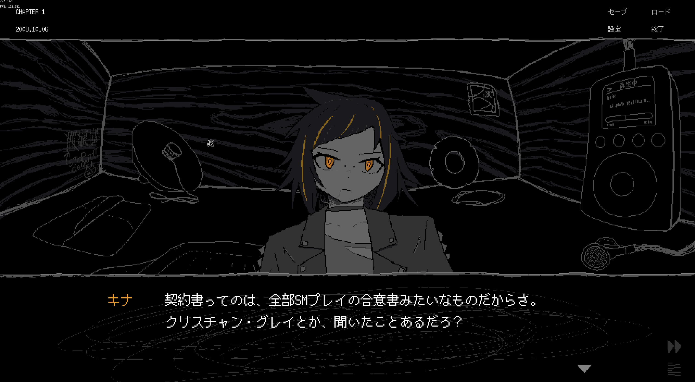

私はSAFE HAVN STUDIOのkypです。この記事は2024年9月3日の開発日記です。

#### 開発してる

最近、全く同じ内容を書いているような気がしますが、この2週間もシナリオの執筆を進めていました。

チーム外のフィードバックをもとに、いくつかの部分は大々的に書き直しました。最初に書いたものより、かなり良くなっている感覚があります。シナリオを書く作業はパズルと似ている気がしていて、何もしっくりハマらなくて苦しんでいるときと、急に「正解」のピースを掴んで全能感に溢れているときがあります。今はわりと後者です。テキストを読み返すと、「そうそうこの展開がやりたかったんだよね〜」という納得があります。新しいテキストに差し掛かったらまた絶望に戻るんだけどね！

今回もシナリオの作業なので、見せられるようなスクリーンショットは少ないです。ただ、２週連続で何も無いのも寂しいので、１枚だけ貼っておこうと思います。キナというキャラクターで、おそらく開発日記には初登場です。ここは立ち絵もセリフも大好きな部分で、多少の時代考証を無視してでも固有名詞（元ネタ[Fifty Shades of Grey](https://www.amazon.co.jp/Fifty-Shades-Grey-Book-ebook/dp/B007J4T2G8)の発売は2011年、[和訳](https://www.amazon.co.jp/dp/4152093307)は2012年）をぶっこんでいます。なぜかというと、固有名詞があったほうが気持ちいいからです。

自分はSFやサイバーパンクみたいに、知らないカタカナ語で小気味よく進む文章が好きです。理解はできないけど、目を滑らせてるだけで気持ちよくなる、みたいな。そういう文章を書く側に回るためには、対象への膨大な知識が必要になると思うのですが、まあ、SAEKOに登場するような知識は得意分野です。

余談ですが、[フィフティ・シェイズ・オブ・グレイの和訳](https://www.amazon.co.jp/dp/4152093307)はすごく好きです。SMの要素はあるけど、実際のプレイの描写は控えめで（というかほとんどない）、どちらかといえばグレイとアナスタシアの恋愛小説として読むことができると思います。和訳も丁寧で、アナスタシアのコミカルな心理描写も好き。設定が都合良すぎって思うこともあるかもしれないけど、まあ、それはそういうジャンルだから！

シナリオを書いてると、一生使わないだろうと思っていた知識が突然役に立ったりします。これも文章を書くことの楽しみかもしれません。

#### その他

[Ebitengine ぷちConf \#3](https://gocon.connpass.com/event/322222/)というイベントで、「Ebitengine製ゲームをチーム開発するために」というテーマで発表しました。太字がガビガビになっていますが、当日のスライドも公開しています。

<figure>
    <iframe class="speakerdeck-iframe" style="
        border: 0px;
        background: rgba(0, 0, 0, 0.1) padding-box;
        margin: 0px;
        padding: 0px;
        border-radius: 6px;
        box-shadow: rgba(0, 0, 0, 0.2) 0px 5px 40px;
        width: 100%;
        height: auto;
        aspect-ratio: 560 / 315;
      " frameborder="0" src="https://speakerdeck.com/player/8be8b497767e4a488b3426e35286d933" title="Ebitengine製ゲームをチーム開発するために" allowfullscreen="true" data-ratio="1.7777777777777777"></iframe>
  </figure>

[Ebitengine](https://ebitengine.org/ja/)をSAEKOの開発に採用したのは完全に趣味で、実装してて「楽しい！」という気持ちを強く感じたためでした。だけどその頃は、SAEKOがこんなに大きいプロジェクトになるなんて思ってなかったはず。規模が増えまくった今でも、Ebitengineを書くのはやっぱり楽しくて、（QA期以外の）プログラミングは一番好きな作業なのですが、「ほんとにこれで正解だったのか？」みたいなのは時々思います。特にQA中に。

うーん......答えはまだ見えてない......。でも、選んだことを後悔しないためには、

1.  ゲームをバグのない状態で、他のエンジンを使ったのと遜色ないクオリティに仕上げる
2.  Ebitengineを選んだからこそできることをやる

という２つをやりきるしかないのかな〜と思っています。ナレッジを公開するのも、(2)に入るかな。ゲームを作るだけでユニークな経験ができ、発表すると褒められたりします。

ゲーム開発が後半になるにつれて、正直、自分の関心は徐々に技術的な部分を離れ始めている気がします。今回の発表も、「ツールを実装するのは楽しい。でも、楽しいからこそ、余計に作りすぎないよう気をつけないといけないよね」というスタンスでした。技術的関心でEbitengineに関心を持っている人とは、たぶん真逆の発想なので、話していて心苦しくなるときもある。

ただ、「Ebitengineで商用ゲームを作りたい」って人がいれば、やっぱり現実的な心得みたいなのも必要になると思うし、そういう意味で自分が考えたことは残していきたいなーと思っています。技術のカンファレンスで発表する内容ではない気がするので、開発が無事に終わったら、ブログとかにまとめられたらいいな。

以上。終わり！
