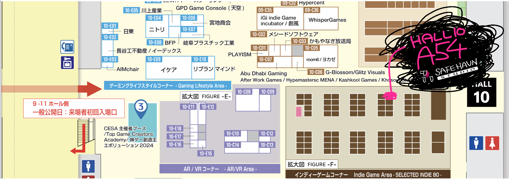
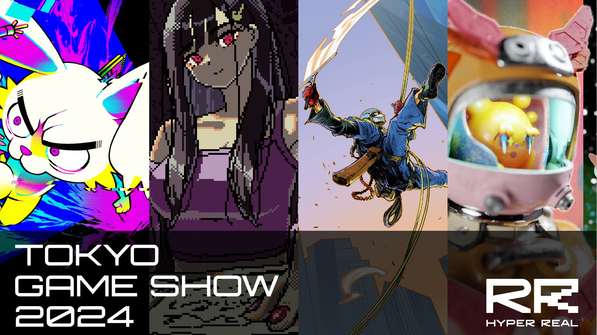
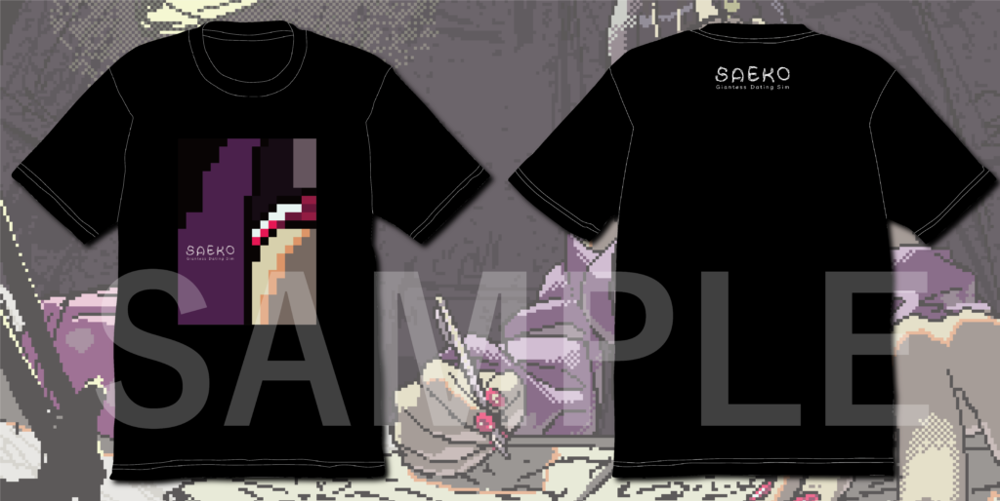
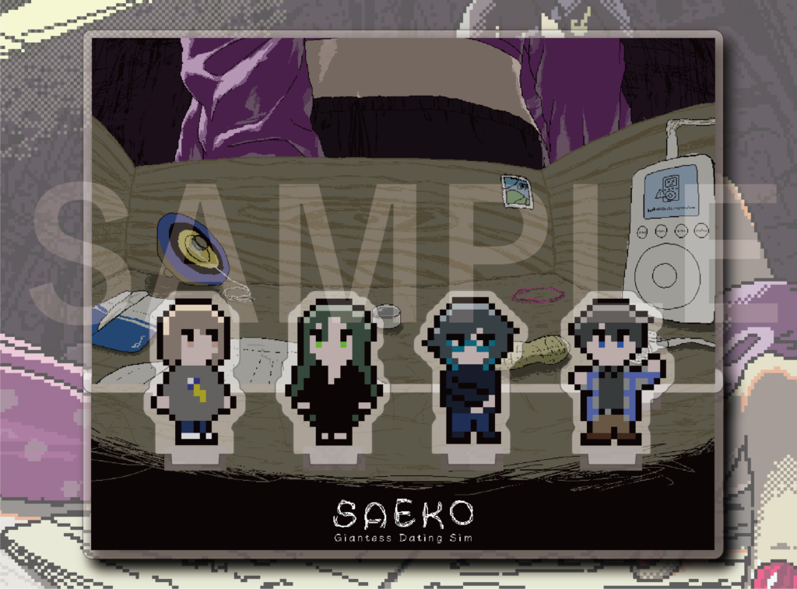

[東京ゲームショウ2024](https://tgs.nikkeibp.co.jp/tgs/2024/jp/)は9月26日〜29日に開催され、SAEKOもなんと複数の場所に登場します。怒涛の展開に開発者も混乱しており、SNS告知でホール名を間違えたりしていたので、メモを兼ねてこちらのブログに出展情報をまとめようと思います。

#### SAFE HAVN STUDIO

<u>場所: ホール10 Selected Indie A54</u>

今年の東京ゲームショウには、なんとSAFE HAVN STUDIOとしての出展があります。内容は体験版ビルドとグッズの展示です。体験版はSteamで配信中のものと同じもので、グッズは会場内の別ブース（後述）で購入できるものと同じです。

なので、まあ、「ここだけで体験できる先行コンテンツがある！」とかではないのですが、装飾は少し凝りたいと思っています。また、日本語/英語でのフライヤーも配布します。記念にぜひお持ち帰りください。

それと、このブースでは基本的に私を含めた開発メンバーが接客することになると思います。巨大な女の子（または可愛い男の娘）の来場をお待ちしています。

#### HYPER REAL

<u>場所: ホール9 インディーゲームコーナー W36</u>

昨年に引き続き、パブリッシャーであるHYPER REALのブースでもSAEKOの試遊展示を行います。他にも沢山の良いゲームがあり、開発メンバーの1人はイベントに参加するたびに試遊して上達を確かめているそうです。

また、こちらのブースでは、来場者の方にHYPER REALオリジナルのノベルティ配布が行われるようです。詳細は、[HYPER REAL様のホームページ](https://hyperreal.jp/tgs2024-titilelineup/)をご覧ください。

#### IGN JAPAN STORE

<u>場所: ホール11 C10</u>

IGN JAPAN STOREでは、SAEKO史上初のオリジナルグッズ販売が行われます。品目はオリジナルTシャツ・オリジナルアクリルスタンドの2種類です。アクリルスタンドはなんと原寸大！ゲーム中の設定そのままに、好きなキャラクターをあなたの手の中に収められます。

価格などの詳細については、判明次第またこちらに記載させていただきます。

<figure>
    
    
  </figure>

というわけで、SAEKOの登場するブースは以上の3つです。東京ゲームショウにお越しの際は、ぜひお立ち寄りください！友達と来てもいいです。家族とかとは......たぶん来ないほうがいいと思う。

以上！終わり！幕張で会おう！
