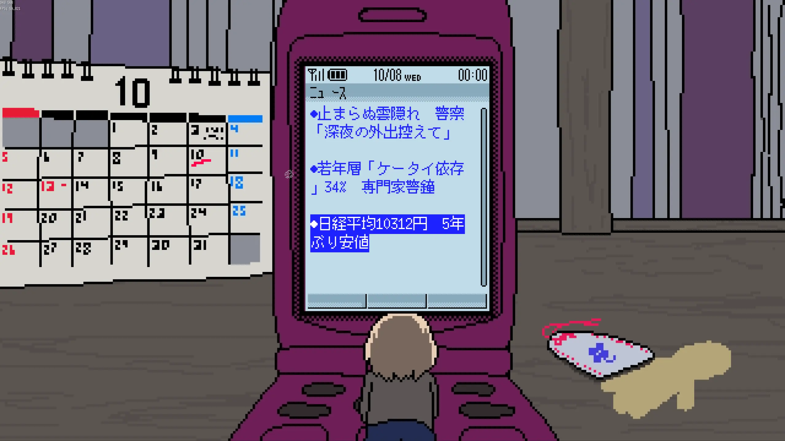

kypです。これは開発日記です。

#### SAEKO開発してる

開発してます。ここ数回ずっと同じ内容だけど、今もまだテキストを書いています。終盤以外はできていて、量としては全体の75%くらいが終わったんじゃないかと思います。嬉しいです。

規模が大きくなってきたし、分岐やシステムとの整合性とかもあって、書いているときはうんうん唸っていた記憶があります。でも今、出来上がったものを見ると、わりと良く書けた気がする。書いているうちにどんどんアイデアが膨れていって、プロットのときは思いもしなかったキャラクターが大好きになったりしています。

シナリオは実際のゲームスクリプトとして書いているので、ビルドに組み込んでチーム内の人に見せたりしています。パブリッシャーとかにも見せるはず。自分と同じくらい気に入ってもらえたら嬉しいな〜と思いますが、けちょんけちょんに言われてもそれはそれで気持ちいいので大丈夫だったりします。

ちなみに、ゲーム内で携帯電話が登場するので、その画面で表示されるフレーバーテキストも少しずつ書いています。ゲームの舞台は2008年10月に設定されていて、もともと深い理由があるわけではないのですが、調べたらリーマン・ショックの直後だったことが分かってびっくりしました。まだ子供だったし、その時代にさほど詳しいわけではないのですが、フレーバーテキストなども使いながら2000年代の日本の不安定さ（と夢）を遠景に描けたらいいなと思っています。

#### その他

TGSが終わって2週間が経ちました。一生の記念に残るようなイベントで、今でもその余韻に浸っているのですが、同時に全てを忘れようとしています。unlearnというか、意図的にドアの外に放り出すような感じ。

読まれることを意識しすぎると文が書けなくなってしまう、というのが理由です。性癖でも、それ以外の文章でも、なんというか書いている最中は他人のことを考えてはいけないような気がします。自分の好みだけを考える。そのために、今は一部の記憶を意図的に見なかったことにしています。１つ１つの記憶は嬉しかったり楽しかったりしたものがほとんどなので、大変心苦しいです（SAEKOを作り終わったらたくさん思い出してニヤニヤします！）。

付け加えると、今は自分が「インディーゲームの界隈に属している」とも思わないようにしています。たぶん実際属してないし。例えば東京ゲームショウのホールでは、周りに素晴らしいインディーゲームが沢山並んでいたけど、自分はゲスト枠で招かれた別の何かだと思ったりしていました。そうすることで、色々な思考から距離を置けます。まあ、もともとそんな界隈存在しないんだけど......なんというか......分かってほしい。我々はみな孤独なのだ。

おわり！
