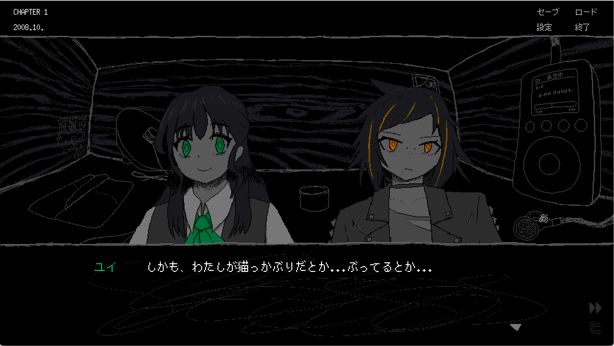

kypです。これは10月29日の開発日記です。

#### 池袋PARCOにSAEKOのグッズが展示されてた

10月18日から28日まで、池袋PARCOにSAEKOのグッズが展示・販売されていました。あまりリアル展開とかに興味ないほうがカッコいい気がするし、私も当初はクールに決めようと思っていたのですが、結局ドキドキしながら開催初日に見に行きました。[Milkシリーズ](https://store.steampowered.com/app/1392820/Milk_inside_a_bag_of_milk_inside_a_bag_of_milk/?l=japanese)、[ゆめにっき](https://store.steampowered.com/app/650700/)などと一緒に自分の作品が並んでいるのがとても嬉しかったです。

<figure>
    <blockquote class="twitter-tweet">
池袋パルコ行った！SAEKOめっちゃいいとこに置いてもらってる！Milkのシャツ2枚買っちゃった！ <a href="https://t.co/iG10hlEbU4">pic.twitter.com/iG10hlEbU4</a>
— kyp (@_newkyp) <a href="https://twitter.com/_newkyp/status/1847186289562640761?ref_src=twsrc%5Etfw">October 18, 2024</a></blockquote>  

  </figure>

アクセスしやすい百貨店という場所も相まって、ゲームイベントより一段と「現実」に創作が食い込んできた感じがします。職場でこの話をして、次の週オフィスに出社したら、複数人がSAEKOのTシャツを着て仕事していました。恐ろしい世の中です。

また、SNSでも複数の購入報告を見ることができました。こちらは応援していただいているお気持ちの現れだと思うので、とてもとても嬉しいです。ご購入ありがとうございました！

#### 文章だいぶ書き終わった

開発の話。体験版のリリースが終わってからずっと、シナリオの執筆を進めてきました。絵や翻訳を準備する都合上、早めにテキストが出来上がっている必要があるというのが理由です。ただ、そろそろ全体の7〜8割くらいのテキストを書き終え、翻訳作業も少しずつ始まったので、ようやく他の作業をする余裕が生まれ始めています。

やりたいときにやりたい作業ができるというのはとても嬉しいことです。自分は文章・（一部の）絵・音楽・プログラムを書いていますが、それぞれ微妙に脳の違う部分を使っていて、１つの作業をずっと進めているとその部位だけが疲れてくるし、逆にある作業をしていると脳の他の部分が別の作業のアイデアを考えついたりしてくれます。なので、自分の場合は違う作業をぐちゃぐちゃに織り交ぜながら進めるのが一番楽しく、文章の締切が一段落したおかげで、絵やプログラムなどの他の作業にまた没入できるのがとても嬉しかったです。

というわけで、ずっと放置していたキャラクターの立ち絵を描いたりしました。左側の立ち絵はユイというキャラクターで、数ヶ月前にkohからキャラデザ資料をもらっていました。すごく好きなデザインだったのですが、なぜか自分で描こうとすると全然可愛くならず、失意のあまりずっとWIPのまま放置していました。今、時間を取って描けたものを見ると......まあまあ......可愛く描けたんじゃないかな。

<figure>
    
    <figcaption>出典: <a href="/blog/2024-07-23/yui_rafu.png">開発日記 2024-07-23</a></figcaption>
  </figure>

キャラクターの数が増えてきて、描いた時期も１年くらいの隔たりがあり、キャラごとの絵柄が微妙に統一できてなかったりします。スクリプト打ってると気になる。でも、絵柄は変わり続けるものだし、いま調整してもまた後で「何この古い絵柄！」って思うかもしれないです。リリース直前くらいのタイミングで、がっつり時間を取って手直ししたいな〜と思っています。

#### おわり

何ヶ月も集中して取り組んでいたシナリオの作業が一段落して、いまはかなりリラックスした気持ちになっています。好きな作業ができているから、目先の締め切りが一旦なくなったから、というのもあるし、あと、すごく正直に言ってしまうと、書き終わった文章を読んで「良いシナリオが書けたな〜〜〜」と自分で満足できているところがあります。

この数ヶ月、過激なシナリオを書くことについての抵抗があって、開発日記とかでも謎の長文を書いたりしました。ただ、大変だった作業が終わり、いま書き終わったテキストを読むと、「過激にしておいてよかったな」と強く思います。自分は人の死なない綺麗な創作も好きだし、剥き出しの過激さそのものについては今でも100%賛成できるわけではありません（正直、「性癖を出そう」みたいな流れにも乗れなかったりする）。だけど、一方で、過激で特殊な創作には、過激で特殊な部品でないと表現できない価値観みたいなものがあって、それをきちんと作品の中で表現できると、死体とかおしっことか汚い部品たちが美しい芸術に生まれ変わります。

笛地先生の原案小説とか、家畜人ヤプーとかサドとかバタイユとか、奇譚小説として読まれているものには少なからずそういう美しさがあって、そして自分はそういう過激な美しさが何より好きなんだと思います。今回、SAEKOのシナリオをある程度書き終えて、もちろんそういう偉大な作品たちの足元には全然及ぶべくもないのですが、それでも「過激なテーマじゃないと書けない美しさ」みたいなきらめきはほんの少し再現できたような気がします。ただ過激なんじゃなく、その過激さに意味を付与できたというか。

もちろん、結局、リリースされるまで最終的な受け取られ方は分からないし、こうやって日記に書けば書くほど自分の首が絞まっていく気がする！プレイするときはここの内容は全て忘れてください。私も明日から謙虚な人間に戻ります。

おわり！
