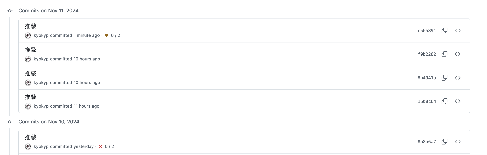

今回の開発日記は薄味です。いよいよ書けることがないからです。

#### 最近の作業とか

前回の開発日記でお伝えした通り、ゲーム内のシナリオは大部分が書き終わりました。ゲームとしての、終わりの形も見えてきた感じ。そこで、今は「テキストだけ100%書き進める」というフェーズを脱して、立ち絵の差分や分岐の実装など、細々したタスクをこなしながら残りのテキストを書いています。

それと、いよいよローカライズの工程が始まるので、翻訳者の方に作業していただくための資料やスプレッドシートの準備も行いました。こちらは創作というより事務的な仕事ですが、キャラクターの説明資料を作りながら年齢や裏設定を考えたり、スプレッドシート内のテキスト総文字数をカウントするためにIF関数まみれの計算式を組んだり、わりとノリノリで楽しく進めることができています。翻訳用の注釈を入れるのは楽しいです。プレイヤーには決して公開することの出来ない情報を書くことができます（例：この一連のセリフは◯◯◯が✗✗✗であるという裏設定を反映していて......）

自分の文章に翻訳者がつくというのは大変恐れ多いことで、テキストを渡すときにも、とてもすごく緊張します。内容がひどすぎて、一読した瞬間に契約を解除されたらどうしよう？

それは冗談としても、物語の翻訳とは原語のテキストを深く読み込んでもらって、一度翻訳者の脳内で概念に変換したのち、もう一度別の言葉で語り直してもらう......みたいなプロセスだと思います。自分の書くテキストはそんな域にまで達しているのだろうか、とか考えると、不安で推敲が止まらなくなります。そして編集履歴を見ます。「直す前のほうが良かったんじゃね？」ってなったりします。そして戻します。無間地獄です。うわあああああ。

体験版のときもそうでしたが、翻訳していただいたテキストを読むのは楽しいです。いま書いている文章には本当にひどい内容が含まれているので、渡しながら申し訳ない気持ちになることが多いのですが、自分の書いたシナリオが他の言語で表現されているのを見ると、なんというか幸せな気持ちになります。

もし翻訳者の方がここを見ていたら、契約を解除しないでいただけるとありがたいです。

#### スケジュール管理とか

自分はスケジュールやタスク管理的なものが苦手で、体験版を出してからは一度完全に放り投げていたのですが、少しずつまた残りタスクの起票などを始めています。シナリオの大半が書けて、リリースまでの残りタスクがハッキリしてきた、というのが理由だと思います。

ネットを探しても、ゲーム開発のスケジュール管理についてはあまり情報が見つからず、色々な方法を試行錯誤しながら試しています。創造性とは真逆の部分だし、ほとんど仕事の方法論みたいな話になってしまいそうなのですが、ある程度自分たちで方法を確立できたら、今後の開発日記でも紹介していきたいな〜と思います。

#### おわりに

今回はそんな感じです！特に悩みとかもないです。ノベルゲームを作る上で、一番の肝になる部分はもう出来たと思うので、あとはあまり余計なことを考えず、淡々とゲームとしての完成を目指す方向になるのかなと思います。この日記に書くことを探すのが一番の課題になりそう。

おわり！
