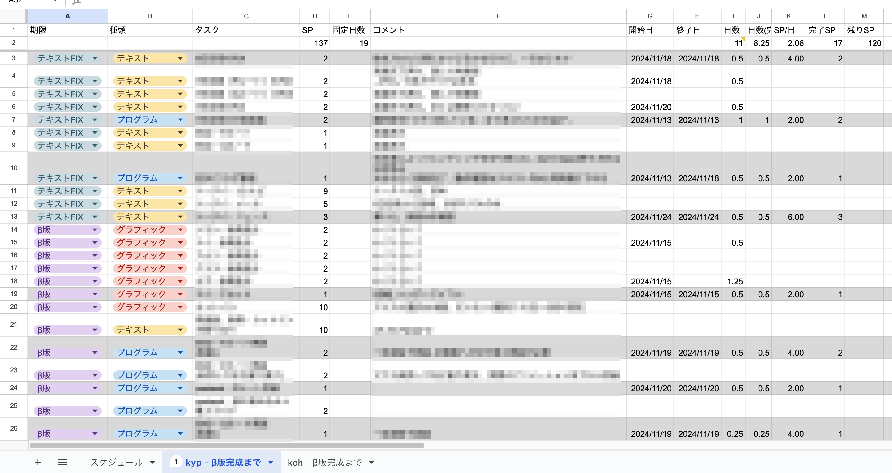
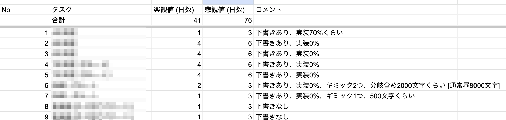
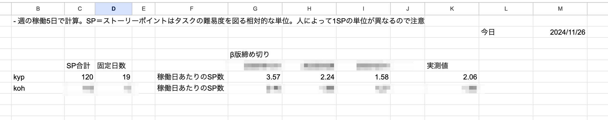

今回の開発日記では、SAEKOのスケジュール見積もり手法について紹介します。同じく小規模ゲームを開発している人の役に立ったらいいな〜と思います。

#### はじめに: インディーゲーム開発とスケジュールマネジメント

いまのゲーム開発の世界では、開発が完成してからゲームを公開することはほとんどないと思います。大体は、開発中から情報発信を行い、実際の発売日までに少しでも多くの注目を集めることを目指します。そして、イベントに出るにしろプロモーションを行うにしろ、発売予定時期はとても大切な情報です。

ただ、開発完了時期の見積もりはとても難しいです。「x年y月発売予定」と言っても、その根拠は個人の勘でしかなく、実際には外れまくることがよくあるのではないでしょうか。

私はあります。そして現在進行系でその影響に苦しんでいます。

個人/小規模チーム開発では、仕様やプロットなんて決まっておらず、したがってスケジュールも立てられないことがほとんどだと思います。一方で、開発が進んでゲームに関わってくれる大人が増えてくると、どうしても「発売日の予測」を立てないといけないときがやってくると思います。

私達も、ここ数ヶ月で発売日を決める必要が出てきたのですが、初めての経験だったのですごく苦労しました。ネットで「スケジュール　見積もり」で出てきた方法を調べて、それであんまり良く分からない結果になったり。

ただ最近、数回の試行錯誤と調整を経て、ようやく自分たちに合う見積もり方法を見つけたように感じます。今回の記事では、その内容を紹介したいと思います。

#### これがSAFE HAVN STUDIO流のスケジュール管理だ

いきなりのデカめのスプシで恐縮です。SAFE HAVN STUDIO流のスケジュール管理で一番重要なのは、

1.  完成までに必要なタスクをできるだけ細かく書き出すこと
2.  それぞれのタスクに対して、**難しさを相対的なストーリーポイントで記載すること**

です。

2について説明します。もともと、私たちは具体的な日数を使った見積もりを試していました。「楽観値」「悲観値」は「うまく作業が進んだ場合」「進まなかった場合」に対応していて、「楽観値4、悲観値6」のタスクは「うまくいけば4日、苦戦すれば6日」という意味になります。ググると、2点見積もりとして真面目なソフトウェア開発で出てくる手法です。

ただ、この方法には問題があります。それは、「前もって日数を考えるのが難しいこと」「余計な心配で悲観値の数字が増えがちなこと」「**見積もりがノルマみたいになって開発が辛くなること**」です。自分は最後が一番つらかったです。

そこで、今の見積もりでは、タスクの必要時間を見積もる単位として日数を使用しません。その代わり、具体的な日付には紐づかない、抽象的な難易度の単位を用意します。それが「**ストーリーポイント**」です。私は簡単にポイントと呼んでいます。

まず、簡単で自分が良く知っているタスクを用意します。私の場合は、「１キャラの表情差分を全て描く」です。次に、「そのタスクの難しさ」＝「３ポイント」とします。これを基準として、あとはそれ以外のタスクの難易度を同じポイントの単位で表していきます。「一枚のアニメーションを描く」だったら１ポイントだし、逆に「セーブ・ロードのUIを新規実装する」とかだと８ポイントくらいになります。**タスクはできるだけ分解して小さくすること**、**あとで直すつもりであまり深く考えすぎないこと**がポイント（！）です。

ストーリーポイントは実際の日数に結びつかない単位なので、この一覧から直接完成予定日を求めることはできません。

しかし、実際に作業を始め、何ポイント分の作業を何日でこなせたか記録すると、「1日あたりの完了ポイント」が求められるようになります。そして、完成予定日は以下の式で求められます。

                合計ポイント(SP) ÷ 稼働日あたりのポイント数(SP/日)
                = 締め切りまでの稼働日数(日)
              

上のスプレッドシートでは、完了したタスクに要した日数を記録することで、「合計SP数 / 合計日数」から1日あたりの完了ポイントを算出できるようにしています。この数字を元に、すべてのタスクが完了するまでの日数を予測できます。

#### 闇の数式

現実のインディーゲーム開発では、「すべてのタスクが完成したら出す」なんてことを言える余裕はほとんどなく、実際には「この日までにすべてのタスクを終わらせる」という**覚悟の問題**が発生します。

そんなとき、ストーリーポイントを使った見積もりでは、以下の数式が成り立ちます。

                合計ポイント(SP)÷締め切りまでの稼働日数(日)
                ＝稼働日あたりのポイント数(SP/日)
              

この式を使えば、例えば締め切り候補日をいくつか設定して、「10月までに完成させるには2.0SP/日」「11月までに完成させるには1.5SP/日」という風に計算することができます。すると、実際のタスクのSP数と目標値を見比べながら、「今ぐらいのペースで大丈夫そう」とか、あるいは「根性で締め切り守れると思ってたけど身体2つないと無理だったわギャハハ」みたいな実感を得ることができます。

後者になったら、素直に締め切りを伸ばしてもらいましょう。私は現にそうしました。

#### その他

- シナリオの執筆、ゲームデザインの試行錯誤などは、スケジュールを組む前に完了させたほうがいいと思います。タスクの性質上、何十日かけてでも納得するまでやったほうがいいからです。

- 実際の作業が進むにつれ、当初思っていたのとタスクの難易度が変化することがあります。見積もりを正確にするために、タスクの難易度は定期的に見直し、新しいタスクが増えたら正直に記載することをオススメします。

- チームに複数のメンバーがいる場合は、１ポイントの基準そのものを別にすることを強くオススメします。「おれが3ポイント進めたのにあいつは1.5しか……」とか、「おれのやるタスクだけ大きめにポイント設定しちゃお」みたいな闇の感情が生まれるリスクがあるからです。

- 一部のタスクは「完成」の定義が難しく、そういうものはポイントとは別に固定日数を与えています。自分の場合、サウンドの作業がこれに当たります。「いくら気に入らなくても3週間のうちに完成させる」みたいな感じです。

#### おわりに

ここまで、SAEKOの開発で採用している、相対見積もりによるスケジュール管理の方法を説明しました。以前導入していた日数による管理と比べ、明らかにタスク見積もりの精度は上がったし、何より１日の成果が分かりやすくて楽しいです。スケジュールや締め切りが苦手（ガントチャートを見ると吐く）な私でも楽しく続けることができています。

それと、今回取り上げた方法はあくまで私たちのチームにとって良かった方法で、人によって最適な手法は異なると思います。今回取り上げたのはいわゆる「アジャイル開発」の手法を小規模ゲーム開発用に簡略化しまくったもので、一部には明らかにアジャイルの教えに反しているものもあります。

アジャイルの手法は[SCRUM BOOT CAMP](https://www.amazon.co.jp/dp/B086GBXRN6/)などに分かりやすくまとめられており、「そもそもプロジェクト管理って何？」みたいな思索を巡らせたければ[エンジニアリング組織論への招待](https://www.amazon.co.jp/dp/B079TLW41L)という本がオススメです。いずれの本も、メインで扱っているのはもっと固いソフトウェアの開発ですが、ゲーム開発にも役立つことがあると思います。もし、この記事を読んでスケジュール管理に興味が出てきたら、ぜひこれらの本も参考にしつつ自分なりの方法を見つけていただけると嬉しいです。

#### おまけ

SAFE HAVN STUDIOでは[SAEKO: Giantess Dating Sim](https://saekogame.com/steam.html)というアドベンチャーゲームを作っています。

<figure>
  <iframe src="https://store.steampowered.com/widget/2492120/" frameborder="0" width="646" height="190"></iframe>
  </figure>

この開発日記とは全然異なる、うわ～ってきてドカーンってなる体験が味わえます。よかったらウィッシュリスト登録と体験版プレイしてみてください！
