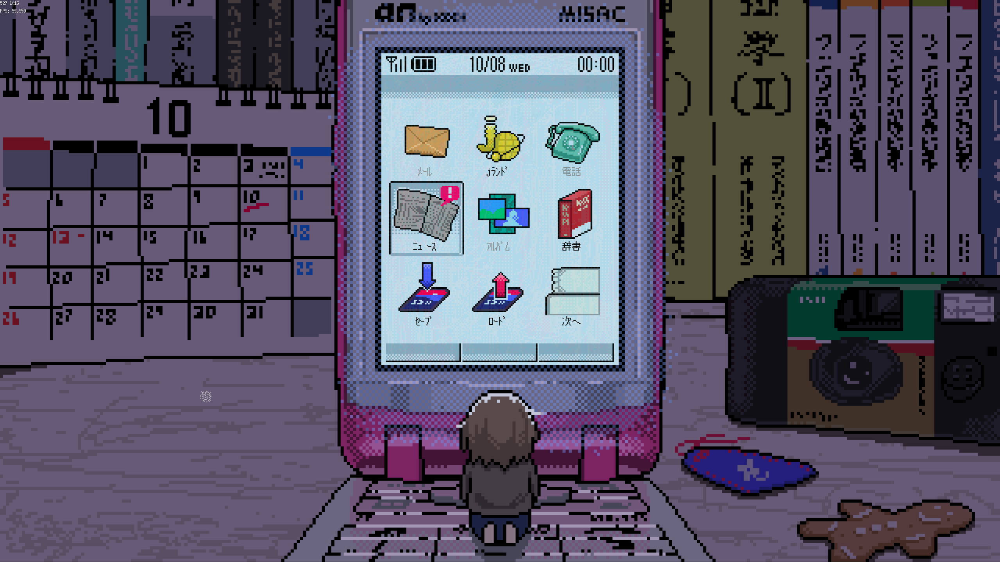
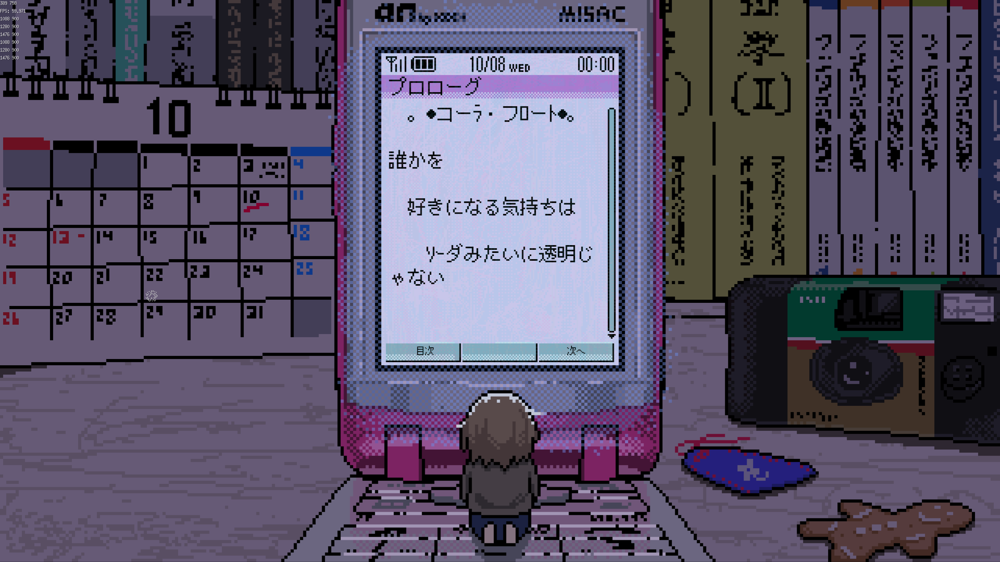

SAFE HAVN STUDIOのkypです。今回も開発日記をお送りします。

#### SAEKOの発売を2025年上半期に延期しました

<figure><blockquote class="twitter-tweet">
【お知らせ】  SAEKO: Giantess Dating Simについて、発売予定時期を【2025年上半期】に延期することとなりました。   お待たせして申し訳ありません！ できるだけ最高の形で皆様に作品を届けられるよう、開発チーム一同努力しておりますので、もうしばらくお待ち下さい🙇 <a href="https://twitter.com/hashtag/saekogame?src=hash&amp;ref_src=twsrc%5Etfw">#saekogame</a> <a href="https://t.co/eO3aeRBEDC">pic.twitter.com/eO3aeRBEDC</a>
— SAEKO: Giantess Dating Sim (@saekogame) <a href="https://twitter.com/saekogame/status/1866296152704110784?ref_src=twsrc%5Etfw">December 10, 2024</a></blockquote>  </figure>

SAEKOはもともと2024年内のリリースを目標にしていたのですが、このたび発売予定を2025年上半期に延期させていただくこととなりました。皆様をもう少しお待たせする形となってしまい、申し訳ありません。

開発自体は止まったり遅れたりしているわけではなく、毎日順調に色々なタスクが進んでいて、誰かに早く見せたい成果もたくさんあります。ただ、当初ゲーム内でやりたいと思っていたことを実現させるためには、やらないといけない作業が当初自分が思っていたより大きかった......というのが正直なところです。特に、ゲームの規模がある程度以上に育ってくると、シナリオでもプログラムでも考えないといけないことがどんどん増えてきて、難しさを痛感しました。

今後の目標は2025年まで生き延びること！頑張ろうぜ！

#### サントラ公開中

<figure><iframe width="560" height="315" src="https://www.youtube.com/embed/Odwini8ktYw?si=Gz1hIKwiTfobG-bU" title="YouTube video player" frameborder="0" allow="accelerometer; autoplay; clipboard-write; encrypted-media; gyroscope; picture-in-picture; web-share" referrerpolicy="strict-origin-when-cross-origin" allowfullscreen=""></iframe>
  </figure>

あと、今回の発表に合わせて、デモ版のサウンドトラックも[YouTube](https://www.youtube.com/watch?v=HYrHwEg7FAI&list=PLhB41OFPSrq9h1rPrccs_668lQ4VwobHg&index=3)・[Soundcloud](https://soundcloud.com/kyp_osushi/sets/saeko-giantess-dating-sim-demo-original-soundtrack)で公開しています。デモ版のBGMは締め切り直前に一気に作ったので、聴き返すと直したい部分があったりします。そのため、「いつか時間のあるときに微修正してから出そう」と考えていたのですが、結局そんな時間などなく、思い切って全てビルドのままの音源をアップロードしました。

来年のリリースまでには既存の音源を触る時間も作れそうなので、製品版ではBGMとしてさらに洗練された形にアレンジしたいと思っています。というわけで、まあ、今の音源は歴史的資料として聴いていただくのが良いのではないでしょうか！

#### 開発とか

というわけで、今回は大きなお知らせもありましたが、開発は引き続き進んでいます！特に最近は、これまで形の定まっていなかったケータイ画面が大幅に進化しました。ゲームプレイとしては、昼→夜と１日を進めたあとに遷移して、ちょっとした休憩のように色々なテキストが読める場所にしたいと考えています。

ちなみに、ケータイ文化だったら出さないわけにはいかない！ということで、ゲーム内でちょっとしたケータイ小説も読めるようにしています。参考用に当時のケータイ小説をいくつか読んでから、実際のテキストは自分自身で書いたのですが、これがめちゃくちゃ楽しかったです。普段と全然違う文章を書けるからかな。

あと、ケータイには絵文字とか物理ボタンの操作とか、プログラム的にしんどい要素がたくさんあり、その辺はけっこう後回しにしています。まあ、テキストが全て出来て、時間に余裕が出てくれば、将来の自分がガーっと一気に実装してしてくれる！はず！たぶん！

#### おわりに

というわけで、今回の記事はここまでです！

発売が遅れるのは申し訳ないですが、正直一番悲しんでいるのは開発者自身なので（早く発売して秘密とか全部バラしたい！！！！！）、ぜひ暖かい目で見守ったり、発売中の他の素晴らしいゲームを遊んだりしてほしいです。2週間に1度だけ、この開発日記を読みに帰ってきてくれたらさらに嬉しい。

おしまい！
