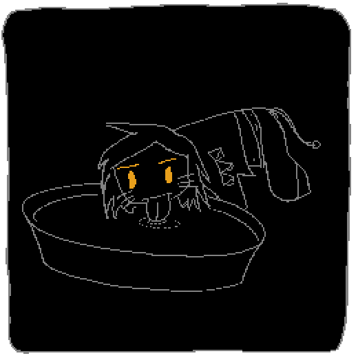

 メリークリスマス(Happy Holidays)！これは12月24日の開発日記です。手でHTMLを書いているのでこんな面白い遊びができます。面白い......よね......？

#### SAEKOの開発してる

開発してます。基本的には終盤のシナリオのFIXと、ケータイ画面のフレーバーテキストの執筆を中心に作業していました。どちらも全てがネタバレになってしまうので、スクリーンショットを共有したり、具体的にやっていることを説明したりはできないのですが......順調に進んでいる、と思います。

エンディングまでのテキストが入ったビルドを周りの人々にも見せたのですが、今のところ感触は良く、とても安心しています。自分でも書いてて楽しかったし！骨格の部分はこれで完成だと思っているので、あとはゲームとしての手触りや素材のクオリティを高めていきたいな〜と思っています。

#### 書けることがない

か......書けることがない！開発日記って今まで何書いてたっけ？シナリオ......の話はネタバレすぎてできないし、ほとんどの絵もシナリオに絡んでいて共有できないです。上のGIFもほんとはかなり怪しい。プログラム......は......あんま書いてないし......うーん......。

................................................

か、過去最高の短さだけど、今回の開発日記はここまで！作業はこれまで通りやってるし、これまで悩んでた部分が良いアイデアで解決したり、誰かに話したいこともいくつか起こってます。ただネタバレすぎて書けない！申し訳ないですが、今回はこんな感じでミニマムに締めくくろうと思います。良いお年を！
