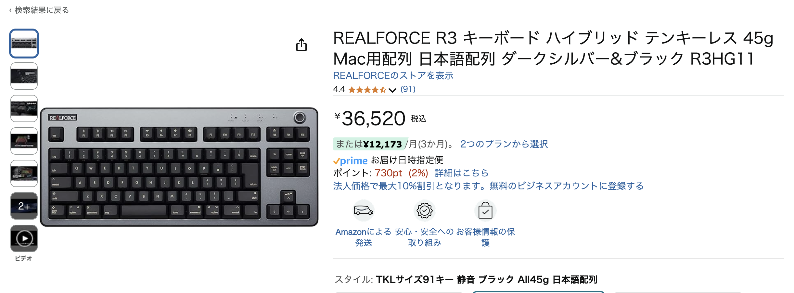
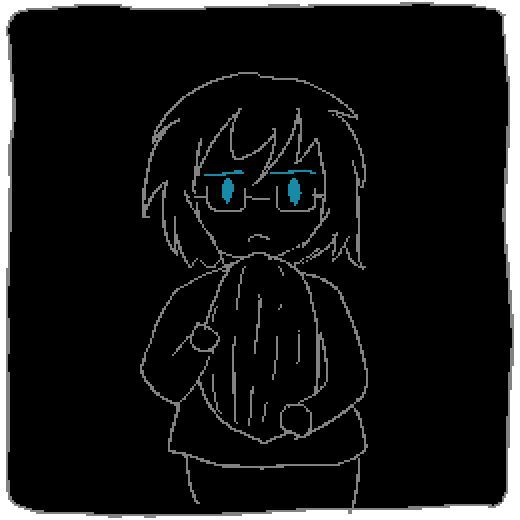

kypです。昨晩うっかり飲み物をこぼしてしまい、3年くらい使ってきたキーボードが壊れてしまったので悲しんでいます。今日の開発日記は短めです。

<figure>
    <a href="https://www.amazon.co.jp/dp/B0B3R7LXJG/">
      
      <figcaption>今はこれが欲しいです。値段とにらめっこしています</figcaption>
    </a>
  </figure>

#### SAEKOが台北ゲームショウに出ます

<figure>
    <blockquote class="twitter-tweet">
＼HYPER REALが  <a href="https://twitter.com/hashtag/%E5%8F%B0%E5%8C%97%E3%82%B2%E3%83%BC%E3%83%A0%E3%82%B7%E3%83%A7%E3%82%A62025?src=hash&amp;ref_src=twsrc%5Etfw">#台北ゲームショウ2025</a>  に出展!!／  ▼ 『SAEKO』『SKY THE  SCRAPER』『Telebbit』3作品の試遊展示 ▼ Wishlist登録でゲームグッズプレゼント ▼  Telebbitタイムアタック大会実施  2025.1.23 -  26まで、インディーコーナー【A23】でお待ちしています! <a href="https://twitter.com/hashtag/indiegame?src=hash&amp;ref_src=twsrc%5Etfw">#indiegame</a>  <a href="https://t.co/z8WLmmFOkU">pic.twitter.com/z8WLmmFOkU</a>
—  HYPER REAL (@HYPERREAL_jp) <a href="https://twitter.com/HYPERREAL_jp/status/1879679962724081850?ref_src=twsrc%5Etfw">January  16, 2025</a></blockquote> 
  </figure>

出ます！今回もHYPER REALさんのブースで、遊べるのはSteamで公開中のものと同じビルドです。念の為書いておくと、製品版発売までの残りイベントは全てそうなると思います。

あと、ツイートに書かれている通り、ウィッシュリスト登録でSAEKOのグッズがもらえるみたいです。台北にいる方はぜひ立ち寄っていただければと思います。

台北......超いい場所......自分も行きたい......。

#### 進捗

台北には行けません。自宅にこもってSAEKOの開発を進めています。それしかできることがない......。ストーリーや根幹の部分はもうできていて、今はゲームに組み込む画像素材や、細かい実装の調整などを続けています。

この2週間、自分は主にアニメーションを描いていました。絵を描くのはずっと苦手なのですが、毎日気合でいろんな素材を描いていくうちに、だんだん「自分の絵柄」みたいなのが見えてきました。描けば描くほどうまくなってる......はず......。わりと楽しく描きつつ、気づいたら一日が終わっています。

それと、プログラマとしては、もう少し複雑なアニメーションの仕組みを作ったりしました。例えば、冴子との会話シーンの裏側では、「表情：笑顔」「口：会話中（ぱくぱくする）」「手：動いてる」みたいな状態がプログラム側で管理されていて、それに即して画面内の複数箇所でアニメーションが再生されます。

デモ版の時点では、これは複数のレイヤーを重ねて表示しているだけというとてもシンプルな作りになっていたのですが、中盤や終盤のアニメーションで色々やりたいことがでてきたので、裏側の仕組みも含めて再実装を行いました。作っているときにはあれこれ設計を悩んだりしたのですが、結果的にはいい感じの見た目ができたので良かったんじゃないかと思います。

#### おわり

今回の開発日記はここまで！本当は描いたアニメーションを載せたりしたかったのですが、アニメーションって基本的に「モノを誰かに渡した結果」なので、前もって載せてしまうと１個分選ぶ楽しみが無くなってしまうんですよね......。

しばらく淡白な記事が続くと思いますが、開発自体は順調に進んでいるので気長に待っていただけるとありがたいです。人に見せたいものはたくさんあるけど、ゲームの中で見せられるように頑張ります！

おわり！
