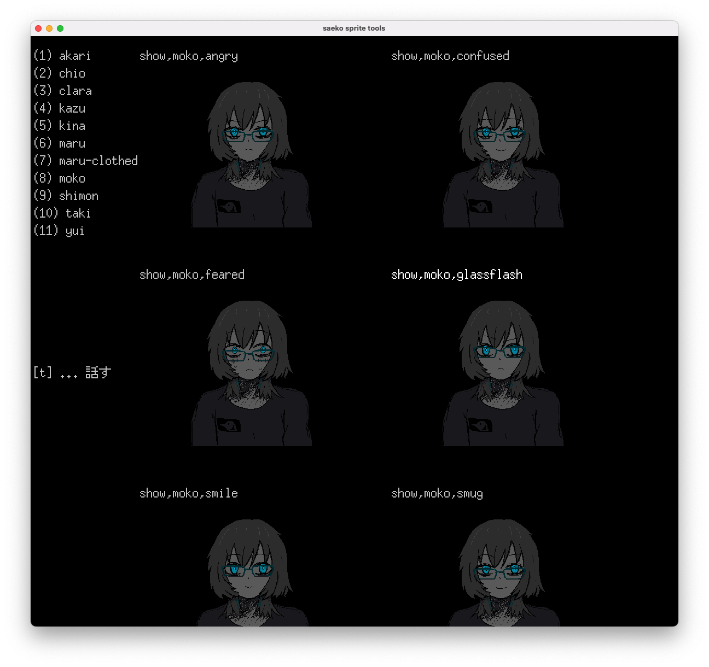

こんにちは。kypです。これは2月4日の開発日記です。

#### 進捗

前回に引き続き、この２週間はゲーム内のアニメーションを描いたり、エンディングの実装をしたりしていました。

SAEKOのテキストは全て完成していて、ゲーム内でにもスクリプトとして組み込んであります。条件分岐とかもある。ただ、テキストが流れるだけだと当然ノベルゲームとして微妙なので、今はここに表情差分やアニメーションなどの素材を描いて追加する作業をしています。

テキスト自体はできているので、あまり頭を悩ませるようなことは少ないのですが、単純に量が多い！自分にとって絵は一番難しい分野なので、好きな音楽を聴いたりツール・ド・フランスを流したりたまにアルコールを投入したりしながら、１つ１つ着実に描き進めるようにしています。

<figure>
    <blockquote class="twitter-tweet">
差分描くのとても楽しい <a href="https://t.co/52p2iaAAxC">pic.twitter.com/52p2iaAAxC</a>
— KYP (@_newkyp) <a href="https://twitter.com/_newkyp/status/1885537763669532729?ref_src=twsrc%5Etfw">February 1, 2025</a></blockquote> 
    <figcaption>ユイの表情差分。2000年代のアニメ絵をなんとなく意識している…つもり</figcaption>
  </figure>

あと、表情差分は描いててめちゃ楽しいです。１キャラあたり元々６〜８個の想定だったのが、気づくとその２倍ぐらいの差分ができたりしています。ゲームの性質上、恐怖やネガティブな感情の差分が多いんですが、そういう絵を描くのは何よりも楽しいです。本当はこの日記でお見せしたいんですが、ゲーム中の「そういう場面」で見てもらったほうがより良い体験になるかなと思うので、今は伏せておきます。いひひひひ。

<figure>

  <figcaption>代わりにネタバレのない画像を共有: 以前の開発日記でも触れたと思うのですが、キャラや差分が増えてきたので、ちょっとしたツールを作って表情差分を一覧で見られるようにしています。見ているだけで幸せな時間が過ぎていきます。</figcaption>
  </figure>

もう１つの話題として、エンディングの実装がほとんど終わりました。エンディングでやりたいと思っていたことが概ね実装できてホッとしています。色々悩んだ部分もあるのですが、発売前の日記では絶対に書けない気がするので黙っておきます。早く発売して楽になりたいです。

#### おわり

今回の日記はここまで！最近短い記事が続いていますが、おそらく発売まではこんな感じだと思います。タスクは着実に進んでいて、完成までに必要なこともはっきりしてきました。開発中盤までの思いつきを片っ端から実装していた時期とは異なり、今はスプレッドシートに書かれた通りに素材を作るような生活が続いています。正直、「作業」って感じでウッとなることも多いんですが、これも必要なプロセスだと思って黙々とやるしかないな〜〜〜って思います。

おわり！
