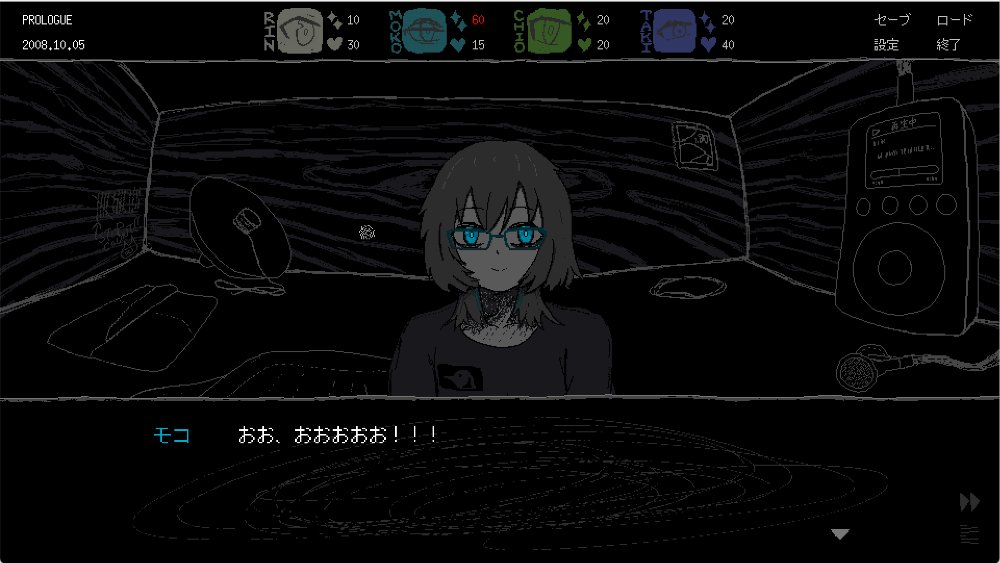
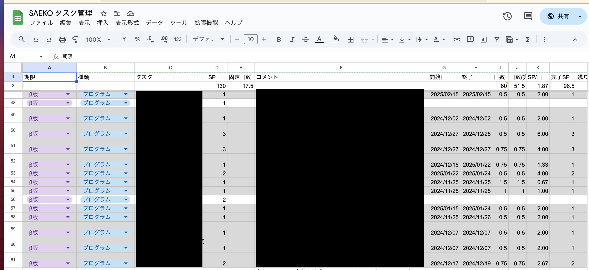
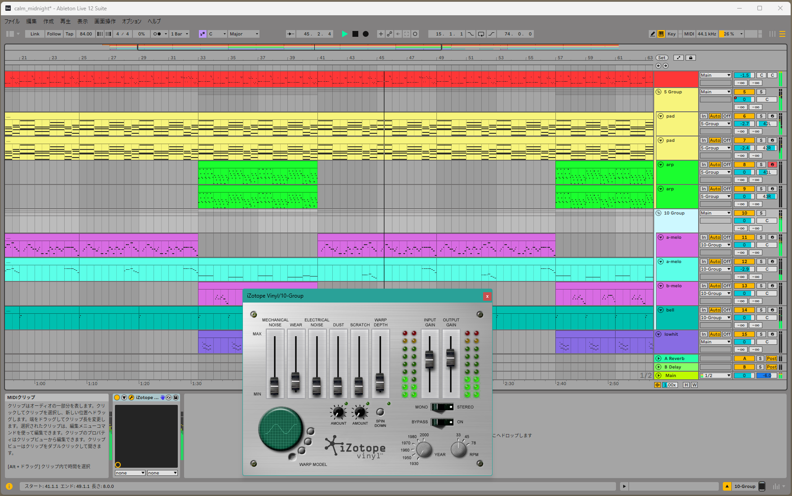

こんにちは。kypです。この開発日記はこれまで隔週火曜日に更新してきたのですが、仕事の都合で水曜日に変更しようと思います。ただ、水曜の夜ってイベントが多いイメージなので、数回経ったらまた変更するかも？しばらくふわっとした感じで待っててもらえると嬉しいです。

#### さらばスケジュール管理

以前[まるまる1つの記事](https://safehavn.dev/blog/2024-11-26/)を書いたように、この数ヶ月スケジュール管理にただならぬ情熱を傾けてきたのですが、１週間くらい前からやめてしまっています。無駄だったからやめた、というのではなく、実際、相対ポイントを使った見積もりはかなり有効だったと思います。

ではなぜやめたかというと......そろそろ完成が見えてきたからです！！！

もちろん、まだ手を動かす必要のあるタスクは残っているし、一旦ゲーム（正確にはβ版のビルド）が完成したとしても、翻訳やQAなどの作業がさらに必要になります。発売まで、最低でもあと数カ月はかかるはずです。

ただ、数ヶ月の開発を経て、「これをやらないと絶対ゲームが出来上がらない」と事前に分かっていたタスクはやっとほとんど片付きました。いま取り組んでいるのは主に、「ここの演出をもっとリッチにしたいな」とか、「こういう機能もあったら嬉しいな」みたいなオプショナルな部分です。そして、そういう作業は事前に計画しようがないし、むしろ時間を気にせず納得行くまでやったほうがいいと思っています。

というわけで、現在は煩わしいスプレッドシートから解放され、ようやく心の赴くままに開発を楽しみ始めました。久々に何も考えないで今のビルドをプレイしたら、まあ、これ良いゲームだな〜って思いました。毎日が幸せです。わっはっはっは！

もちろん、最終的に他の人に気に入ってもらえるかは分からないですが、自分の好みには合うものができてきたと思います。とはいえ残りのタスクもまだまだあるので、多幸感に包まれているうちに片付けてしまおうと思います。

それと、これまでずっと先送りにしてきたサウンドのタスクにも取り掛かり始めています。体験版用にBGMを作っていたときには、「作っているうちにゲームのイメージからかけ離れてしまう」ということが頻発して、そのせいで使い道のないmp3をたくさん生み出したりしていました。

ただ、この数週間に関しては、「作り始める前にどのシーンで使う曲か決める」「シーンごとに合いそうなジャンルやリファレンスとなる曲を書き出す」「別ウィンドウでビルドの該当シーンを起動しながら曲を作る」「作業したらできるだけ段階でビルドにぶち込む」という方法で、わりと生産的に進められていると思います。

β版完成までの時間も少なく、あまり試行錯誤している時間もないので、残りの曲もそんな感じで作っていく予定です。調子が良ければ１日で１曲できたりする。調子が悪ければ......ふて寝する。そしてまた起きて挑戦する。そんな感じ。

#### その他

[Oxygen Not Included](https://store.steampowered.com/app/457140/Oxygen_Not_Included/?l=japanese)はとても良いゲームなので、ぜひプレイしてみてください。グラフィックの可愛いサバイバルゲーで、時間を忘れて熱中できます。私とkohはSAEKOが完成するまで起動しないと互いに誓いました。

おわり！
