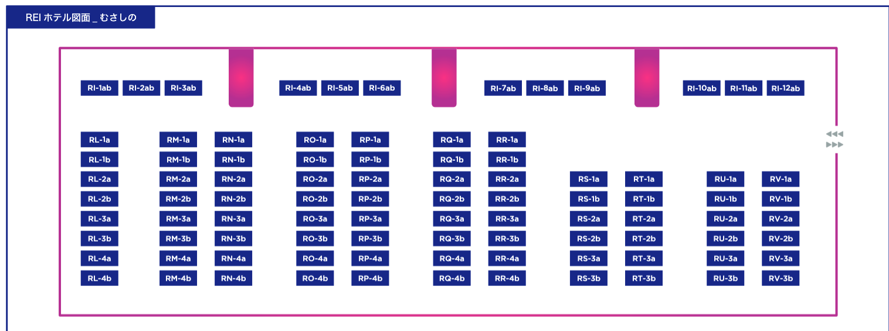

私はkypです。これは3月5日の開発日記です。

#### \#TIGS2025

3月8〜9日に東京・吉祥寺で開催されるインディーゲームイベント、[TOKYO INDIE GAMES SUMMIT 2025](https://indiegamessummit.tokyo/title/)にSAEKOが出展します。場所はメイン会場（吉祥寺東急REIホテル）のRT-2aです。RT-2aってどこ？

<figure>
    
    <figcaption><a href="https://indiegamessummit.tokyo/pdf/TIGS_MAPLIST_0212_2.pdf">ここ</a></figcaption>
  </figure>

SAFE HAVN STUDIOのブースで遊べるのはSteam版と同じビルドなので、SAEKO目的で来る意味はあまりないかも。ただ、すごく面白いイベントだという噂を方々で聞くので、数多のインディーゲームを見に行くのはきっとすごく楽しいはず！ブースは土日の2日間出しますが、諸事情によりkypは土曜のビジネスデイにだけ伺う予定です。

ちなみに、これがリリース前最後のゲームイベントかも。まあ、リリース後もしばらくはSAEKOでイベントに出られそうな気もするけど......分からない......もしかしてこれが最後の機会なのか......？

#### 進捗

開発は佳境です。全てを正直に書いてしまうと、3月下旬にβ版を作りきるつもりで、今は締切に向けてギアを上げ始めています。

β版というのは開発段階の完成ビルドで、まあつまり、「バグや翻訳の抜けはあるけど完成版と同じものが全部遊べるビルド」です。シナリオ、絵、音楽など、完成版に存在する要素は全て揃っている必要があります。β版の提出後は、バグ修正やシーン間の調整など、細かい部分のみをいじることになります。

まあ、つまり、実質ゲームとしてのポテンシャルはβ版で決まるというか、開発者的にほとんどβ版完成＝完成、あとはウィニングランみたいなものではないか？と思います。違うけど。QAのバグ取りも絶対大変なんだけど......。

というわけで、今は全ての労力をβ版の開発に振り分けています。この１ヶ月で実装できた機能は製品版に出るし、実装できなかったものは無かったことになります。

作業はたくさんやればいいというわけではないと思うので、エナドリ片手にオールナイトの作業を繰り返す......みたいな状態にはまだ陥っていませんが、せめて起きて体力のある時間は全部SAEKOの開発に振り分けようと思っています。SNSもYouTubeもAbemaも見ない。Oxygen Not Includedも起動しない。絶対に。

あ。でも、Outer WildsのDLCを最近やり始めてます。まあ、これは終わりのあるゲームだし、22分ごとに休憩できるし、なんといっても名作すぎて心が豊かになるからいい......よね？

おわり！
