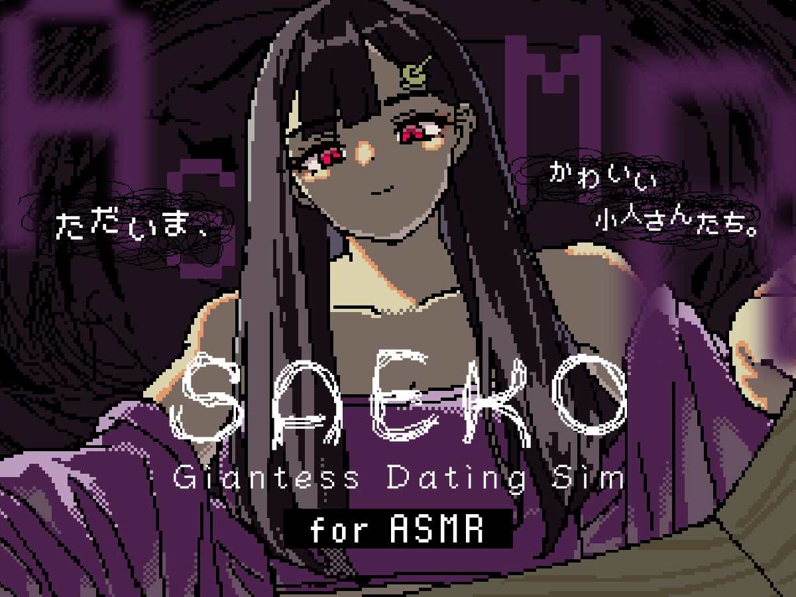

こんにちは、SAFE HAVN STUDIOのkypです。各種SNSでもお伝えしている通り、私達のゲーム「SAEKO: Giantess Dating Sim」が、ついに2025年5月29日に発売されます。この記事では、販売プラットフォームや内容について、もう少し詳しい情報をお伝えしようと思います。

<figure>
    <blockquote class="twitter-tweet">
      

        📅2025.05.29  Save the date! SAEKO: Giantess Dating
        Sim is coming to Steam, DLsite and STOVE on May 29.<a href="https://twitter.com/hashtag/saekogame?src=hash&amp;ref_src=twsrc%5Etfw">#saekogame</a>
        <a href="https://t.co/KHjWhaatGf">pic.twitter.com/KHjWhaatGf</a>
      

      — SAEKO: Giantess Dating Sim | Coming 5.29 (@saekogame)
      <a href="https://twitter.com/saekogame/status/1917761839032852815?ref_src=twsrc%5Etfw">May 1, 2025</a>
    </blockquote>
    
  </figure>

#### 対応環境と販売プラットフォームについて

SAEKOはPC専用ゲームとして発売されます。対応OSはWindowsとLinux(SteamOS)です。

販売プラットフォームは[Steam](https://store.steampowered.com/app/2492120/SAEKO_Giantess_Dating_Sim/)・[DLsite](https://www.dlsite.com/home-touch/announce/=/product_id/RJ01349037.html)・[Stove](https://store.onstove.com/ja/games/100735)です。ゲーム本体の内容は同じですが、以下の細かい違いがあります。

- [Steam](https://store.steampowered.com/app/2492120/SAEKO_Giantess_Dating_Sim/): みなさんのよく知るプラットフォームです。普通にゲームをプレイできるほか、実績機能や一部のコミュニティアイテムなども豊富に用意しています。あと、Steam DeckやLinux(SteamOS)で遊びたい方は必ずSteamで購入してください！

- [DLsite](https://www.dlsite.com/home-touch/announce/=/product_id/RJ01349037.html): こちらも実はみなさんがよく知っているプラットフォームです。普通にゲームをプレイできるほか、購入特典として日本語のASMR音声も付属しています。なお、冴子の声はゲーム内の効果音を担当してくださった[一ノ瀬エアル](https://x.com/earu_voice)さんにお願いしました。シナリオも全面的に監修させていただきましたが、なかなかすごいことになっています。ASMRは単体でも購入できる予定なので、ぜひ聴いてみていただきたいです。

<figure>
    <a href="https://www.dlsite.com/home-touch/announce/=/product_id/RJ01349037.html" target="_blank" rel="noopener noreferrer">
      
      <figcaption>SAEKO: Giantess Dating Sim for ASMR</figcaption>
    </a>
  </figure>

- [Stove](https://store.onstove.com/ja/games/100735): こちらは韓国のプラットフォームで、Stove限定の韓国語でプレイすることができます。もちろん、他プラットフォームと同じく日本語・英語・中国語（簡体字・繁体字）でのプレイも可能です。韓国語でのプレイをご検討されている方はぜひStoveでご購入ください。

#### その他: よくある質問

**Q. プラットフォームや地域ごとに発売タイミングの差はある？**

A. 基本的にはないと思いますが、約束はできません（手でボタンを押す必要があるため）。プラットフォームや地域を問わず、できるだけ同じ時間で発売開始となるよう準備中です。また、「5月29日発売」の基準はあくまで日本時間なので、タイムゾーンによっては5月28日中にプレイできるところもあると思います。

**Q. 価格はどれくらい？**

A. 1000円〜2000円の範囲内です。発売セールも実施する予定なので、お気軽にご購入いただければと思います。作者としては積みゲーでも全然いい！なお、設定の都合上、プラットフォームごとに数十円の価格差があります。まあでも数十円です。

**Q. プレイ時間はだいたいどれくらいになる？**

A. 読むスピードや選択肢によるため厳密には言えませんが、概ねエンディングまで2〜4時間程度になると思います。複数のエンディングや分岐がありますので、全てのテキストを読もうとすると5時間くらいかかるかもしれません。

**Q. 体験版のセーブデータは引き継げる？**

A. ごめんなさい、できません！体験版の公開後に追加した要素があり、互換性を維持することができませんでした。その代わりと言ってはなんですが、体験版に含まれていたシーンにも一部スチルやゲーム要素が追加されていたりするので、新鮮な気持ちでもう一度最初からプレイしていただけると嬉しいです。

**Q. ✗✗(足,胸,破壊...)フェチ向けのシーンはないの？**

A. SAEKOは相対的に巨大なヒロインが出てくるゲームですが、成人向けではなく、あんまりエロ目的でも作っていません（信じて！）。作中の描写も、基本的には全年齢のノベルゲームとしての表現を第一に考えているので、まあ、あまり抜けません。特定のシチュエーションを求めている方には向かないと思います。

**Q. DLsiteでも？**

A. はい、DLsiteといってもうちは健全なフロアです。

**Q. プレイ言語を追加する予定はある？**

A. 現時点では、日本語・英語・中国語（簡体字・繁体字）・韓国語の5言語以外への対応予定は決まっていません。ただ、作者としてはもっといろんな言語で遊べるようにしたいです。SAEKOのテキストは日本語で10万文字以上あり、ネイティブレベルで日本語が分かる方にしか依頼できないため、翻訳にはお金がかかります。現金な話ですが、多くの方にゲームを購入していただければ、翻訳の依頼もできる余裕が出てくると思います。SAEKOの今後の展開を応援しつつ、しばらくお待ちいただければと思います。もちろん対応言語のリクエストはいつでも大歓迎です。もしかするとパブリッシャーに連絡したほうが効果的かもしれない。

#### おわり

というわけで、来週の木曜日にはSAEKOが出ます！ドキドキです。

開発自体は99%完了していますが、プラットフォームの審査やアセットの仕上げなど、まだ微妙に作業が残っています。少しでも完璧な状態でプレイしていただけるよう、発売日までも努力を続けて参りますので、残りの数日間も気長に応援してくださると嬉しいです。

おしまい！
