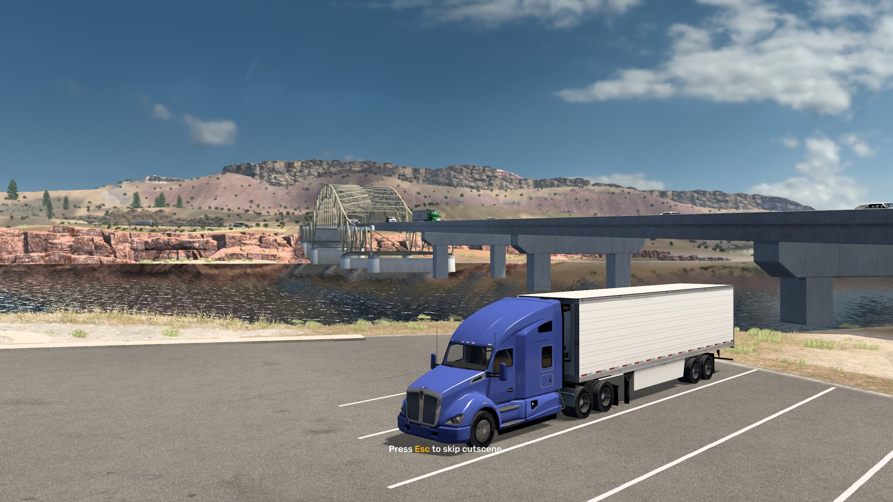
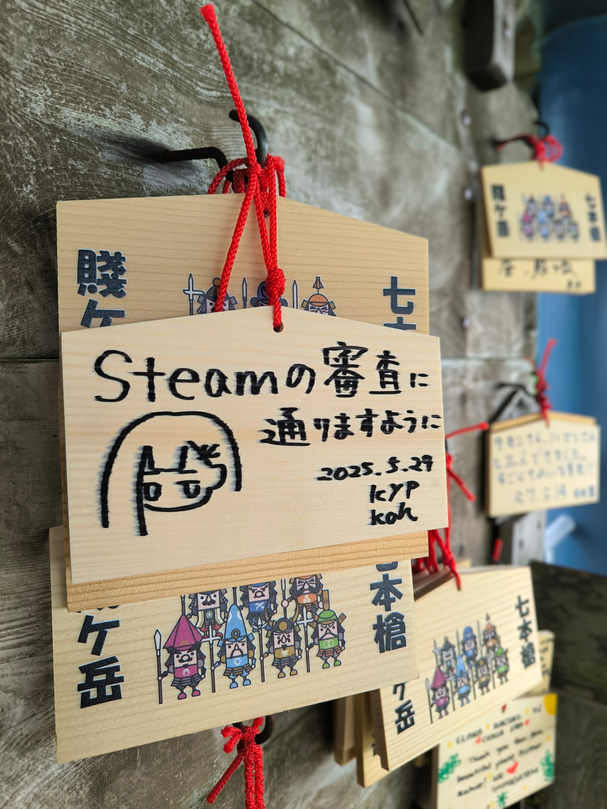

こんにちは。SAFE HAVN STUDIOのkypです。タイトルにある通り、SAFE HAVN STUDIOはSAEKO: Giantess Dating Simの販売を開始しました。対応プラットフォームは[Steam](https://store.steampowered.com/app/2492120/SAEKO_Giantess_Dating_Sim/?l=japanese), [DLsite](https://www.dlsite.com/home/work/=/product_id/RJ01349037.html), [Stove](https://store.onstove.com/en/games/100735)です。

まあ、このブログを読みに来てくれる方は皆さんご存知だと思うんですが。もちろん、既に購入もしてあるはず。......だよね？

<figure>
    <iframe src="https://store.steampowered.com/widget/2492120/" frameborder="0" width="646" height="190"></iframe>
  </figure>

まあ、販促はこのくらいにします。残りはいつもの開発日記です。

#### リリースした感想とか

リリースした感想。ゲームを完成させるのはとっても大変でした。

まず開発。過去には[スケジュール見積もりの記事](https://safehavn.dev/blog/2024-11-26/)なんて出してもいましたが、実際、開発の終盤が近づいてくるにつれ、見積もりは意味をなくしました。これまで気づかなかったタスクがふくれ上がり、SAEKOの開発以外には文字通り何もできない。そんな日々が続きました。

睡眠は絶対に確保していたので、肉体的には健康そのものだったのですが、精神的にはつらかった......。SAEKOの開発が始まったのはおよそ2023年の5月なので、このリリースに2年分の努力がかかっているとか、そういうことを考え始めると遊ぶに遊べませんでした。そしてたどり着いたのが[American Truck Simulator](https://store.steampowered.com/app/270880/American_Truck_Simulator)。ハンドルを手で握っている間は、どれだけ気持ちが焦っていても創作はできないので、良い強制的な息抜きになりました。家から一歩も出ない日々の中、広大なアメリカの大地を駆け巡る魅力に気づいたので、リリース後の今もプレイし続けています。

<figure>
    
    <figcaption><a href="https://store.steampowered.com/app/270880/American_Truck_Simulator">American Truck Simulator 好評発売中</a></figcaption>
  </figure>

そしてリリース当日。ご存じの方も多いと思いますが、この日はSteamでのリリースができませんでした。ずっとValveからのレビュー結果通知がなく、あらゆる角度からサポート窓口に催促のメッセージを投げまくったのですが、リリース予定時刻を迎えても音沙汰なし。結局リリース予定日の翌日、日本の午前6時に無言で承認がなされ、その後すぐに発売を開始しました。

<figure>
    <blockquote class="twitter-tweet">
SAEKO: Giantess Dating Sim is out now on Steam, DLsite and Stove. 全てのプラットフォームで <a href="https://twitter.com/hashtag/saekogame?src=hash&amp;ref_src=twsrc%5Etfw">#saekogame</a> の販売を開始しました。  ゲームの正式発表から約2年、沢山の応援のおかげでここまで辿り着くことができました。 冴子とリン、そして小人たちの結末を、ぜひあなたの目で見届けてください。 <a href="https://t.co/b4tLwsHITV">pic.twitter.com/b4tLwsHITV</a>
— SAEKO: Giantess Dating Sim | OUT NOW (@saekogame) <a href="https://twitter.com/saekogame/status/1928214631476252731?ref_src=twsrc%5Etfw">May 29, 2025</a></blockquote> 
  </figure>

もともとリリースが深夜になるということで、滋賀にホテルを借り、ついでにkohにも来てもらって小規模なパーティをするつもりでした。発売記念お泊り会みたいな。だけどSteamからの連絡はなく、アルコールの力を借りて就寝。翌日、アドレナリンと元気が有り余っていたので、賤ヶ岳という琵琶湖のそばの山に登りました。絵馬を描いたりもした。なんだって楽しんだもの勝ちなのだ。

<figure>
    
    <figcaption>賤ヶ岳。<a href="https://bsky.app/profile/safehavn.dev/post/3lqcbro4bd22s">ちなみに木之本地蔵尊もすごかった</a></figcaption>
  </figure>

発売後の数十時間は、忘れられない思い出になりました。沢山の感想をいただいたり。一番嬉しかったのは「頭がぶっ壊れた」系のコメントです。「助けてくれ」とか「プレイが終わっても１日中SAEKOのことしか考えられない」とか。自分の人生を振り返っても、そういう脳がぶっ壊されたゲームは一生の宝になっているので、自分の創作が誰かの脳も壊しているという事実はとても嬉しかったです。

まあ、SAEKOは明確に尖った作品だし、万人受けするゲームでもないです。一部の評価に書かれている「欠点」は、ほとんどが明確な意図を持ってデザインされています。そして、普通のゲームファンとして、そのデザインが許容できないという意見も分かる。まあ、今回は縁が無かったということで、また次回以降の作品でお会いしましょう。

......次回？

#### 今後とか

話が早いようだけど、とりあえず、SAFE HAVN STUDIOは今後も活動を続けます。初めての作品であるSAEKOを作りきり、納得の行く形で世に出したことで、本当に沢山の物事を学びました。2年前、SAEKOを作り始めた頃から比べると、技術的にも精神的にも大きく成長できたと思います。

この開発日記で何回か述べた通り、作りたいゲームのアイデアは何個かあります。闇のエネルギーはSAEKOで使い果たしたので、次のゲームはもう少し明るい予定です。人が死なない。エロ要素も少ない。あと残念なことに、巨大娘は出てこない。でも、SAEKOと同じようにユニークで、尖っていて、それでいて人間の深部に迫るシナリオにしたいと考えています。

......とはいえ。実のところ、SAEKOのプロジェクトもこれで終わりではないです。移植とか、追加コンテンツとか、他言語対応とか。やりたいことが残っています。今後数ヶ月、パブリッシャーとも相談しながら、少しずつ具体的な形を考えていこうと思います。

#### おわり

というわけで、SAEKOをリリースしました！今後もゲーム開発は続けますが、プロトタイピングやPRがメインで、報告できるような進捗はないんじゃないかと思います。というわけで、定期的な開発日記は、一旦これで最終回です。皆さん、この長いブログを読んでくださり、本当にありがとうございました。およそ２年間、SAEKOが完成するまで飽きずに作業を続けてこれたのは、間違いなくこのブログで得られた継続的な反響のおかげです。皆様、本当にありがとうございました。

SAEKOはすごく個性的なゲームです。作りながら悩むことも多々ありましたが、その悩むのも楽しくて、やっぱり自分は尖った創作が好きなんだと改めて実感することができました。というわけで、SAEKO関連でも、それ以外のプロジェクトでも、私たちはユニークでディープな作品を作り続けていきます。たぶん。

SAFE HAVN STUDIOの今後の活躍にご期待ください！

 

おわり！
