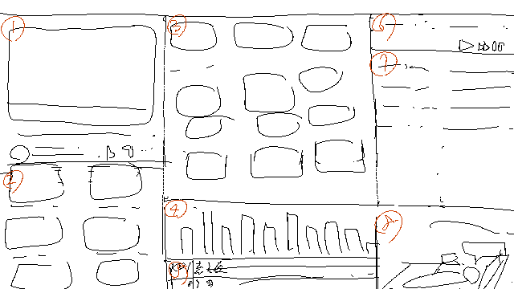

こんにちは。kypです。これは約1ヶ月ぶりの開発日記です。よろしくお願いします。

#### Bitsummitに出ます

今年もBitsummitにSAEKOが登場します。昨年と同じく、パブリッシャーのHYPER REALブースで試遊とちょっとしたグッズの配布を行う予定です。開発チームはブース運営には直接関わりませんが、イベントには3日とも参加するつもりです。発売後初のゲームイベントなので、のんびり会場をうろつきながらプレイヤーとして面白そうなゲームを探そうと思っています。

それと、イベントの告知用に、kohに素敵なイラストを描いてもらいました。冴子が座っているのは会場近くの岡崎公園にある鳥居です。知っている場所が出てくると嬉しい。

<figure>
    <blockquote class="bluesky-embed" data-bluesky-uri="at://did:plc:cw7ouw773yjncd7rmby4o7po/app.bsky.feed.post/3ltme5idoas2d" data-bluesky-cid="bafyreibzlokipx7agtro2ixs7lwwzxdvxe5igvv4keijimcbogzws6al5u" data-bluesky-embed-color-mode="system">
      

        ＼今年も冴子が京都にやってくる／ 7月18日〜20日、京都で開催される
        #BitSummit13th でSAEKOが展示されます。ぜひ
        @hyperreal-official.bsky.social 様のブースにお越しください！
        暑さ対策もお忘れなく☀️🏖️  <a href="https://bsky.app/profile/did:plc:cw7ouw773yjncd7rmby4o7po/post/3ltme5idoas2d?ref_src=embed">[image or embed]</a>
      

      — SAEKO: Giantess Dating Sim | OUT NOW (<a href="https://bsky.app/profile/did:plc:cw7ouw773yjncd7rmby4o7po?ref_src=embed">@safehavn.dev</a>)
      <a href="https://bsky.app/profile/did:plc:cw7ouw773yjncd7rmby4o7po/post/3ltme5idoas2d?ref_src=embed">2025年7月10日 21:42</a>
    </blockquote>
    
    <figcaption>縦に長い！</figcaption>
  </figure>

あまりの嬉しさにシールを注文してしまいました。運が良ければ（納品が間に合えば）会場でも配布できるかもしれません。

#### サントラ出した

その他のニュース！SAEKOのサウンドトラックを発売開始しました。

<figure>
    <iframe src="https://store.steampowered.com/widget/3777180/" frameborder="0" width="646" height="190"></iframe>
  </figure>

私自身、いろいろなゲームのサウンドトラックを見たり聴いたりするのが好きなので、自分が出す側になったと思うと感慨深いです。曲名からシーンを推測したり。ちなみに、私が一番好きな曲は「[Wansegu](https://www.youtube.com/watch?v=v-MBhN7xj34)」です。ワンセグ出てないけど……。

<figure>
    <iframe style="border: 0; width: 100%; height: 120px" src="https://bandcamp.com/EmbeddedPlayer/album=4227255563/size=large/bgcol=ffffff/linkcol=0687f5/tracklist=false/artwork=small/transparent=true/" seamless=""><a
        href="https://kypkyp.bandcamp.com/album/saeko-giantess-dating-sim-original-soundtrack"
        >SAEKO: Giantess Dating Sim (Original Soundtrack) by kyp</a
      ></iframe>
  </figure>

<figure>
    <iframe width="560" height="315" src="https://www.youtube.com/embed/v-MBhN7xj34?si=qbGRmatH0SgqmzmM" title="YouTube video player" frameborder="0" allow="accelerometer; autoplay; clipboard-write; encrypted-media; gyroscope; picture-in-picture; web-share" referrerpolicy="strict-origin-when-cross-origin" allowfullscreen=""></iframe>
  </figure>

ちなみに、サウンドトラックは[Bandcamp](https://kypkyp.bandcamp.com/album/saeko-giantess-dating-sim-original-soundtrack), [YouTube](https://www.youtube.com/watch?v=v-MBhN7xj34)でも配信しています。Spotify, Apple Musicなどのストリーミングサービスには今後登録する予定なので、しばらくお待ちいただければと思います。

#### 最近の進捗とか

今日は7月15日ということで、SAEKOの発売からは約1ヶ月半が経ちました。リリースからしばらく経って、集中力はまだ完全には戻っていないんですが、少しずつまた創作を頑張り始めています。

大きく分けて、いま取り組んでいるプロジェクトは3つです。

1.  SAEKOのアップデート・移植作業
2.  小さめのゲーム。シナリオ薄めのミニゲームみたいな感じ。2〜3ヶ月くらいで作れそう
3.  大きめのゲーム。シナリオもシステムも分厚いアドベンチャーゲーム。3〜4年くらいかかりそう

この記事を読んでくださっている方にとって、一番関心が高いのは(1)だと思うのですが、現時点では決まっていないことが多いです。Switchとか出せたらいいな〜とは思ってるし、ついでに何かコンテンツを追加できたらいいなとも思っています。でも現状は構想があるだけ。もし具体的な何かが進み始めたとしても、しばらく時間はかかるんじゃないかなと思います。

(2)と(3)はそれぞれ異なるゲームのプロジェクトです。以前の開発日記にも書いた通り、次はSAEKOとかなり違う（性癖もヒロインも出てこない）ゲームを作りたいとは思っていて、(2)も(3)もそのときに思いついたアイデアでした。SAEKOより規模の大きい作品を作りたい欲はあるのですが、今の実力で挑戦すると作りきれずに餓死しそうなので、今は(2)の少し小さめのゲームに挑戦しています。

今回は特別にそのメモを公開します。

SAFE HAVN STUDIOは「他の誰にも作れないゲームを作りたい」という欲求が強いチームなので、とにかく実験的なアイデアが多いです。ゲームとしてうまくいくかも分からない。けど、まあ、仮にゴミの塊が出来上がったとしても、そのゴミが他のどの場所にもないなら、それはそれでいいんじゃないかな……くらいのつもりで行動しています。

#### おわり

今回の開発日記はここまでです。本当はSAEKOがリリースしてから記事を書かないつもりだったんですが、なんだかソワソワしてしまって書くことにしました。楽しいです。振り返りにもなるし、今後も不定期に更新していきたいな〜と思います。

おわり！
