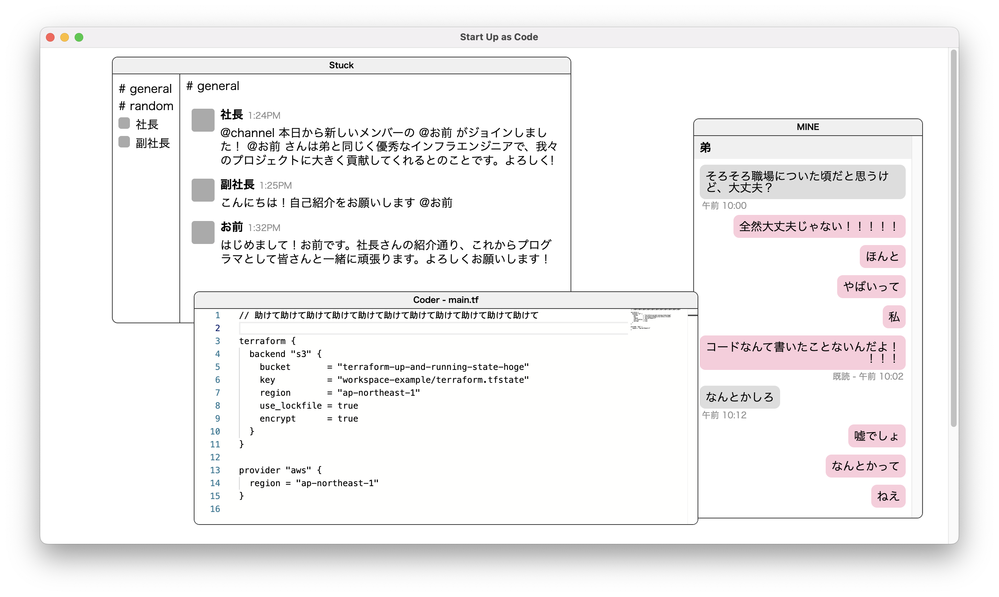
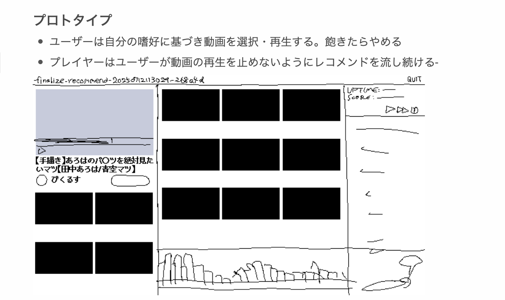

こんにちは。肉の万世(kyp)です。これは開発日記です。よろしくお願いします。

#### Bitsummitおわり

[前回の開発日記](https://safehavn.dev/blog/2025-07-15/)で触れた通り、今年もSAEKOがBitsummitに参加しました。直前に思いつきで刷ったシールもなんとか間に合わせることができ、悔いのないイベントに出来たんじゃないかと思います。

<figure>
    <blockquote class="bluesky-embed" data-bluesky-uri="at://did:plc:cw7ouw773yjncd7rmby4o7po/app.bsky.feed.post/3lu7htxmbzk2n" data-bluesky-cid="bafyreigvqc5g4ev6rkcdldj4yp53x7mty6lf3zqduornoaaw6mykcsjlw4" data-bluesky-embed-color-mode="system">
      

        #Bitsummit has started! We're handing out Saeko-themed
        original stickers at @hyperreal-official.bsky.social booth  <a href="https://bsky.app/profile/did:plc:cw7ouw773yjncd7rmby4o7po/post/3lu7htxmbzk2n?ref_src=embed">[image or embed]</a>
      

      — SAEKO: Giantess Dating Sim | OUT NOW (<a href="https://bsky.app/profile/did:plc:cw7ouw773yjncd7rmby4o7po?ref_src=embed">@safehavn.dev</a>)
      <a href="https://bsky.app/profile/did:plc:cw7ouw773yjncd7rmby4o7po/post/3lu7htxmbzk2n?ref_src=embed">2025年7月18日 12:09</a>
    </blockquote>
    
    <figcaption>今回はちょっと絵巻風な冴子。かわいい</figcaption>
  </figure>

今回は、SAEKOが発売してから初のイベントだったんですが......楽しかった！ゲームイベントにはもう何度も参加しているのですが、これほどリラックスして臨めたのは初めてな気がします。締め切りとかないからね！

それと期間中、SAEKOを知っているか、もしくはプレイ済みの方からたくさん声をかけていただき、これもとても嬉しかったです。突然ちやほやされてワタワタしていました。若干挙動不審だったかもだけど、まあ、嬉しい挙動不審です。

あと、リアルイベントってポジティブなエネルギーに満ちていていいですね。土日は試遊できる台を探すのが大変なくらい混んでたんですが、そもそもわざわざインディーゲームに興味を持ってくれる人が何千（万？）人もいないとそうならないわけで......。特に最近は、インターネットで「何かが好き」って感情に触れることが少なくなっている気がするので、何かが好きで会場に来てくれたりグッズを身に着けたりしている人を見れて本当に嬉しかったです。

創作においても、ポジティブなエネルギーをたくさんもらいました。良いゲームがたくさんあった。kyp個人として気に入ったのは[破滅のオタク](https://store.steampowered.com/app/3318210/_/?l=japanese)、[DIGITAL EXORCIST](https://store.steampowered.com/app/2944390/DIGITAL_EXORCIST/)、[A Passing in the Night](https://store.steampowered.com/app/3427370/A_Passing_in_the_Night/?l=japanese)です。巨大男が出てくる[Militsioner](https://store.steampowered.com/app/1373530/Militsioner/)もずっと気になってたので、体験版をプレイできてよかったです。どれも自分の興味に従って選んだんですが、見事に暗めのテキストを読むゲームばかりで、やっぱり自分の好みには逆らえないな......と思いました。

ちょうど次回作を考えている時期で、実はランダム要素の強いパズルゲームとかを考えたりもしていたんですが......なんというか......どうでもよくなった！次回もテキストゲームを作ります。

#### 進捗とか

好みについて。[前回の開発日記](https://safehavn.dev/blog/2025-07-15/)では、いま取り組んでいるプロジェクトとして2つを取り上げていました。

> 2.  小さめのゲーム。シナリオ薄めのミニゲームみたいな感じ。2〜3ヶ月くらいで作れそう
> 3.  大きめのゲーム。シナリオもシステムも分厚いアドベンチャーゲーム。3〜4年くらいかかりそう

Bitsummitを経て、やっぱり自分はシナリオの分厚いゲームが好きだなと改めて思いました。(3)です。3〜4年ぐらいかかるかも。ただ、既にプロトタイプのようなものは作り始めていて、とても楽しいです。これだけ見ると何これって感じだと思うけど......頭の中にはアイデアがあって......3〜4年費やすとさらにすごい何かができる......はず。

ちなみに、前回の開発日記では「今の実力でこのプロジェクトに挑戦したら作りきれずに餓死する」みたいなことを書いていて、そのあたりの不安は全く解消してないです。つまり、餓死するかも。うーん、そしたらどうしよう......コンビニの廃棄弁当とか、分けてくれる場所でも探そうかな......。

<figure>
    <iframe src="https://store.steampowered.com/widget/2492120/" frameborder="0" width="646" height="190"></iframe>
    <figcaption>SAEKO (+サントラ) 好評発売中</figcaption>
  </figure>

#### おまけ: Recommender Engine (没アイデア)

ボツにした(2)のアイデアについて。これは「現実と繋がったゲームが作りたい」という欲求が芽生え、SAEKOを作っている最中に考えたものです。「Recommender Engine」というタイトルで、動画サイトの推薦システムをテーマにしたゲームを考えていました。

プレイヤーはYouTubeの推薦エンジンとなって、数十の候補の中から、ゲーム内のユーザーに表示される「おすすめ動画」を選択します。ユーザーの好みは数十の変数（次元）で表現されていて、その好みに似ている動画を選ぶとゲーム内は視聴を続けてくれます。たとえ家事がまだだろうと、明日までに試験勉強を終わらせる必要があろうと。そして、ユーザーの幸福とは関係なく、推薦エンジンであるプレイヤーの目標はできるだけ長い時間ユーザーをサイトに留まらせることにあります。

これは実際の動画サイトでも起きていることで、ネタには事欠きません。自分の知識もある分野だし（共変フィルタリング、主成分分析、A/Bテストetc）、YouTubeだって1日何時間も見ています。実況受けもよさそう。思いついたときは「おれ天才じゃね？？？」とか考えていたんですが、実際作り始めてると、思った以上に手が進まなかった......。

何かを思いつくことに比べて、何かを作ることって格段に難しいなと思います。特にゲームになると、四六時中そのゲームのことを考えていないといけないから、必然と理屈じゃない執念みたいなのが必要になってくる。今回取り上げたRecommender Engineだって、頭ではこういうゲーム良さそうとか思ってるんですが、性格の問題なのか、自分で作るほどの熱意は起きてくれませんでした。逆に、SAEKOや今取り掛かっているプロジェクトは、24時間そのことだけ考えていられるぐらい好きです。

まあ、とはいえ、こういう現実と繋がったゲームが欲しいという気持ちは今も残っています。Recommender Engineも、同じ内容のゲームがSteamにあったら間違いなく買うはず。アイデアを放出することによって、誰かが奇跡的に作り上げてくれないかな〜とか思って書きました（無責任）。

#### おわり

今回の開発日記はここまでです。やっぱり長文を書くのは楽しい。抜けはあるかもしれませんが、また2週に1度のペースで書き進めていきたいと思います。

それと最近、ゲームにおける性や暴力の表現、そしてその規制が話題になっています。

私(kyp)の創作にとって、性や暴力は大切な主題の１つでしたし、今後もそうあり続けます。もちろん、他人を不快にさせないために、宣伝の場などで最低限守るべき節度はあると思いますが、表現の内容そのものは絶対に自由であるべきです。

実在する人間の保護や、ポルノと芸術表現の区別など、この分野には難しい問題がたくさんあります。自分ですら迷うことは多いです。それでも、私の本棚には性や暴力を取り扱った文学作品がたくさんあって、そのどれもが過去の自分を成長させてきました。性や暴力は人間の決して切り離せない一部だし、芸術のテーマとして、これらを描く自由は今後も存在し続けるべきです。

まあ、とにかく、周りがどうなろうと自分のゲームは今後も下ネタだらけだし、都合の良い童貞も純愛も出てこないということ！主人公は早漏だしヒロインの腋でシコっている！おわり！
