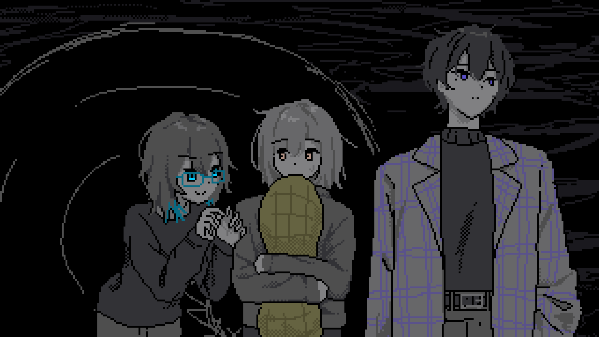
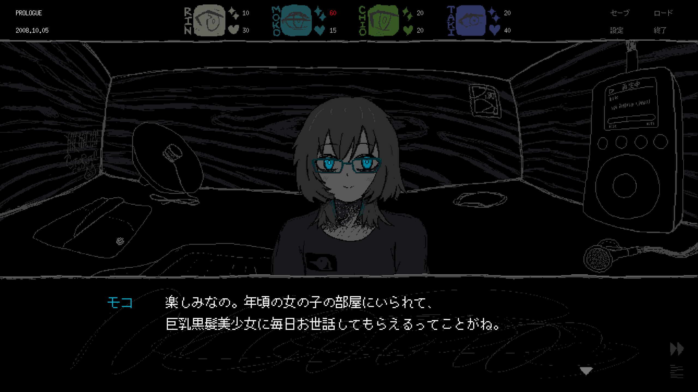
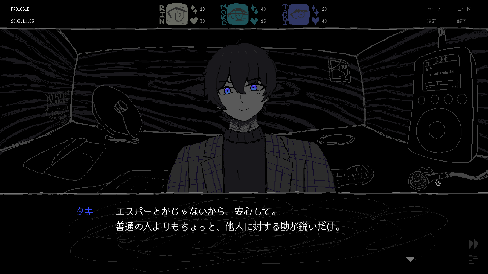

    

      <h4>クイズ</h4>
      
引き出しの管理人、タキの趣味は何？

      <ol class="notice-quiz">
        <li>
          <a href="#">ピーナッツを食べる</a>
        </li>
        <li>
          <a href="#">音楽を聴く</a>
        </li>
        <li>
          <a href="#spoiler">コマを回す</a>
        </li>
      </ol>
    

    <figure id="store">
      <iframe src="https://store.steampowered.com/widget/2492120/" frameborder="0" width="646" height="190"></iframe>
      <figcaption>
        この記事には重大なネタバレが含まれます。未プレイの方はぜひ一度遊んでみてください！
      </figcaption>
    </figure>
  

<strong>正解おめでとう！！！</strong>

<figure>
    
    <figcaption>
      <i>「...ねえ。首筋とかの筋肉ってどうなってるの？
        パーカーの中、ちょっとだけ手を入れてもいい？」</i>
    </figcaption>
  </figure>

というわけで、今日は10月5日、Daily SAEKOの記念すべき1日目です。ゲーム内でも、この日から「昼」「夜」「深夜」からなるメインのゲームプレイが始まり、セーブ/ロード画面や夜画面では「1日目」として表示されます。

でも、これがリンにとって本当の1日目なのかというと......どうだろうね？（ネタバレ注意！！！）

ともかく、1日目は物語のフックとして書いた箇所で、大きな裏切りが起こる場面です。ゲームの開始直後、冴子は「道端で縮んでいたリンを拾ってきた」と言い、保護するという名目で引き出しの中に入れます。だけど、引き出しの中にはなぜか他の小人がいて、タキとチオは挙動不審、明らかに何かを隠しています。そして、冴子が帰ってきて、目の前でモコが食べられ、タキはリンに説明をしなかったという罪で握り潰されて死にます。

改めて自分で書き出してみると、とてつもなくやばいプロットです。......どうしてこうなった？

昨日の記事で触れた通り、SAEKOには2種類のシナリオが存在します。プロトタイプと本編です。プロトタイプは2023年、開発を始めた当初に使っていたシナリオで、Tokyo Indiesや最初の東京ゲームショウなどで使用しました。当時は完全に趣味で作っていて、何の計画もプロットもなかったので、プログラムに飽きたらシナリオを書き、シナリオに詰まったらプログラムを書くという、とても自由な形で書き進めていたのを覚えています。

ですがその後、トレイラーを公開してパブリッシャーがついたのち、システムも含め全てを1から作り直すことに決めました。現在の本編に使用されているのは、その際に新しく作り直したシナリオです。余談として、この作り直しで数ヶ月分の進捗が失われたのですが、この過程でシステムの完成度も上がったと思うし、なにより「これは何をしたいゲームなんだろう」という疑問への自分自身の理解が深まったので、やってよかったなと思っています。

<figure>
    <iframe width="560" height="315" src="https://www.youtube.com/embed/rKV4H0SKmsE?si=rDgA5sEujhmmDERM" title="YouTube video player" frameborder="0" allow="accelerometer; autoplay; clipboard-write; encrypted-media; gyroscope; picture-in-picture; web-share" referrerpolicy="strict-origin-when-cross-origin" allowfullscreen=""></iframe>
    <figcaption>
      ファーストトレイラー。現在とは何もかも違う。古いシナリオも、ゲームシステムが現在のビルドと違うので難しい部分がありますが、いつか遊べる形で公開したい......！
    </figcaption>
  </figure>

プロトタイプと本編では、ゲームシステムも異なっています。プロトタイプの時点では、「食べ物で小人の魅力を上げ、毎日１人ずつ冴子に差し出す」という現在のループは確立していませんでした。体力と魅力の定義は曖昧で、すべてのアイテムに応じて変動します。パラメータ管理ゲーを目指していたのだと思いますが、シナリオ作りには詰まってしまい、だからこそ本編のゲームシステムはかなり単純なものになりました。

冴子のキャラクターには原案の小説があるため、プロトタイプの頃からずっと一貫していました。残酷で、嗜虐癖があり、しかも好んで小人を食べます。いわゆるデートシムのヒロインに求められる、恋愛やエッチな展開には全く繋がりません。でも、どこか繊細な部分があって、深いところで悩んでおり、その悩みに介入してくれる（もしくは、その悩みすら肯定してくれる）誰かの存在を求めています。

現在のシナリオを書き始めたのは、SAEKOのトレイラーやニュース記事が話題を呼び、潜在的なファンの反応がある程度分かり始めた時期でした。自分たちが出している情報が断片的なこともあって、その頃に多かったコメントは、「巨大な美少女にお世話されたい」とか、「大きな身体を使ってエロいことをしてほしい」というものが多かったです。期待されているという嬉しさはあったものの、一方で、自分たちが作っているゲームは確実にその期待に答えられないだろうなと感じていました。

優しく管理してくれる巨大美少女を求めているプレイヤーに、どうやって我々の知っている残酷でダークな冴子を突きつければよいのか？

こうしてモコが誕生しました。

モコは骨太のオタクで、子どもの頃から二次元に親しみ、三次元の出来事も全て創作として解釈します。バスケやバレーに詳しいし、浮気の相談されたら「NTRだ...」って思う（言う）し、もちろん3L全ていけます。リンを「男の娘」って呼んだり、冴子を「巨乳黒髪美少女」って呼んだりするけど、そこに深い意味はなくて、ただオタクとして目の前の人物に属性を当てはめているだけです。そして、もともと明るくて友達の多い女の子ではあるのですが、この日はリンを始め初対面の人が多く、変なギアがかかってしまい、だからこそ鬼のようにしゃべるしリンの股間を触ってきたりしています。書いててつらくなってきた。仲良くなりたいだけなんです。許してあげてほしい。

モコは書いていて本当に楽しいキャラクターで、次から次へと良いセリフが浮かんできます。パブリッシャーに見せた最初のビルドでは、モコはもっとたくさん話していました。女オタクとしての誇りとかについて。ただ、冗長というアドバイスを受け、セリフを削っていき、結果的には現在のセリフ量に落ち着きましたが、これで良かったと思います。

明るくて、黒髪美少女・冴子とのえっちな展開を期待しているモコが、なんとその彼女に食べられて消えてしまう。文字に起こすとなかなか酷いプロットですが、ゲームの本編の始まりとして、これ以上ないくらいにぴったりハマったんじゃないかと思っています。

  

そして、もう１人のキャラであるタキについて。タキはリンの前の管理人で、人当たりが良く、身体も顔も良いイケメン男子です。彼は人の心を読めるという特技があり、そして、作中には出てきませんが、医学部卒のエリートという設定を考えていました。もともとリンにゲームシステムを教えるキャラとして考えていたので、2日目以降も生き残り、リンに魅力や体力のシステムを解説してもらう予定でした。

では、なんで1日目で死ぬことになったかというと......これ以外に殺せる場面がなかったから！

タキは引き出しのルールを知っていて、賢いし、なおかつ生き残りたいという意志があります。リンからの食べ物は受け取らないだろうし、かといって脱出への協力もしないだろうし、自分の力量では、タキが死ぬ場面を想像できませんでした。この「引き出しの事実を知っているキャラが生き残ってしまう」という問題はけっこう深く、今後もどうにか逃げ回り続けることになります。

結果、タキの死はやや唐突な感じになってしまいましたが、結果的にはこの唐突さが良かったのではないかと思っています。プレイヤーにとっても意外でショックを与えられたでしょうし、流血の描写は絶対に欲しかったので......。タキを握りつぶしたあと、指についた血を冴子がティッシュで拭くシーンを描いてもらいましたが、あれは自分としてかなり気に入っています。原案小説にも似たような描写があり、そこでも小人の命の軽さが鮮やかに描かれていて、ゲームでも取り入れたいと考えていました。

ちなみに、モコの名前は村上龍の「限りなく透明に近いブルー」の登場人物から取りました。漢字表記は「萌子」ですが、個人的には「喪」（「喪女」）とかのイメージもあります。

タキは原案小説に登場する本郷剛士（仮面ライダーの本郷猛と同名異字ですが、原案にはこういうパロディがよくあります）から取ったのですが、「タケシ」と書くと例の糸目のジムリーダーが思い浮かんじゃうので、「タキ」に変更しました。

小人の名前全般に言えることですが、実在感がありすぎると邪魔かなと思って、全体的に少し響きをずらしています。例外はユイとカズですが、これはなんとなく分かるかなと思います。２人とも、実在感が必要なキャラクター設定だったからです。

......やばい、無限に書きたいことが出てきてしまう！携帯のニュースとか、そもそも冴子とリンの設定とか、書きたいことはたくさんあるんですが、このままだと終わらなそうなので明日以降に回します。続きはまた明日！
