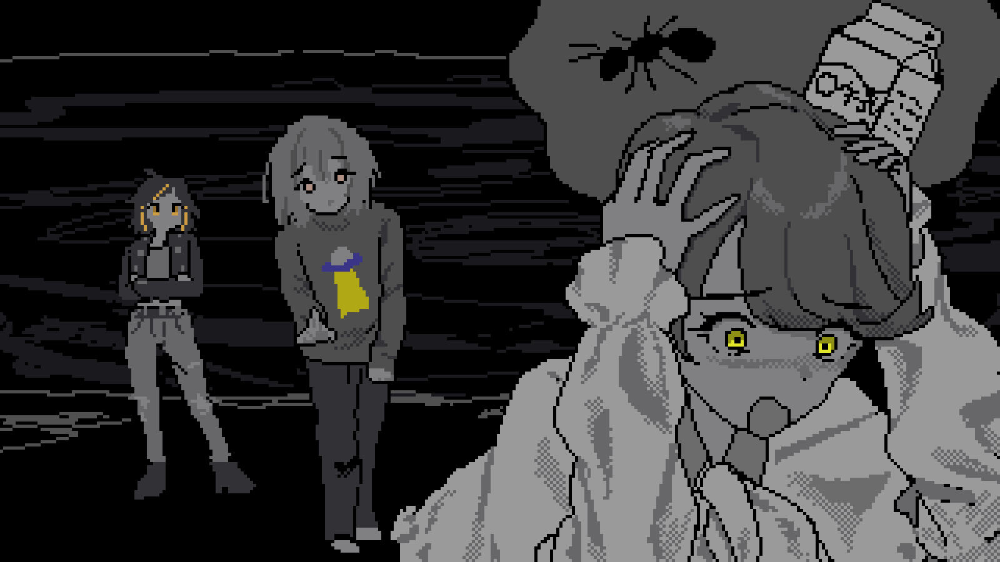
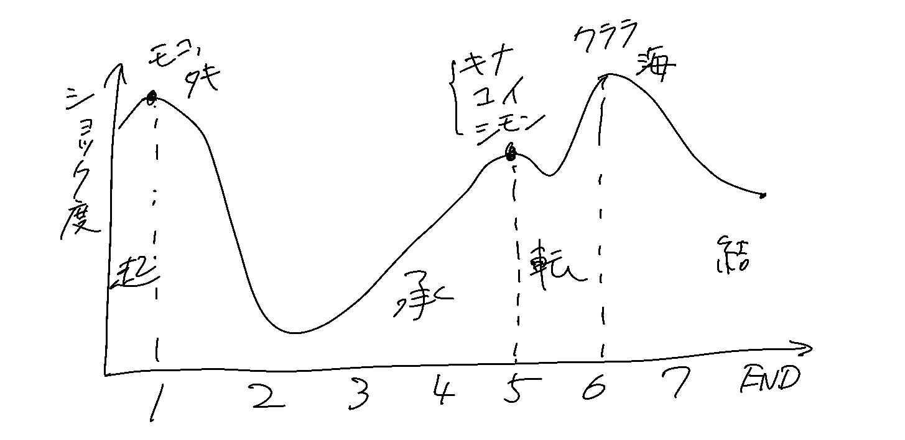
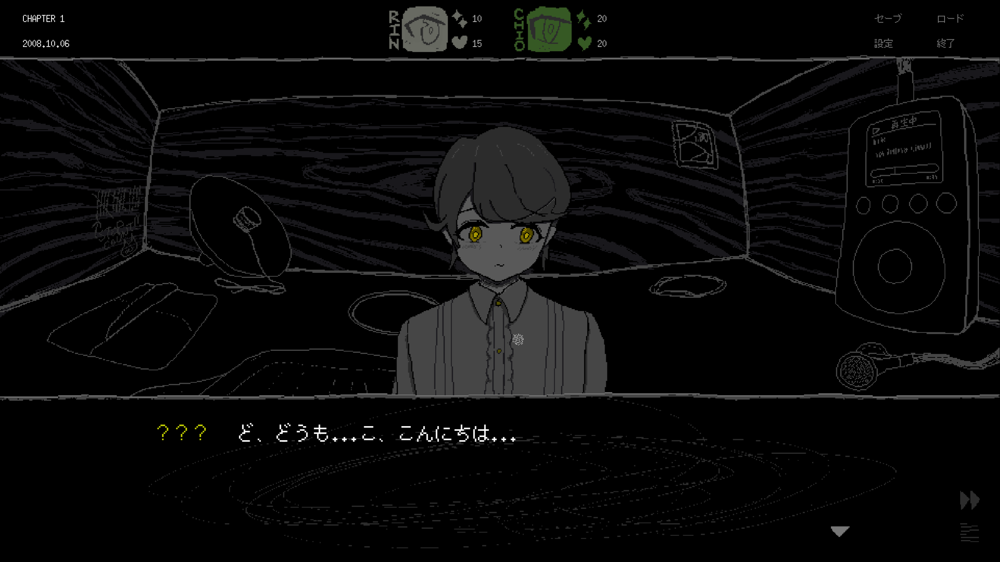
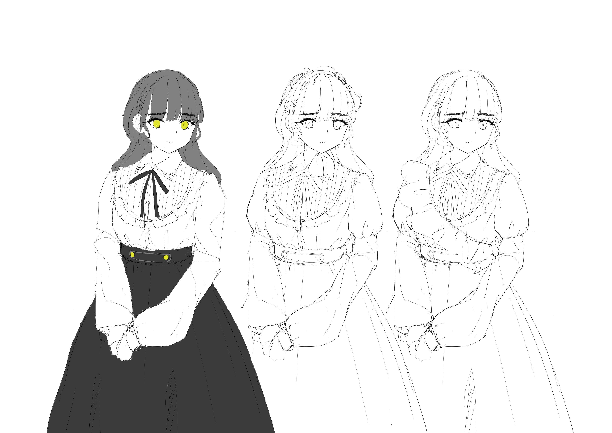
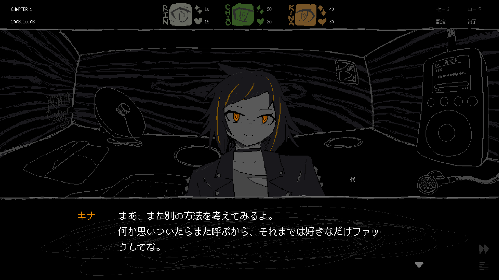

    

      <h4>クイズ</h4>
      
マルの特技は何？

      <ol>
        <li><a href="#spoiler">洋服を作る</a></li>
        <li><a href="#">生き物の世話</a></li>
        <li><a href="#">おしっこを我慢する</a></li>
      </ol>
    

    <figure id="store">
      <iframe src="https://store.steampowered.com/widget/2492120/" frameborder="0" width="646" height="190"></iframe>
      <figcaption>
        この記事には重大なネタバレが含まれます。未プレイの方はぜひ一度遊んでみてください！
      </figcaption>
    </figure>
  

<strong>正解おめでとう！！！</strong>

ということで、今日はDaily SAEKOの2日目です。作中ではマルとキナが登場します。リリースしてからの反応を見ると、キナはすごく人気がある一方で（ありがとうございます）、マルは少し影が薄いようです。でも、それはある程度狙い通りでもあるので、まずはそのへんから。

<figure>
    
    <figcaption>
      <i>「こ、これが偶然なわけがない...や、やっぱり、ぼくのせいで、みんな殺されちゃうんだ...」</i>
    </figcaption>
  </figure>

冴子のプロットとして、まず最初に出来たのは１日目の「起」の部分でした。次に６日目の「転」が決まり（６日目のときにまた書きますが、「元カノが冴子に殺される」というプロットは比較的早い段階でできていました）、２〜５日目はいわゆる「承」として後から埋めていった部分です。

SAEKOのゲームプレイは「食べ物で魅力を上げて、１日１人冴子に小人を食べさせる」というやばいシステムです。僕の感覚としては、これはあまりにも過激でしんどくて、思いついてから一度ボツにしてしまっていたぐらいでした。冴子はずっと小人を食べるのが好きな女の子で、「魅力が50を越えた小人を食べちゃう」というシステムはプロトタイプのときからあります。ただ、プロトタイプでのプレイヤーの役目は製品版の逆で、「誰も冴子に食べられないよう、魅力を50未満に調整する」というヒーローの役割を担っていました。シナリオの都合から、最終的にはこの役割を反転させ、プレイヤーには「誰かを食べさせる」という悪の所業をやってもらうことになったのですが、それでも私は「このシステムは残酷すぎるのではないか？」と感じました。

この、「システム面の残酷さを緩和する」というのはシナリオ制作における１つの課題で、色々な調整を試みることになりました。その１つが、いわゆる「承」の部分の心理的負担の軽減です。５〜６日目のつらい展開を残しつつ、プレイヤーの心が途中で折れてプレイを辞めてしまわないように、２〜４日目は比較的楽しくプレイできるようにしようと思いました。

ここで、２日目の心理的な役割が決まりました。１日目の役割が可能な限りプレイヤーの期待を裏切り、精神的なショックを与えることだとしたら、２日目はそのショックを癒やし、かつ「もっとこの先が読みたい」と思えるような、ちょっと楽しい気持ちになってもらうことです。

あと、２日目にはいわゆるチュートリアルの役割もあって、「体力が0未満のキャラが出たらまずい」というゲームシステムを教える必要がありました。この２つの役割を満たすためには、体力が低く、かつプレイヤーがあまり心を痛めずに冴子に差し出せるキャラクターが必要です。

そう、そしてそれがマルです。

マルは大人しく、手芸や裁縫が好きな男の子です。趣味にも見た目にも、どことなく女性っぽい柔らかさがありますが、それもそのはず、マルはもともと女の子という設定でした。途中で男の子に変更したのは、ゲーム全体の男女比が女性に偏りすぎてしまったためですが、結果的にはマル本人にとっても良い判断だったかなと思います。キャラとしてユニークになったし、「アリの巣をおしっこで……する」というエピソードも、今思えば男の子のほうがはるかに説得力があると思います。精神的にも、物理的にも。

ちなみに、「魅力を上げたキャラクターが、急にめちゃくちゃなド下ネタを言い始める」というのも、上に挙げたプレイヤーの心理的負担を避けるための処理です。誰かを殺すことになったとして、そのキャラが良い子で命乞いをしていたら辛くなるけど、悪い子で支離滅裂なことを言ってれば楽、みたいなことです。

この「めちゃくちゃな下ネタでプレイヤーの罪悪感を軽減する」というのは、ダンガンロンパシリーズに強い影響を受けました。あの作品も、プレイヤーの罪悪感や高感度を会話の内容で調整していて、プレイするたびに本当にすごい作品だと思います。V2リメイク楽しみ！

もっとも、マルのエピソードはだいぶ自分の趣味が入っています。マルのシナリオを書く少し前に、バタイユの「眼球譚」という小説を読んだのですが、絶頂して失禁したり死体に放尿したり、とにかくおしっこのオンパレードでした。哲学・美学的な意味があるというのは分かるのですが、個人的にはそれ以降、おしっこが面白い存在になってしまっていて（今も）、だからマルのエピソードはすごく楽しく書いた記憶があります。まあ、SAEKOの会話は「人間と暴力」というテーマだし……マルのエピソードもその延長というか……文学的にも意味がある……よね？

ちなみに、マルの名前は眼球譚の登場人物、マルセルに由来します。彼女も作中で失禁して発狂します。もう１人の登場人物、シモーヌの名前もシモンに引き継がれますが、こちらの名残りは全然ないですね。２日目のキーアイテム、「牛乳」も眼球譚の冒頭のシーンが由来です。

  

2日目にはもう１人、キナが登場します。こちらはマルとは反対に息が長く、最大5日目まで生き残るキャラクターです。キナは皮肉屋で反骨精神を持つ、ボーイッシュなパンクガールとして作りました。なぜなら、私はボーイッシュなパンクガールが好きだからです。

キナは最初からキャラが固まっていて、脳内でも自由に動き回ってくれる（そして片っ端から酷い毒舌を言いまくってくれる）ので、書いていてあまり困りませんでした。当時のメモを見たら、参考にするキャラとしてアークナイツのアシッドドロップと、スコット・ピルグリムのキム・パインを挙げていました。特に、ドラムボーカルのバンドマンという設定はキム・パインを参考にした記憶があります。３日目、食べ物にパイナップルが登場しますが、これもキム・パインの名前から取りました。

キナについてはまだ書き足りないこともあるのですが、明日以降も登場しますし、続きはまた今度書くことにします。

  

というわけで、本日の記事はここまで！続きはまた明日！
