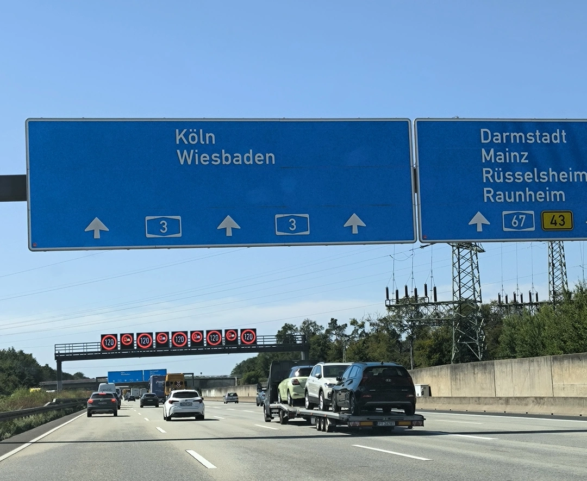
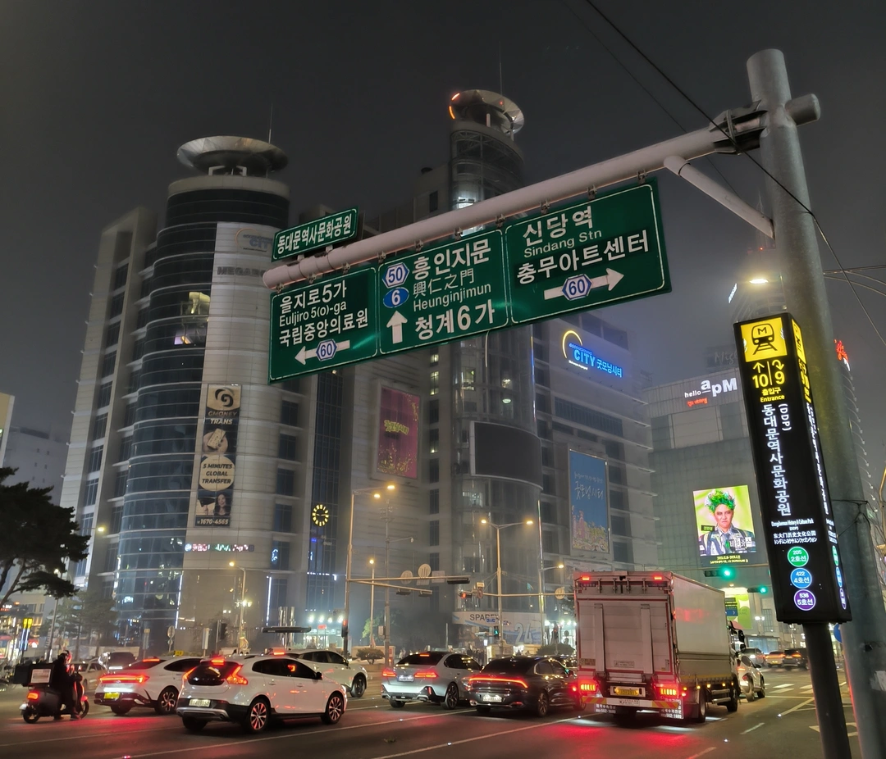
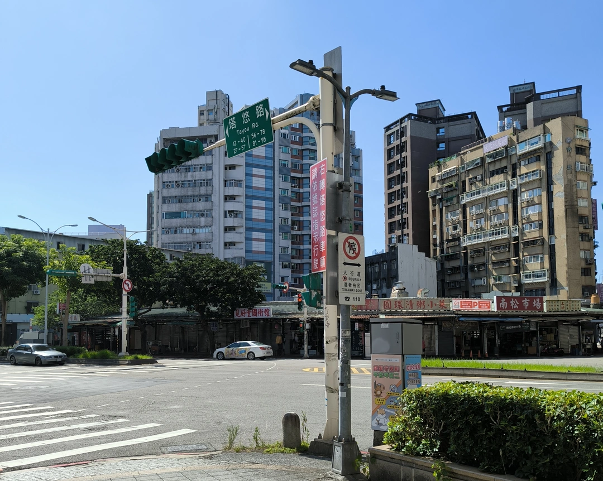

こんにちは。SAFE HAVN STUDIOのkypです。前回の開発日記が8月とかだったので、これは4ヶ月ぶりの開発日記です......が......前回の記事を書いてから、新しく現時点で紹介できるような開発内容は存在しない気がする......。

これはただの日記です。

#### 近況報告

この4ヶ月間、めちゃくちゃイベントに行きました。Gamescom, TGS, Taipei Indie Week, Beaver Rocks。場所もドイツ、東京、台北、韓国とバラバラで、ワールドツアー中のアーティストみたいな気分！

どのイベントもすごく楽しくて、貴重な経験をさせてもらいました。特に海外イベントでは、どの国に行っても既にSAEKOをプレイしたファンの方がいらっしゃって、感想を聞かせてもらえるのが嬉しかったです。自分のゲームのプレイヤーが世界中にいるというのは、もちろんSNSやSteamの管理画面を見れば分かることではあるのですが、実際にファンの方とお会いすると実感が強くなります。外国に自分の作品を届けるというのは、SAEKOでやりたかったことの1つなので、それが達成できてよかったなと思います。

個人的なことでいうと、私は外国の標識や看板を見るのがとても好きなので、そのあたりも良い経験ができました。ドイツのアウトバーンにも乗れたし、台北やソウルの地下鉄もカッコよかった。パブリッシャーやチームの皆様には、観光地でもなんでもない交差点で異常に写真を撮りまくってびっくりさせてしまったと思います。

でも許して...こういう写真見返すのまじで楽しいし...あと観光地で周りみたいに写真撮るのなんか恥ずかしくて...

イベントでSAEKOを展示するたびに、たくさんの人に話しかけられて、作りながらあれこれ悩んでいたことも無駄じゃなかったんだなと思うし、ゲーム制作のモチベーションも上がります。

じゃあその分、開発も進んでいるかというと......実のところ......それは......全然進んでない！

本当に恥ずかしながら、この数カ月間はイベント出展と個人的な旅行（九州とか沖縄とか行った）で、2週間に1回は出かけているような毎日でした。個人的な事情として、最近引っ越しを行ったこともあり、集中して作業に取り組める時間がなかなか作れませんでした。

SAEKOの追加コンテンツについても、１つゲームシステムの実装まで進んでいたものがあるのですが、どう頑張っても面白いシナリオを思いつくことができず、結局システムごと没にしました。まあ、ゲーム開発って元々そういうものだと思うんですけど、それでもやっぱり悲しいです。

イベントに出るのは超楽しいし、旅行するのも楽しいんですけど、やっぱり本当は開発のほうが好きです。１人で部屋に引きこもって作業して、気づいたら１日が終わってるの、脳汁が出ている感じがします。幸い、今後はしばらくイベントの予定もないし、個人的な用事もできるだけ減らしています。そして何より大事なことに、結構ヤバめの締め切りがあります（嬉しい！！！）。

というわけで、これからしばらくは部屋に引きこもって制作をする人間になります。さらばだ！

#### 今後

SAEKOのプロジェクトはこれで終わりではなく、追加の展開を用意しています。具体的なことが書きづらく、ふわっとした表現にはなってしまうのですが、それでも裏側ではしっかり準備が進んでいます。先週もヤバい締め切りがあったし、来週にもまた別のヤバい締め切りがある。ヤバい。韓国から日本に帰ってきて、冷静にカレンダーを見たときの焦りがすごかったです。でもその焦りのおかげで作業に集中できる。やっぱり締め切りっていいですね。

それと、ゲームイベントに出るたびに、SAEKO以外のコンテンツで出てみたいという気持ちも強くなります。新しいプロジェクトを披露するのってめちゃくちゃ楽しいので......。SAEKOより、もう少しだけアクション性が高いゲームのアイデアを何個か考えたりしています。前述のヤバい締め切りたちをこなしつつ、空いた時間で新しいゲームの制作を進めていきたいです。空いた時間が......あればの話だけど......。

おわり！
