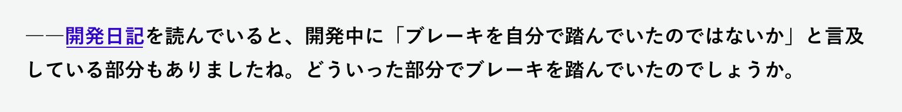
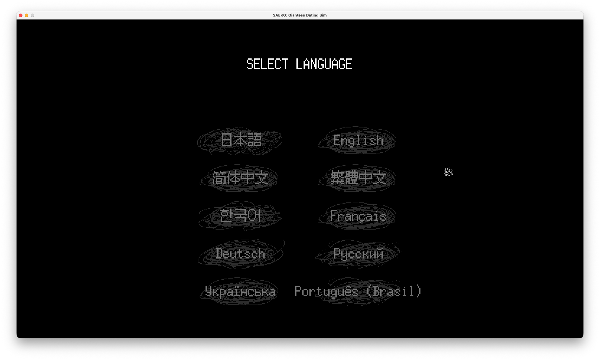
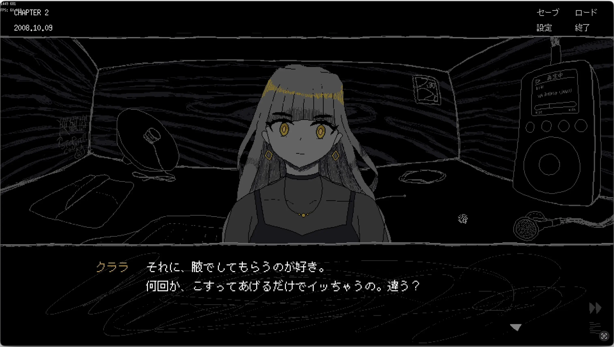

こんにちは。kypです。これは2025年12月23日の開発日記です。

#### ハーフアニバとか

前回の記事で触れられていなかったのですが、パブリッシャーのHYPER REAL様にご尽力いただき、SAEKOの発売半年を祝うハーフアニバーサリーイベントを開催しました。

<figure>
    <blockquote class="twitter-tweet">
      

        ◤SAEKO ハーフアニバ記念イラスト1日目◢  『SAEKO』の発売半年を記念してハーフアニバーサリーキャンペーンを開催！ 今日から1週間、人気アーティストたちによる豪華描きおろしお祝いイラストを毎日公開します。  🎊1日目はこちら 開発者SAFE
        HAVN STUDIOのkoh様(<a href="https://twitter.com/koh9083?ref_src=twsrc%5Etfw">@koh9083</a>)からいただきました。…
        <a href="https://t.co/3GS8AtU7m1">pic.twitter.com/3GS8AtU7m1</a>
      

      — HYPER REAL (@HYPERREAL_jp)
      <a href="https://twitter.com/HYPERREAL_jp/status/1997954330607902940?ref_src=twsrc%5Etfw">December 8, 2025</a>
    </blockquote>
    
    <figcaption></figcaption>
  </figure>

期間中の日替わりイラスト企画では、ゲーム内アーティストの[koh](https://x.com/HYPERREAL_jp/status/1997954330607902940)の他、[肉村Q](https://x.com/nikukaiQ/status/1998319531274469770)さん、[なるめ](https://x.com/narumeNKR/status/1998686343086449049)さん、[細川成美](https://x.com/giRly_darkness/status/1999042620635681155)さん、[ななみ雪](https://x.com/yuki77mi/status/1999414143343067595)さん、[キュアもと](https://x.com/curemoto_dot/status/1999778114378031170)さん、そしてSukeban Gamesの[kiririn](https://x.com/HYPERREAL_jp/status/2000128630400205272)さんにSAEKOにまつわる素敵なイラストを描いていただきました。本当にありがとうございます。

  

期間中、いくつか新規発表がありました。まずは対応言語の追加。非常に要望が多く、非英語圏のゲーマーとして自分自身もずっと気になっていたことなので、ついに実現できて嬉しかったです。

<figure>
    <blockquote class="twitter-tweet">
      

        ◤SAEKO ハーフアニバ記念ニュース第3弾◢  発売半年を記念して、多言語対応が決定しました！ 🖊️追加言語 ・フランス語 ・ドイツ語 ・ブラジルポルトガル語 ・ロシア語 ・ウクライナ語  対応時期については続報をお待ちください！<a href="https://twitter.com/hashtag/saekogame?src=hash&amp;ref_src=twsrc%5Etfw">#saekogame</a>
        <a href="https://t.co/L1PVF53qaD">pic.twitter.com/L1PVF53qaD</a>
      

      — HYPER REAL (@HYPERREAL_jp)
      <a href="https://twitter.com/HYPERREAL_jp/status/1999041654339277090?ref_src=twsrc%5Etfw">December 11, 2025</a>
    </blockquote>
    
    <figcaption></figcaption>
  </figure>

とはいえ、これでも要望をいただいた言語の全てには対応できていません。まだまだ先の話になってしまうとは思いますが、MODへの対応など、皆さんが好きな言語で遊べるようにするための調整は今後も進めていきたいです。

  

それから、[IGN Japan様でのインタビュー記事](https://jp.ign.com/saeko-giantess-dating-sim/82020/interview/saeko-giantess-dating-sim)も公開されました。実写注意。室内のインタビューなのに、なぜか髪が爆発しているkypの様子を見ることができます。インタビューで着用したTシャツは[IGN Store](https://store.ign.com/collections/ign-review-tees?srsltid=AfmBOoonYyRgMh54UiQNXQJcuSnannG-H0aS0FcH5vkromt7TDIHTUSc)で好評販売中です。

インタビュワーがSAEKOについてよく調べてくださっていて、質問には開発日記の内容について触れたものまでありました。正直、完全にチラシの裏のつもりで書いていたので、読まれているのが分かって死ぬほどビビりました。しかも昔の文章は荒れまくっている。2年くらい前の記事について聞かれて読み返したら、何かに悩んでいるということだけ伝わってきたけど、何の悩みかは思い出せず、なんか適当に思いついたことを話したりしました。恥ずい。

<figure>
    
    <figcaption><a href="https://safehavn.dev/blog/2024-04-23/">1年前の記事へのリンク</a>まである</figcaption>
  </figure>

それと、インタビューでは、今後の展開について少し話しました。多言語対応の他にも、携帯型ゲーム機への移植などを行いたいと考えています。左右のコントローラーが外れたり、TVに投影できたりするあれです。今のところ、作業は順調に進んでいるので、いつかどこかで発表したいなと思います。

このチラ裏以外のどこかで。

#### 最近の作業とか

というわけで、最近はSAEKOのプロジェクトに戻って、追加言語の実装とか、携帯機移植の対応とかを進めています。また、どうせバージョンアップをするのなら...ということで、ずっと追加したかったコンテンツをついでに実装しました。ゲーム本編とは違うシナリオになりますが、既存ファンの方にも気に入ってもらえたらいいなと思います。

余談ですが、新規言語の実装は楽しいです。言語のテキスト自体は完全に未知だけど、シナリオや演出は日本語のものと同じなので、なんとなく意味の察しがつきます。アイテムの名前とかも楽しい。「ジュエリーボックス」はドイツ語で「Schmuckkästchen」です。かっこいい。そしてSAEKOは原文が最悪なので、各言語での童貞や早漏の言い方について学ぶこともできます。

#### ねんまつ

ちなみに今日は12月23日で、これが2025年最後の開発日記です。今年の1月は[まだSAEKOのテキストを書いていて、ケータイ画面の実装とかで苦しんでいた](../2025-01-07/index.html)ことを考えると、本当に隔世の感があります。修羅場を経験して、（ちょっぴり延期もしつつ）リリースして、遊んで、海外イベントなんかにも行っちゃって、今後の人生でこれより濃い1年を過ごすことはきっとないんじゃないかと思います。

総じて言えばめちゃくちゃ楽しかったんですが、もちろんこれは自分の力だけで成し遂げられたわけじゃなく、いつも応援してこんなブログまで読んでくださっている皆様のおかげです。改めて感謝します。

2025年の前半は超クリエイティブで、後半はそれほどでもなく、どちらかというと外の世界を見て回ることに費やしていました。でもそれも終わり！もう十分見た！2026年からは再び家に引きこもり、まずはSAEKOを、そしてその後はSAEKOとは全然違うゲームを、楽しく作っていけたらと思います。

それでは、良いお年を！来年も、このチラシの裏でお会いしましょう！
