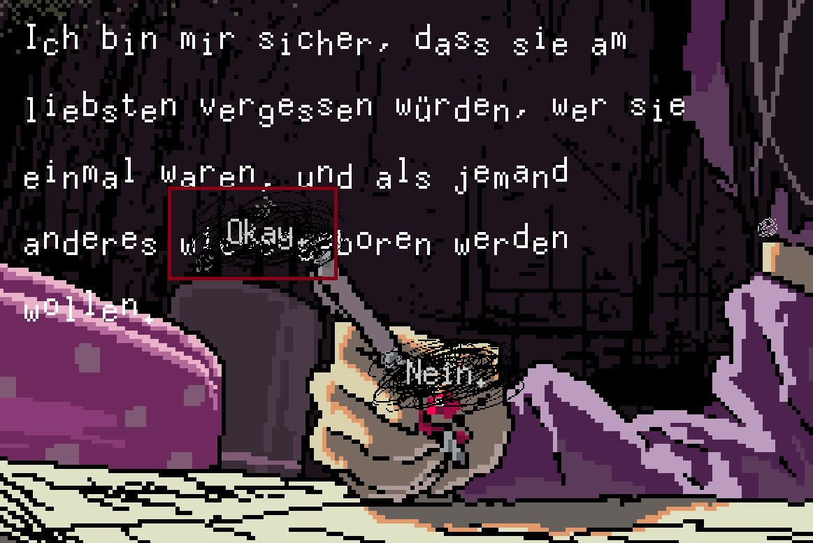
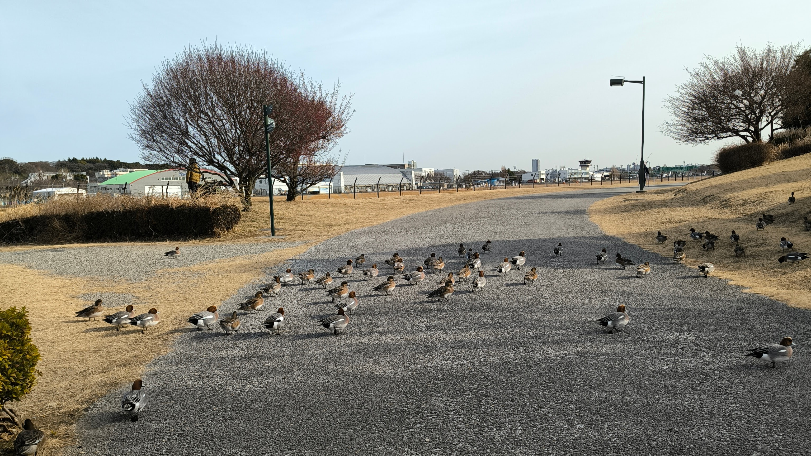

こんにちは。kypです。これは開発日記です。

#### 書けることがない

ここ数ヶ月ずっとこんな感じで申し訳ないのですが、開発日記に書けることが本当に少ないです。1ヶ月ぶりに記事を書こうとしてエディタを開いたのですが、書けるようなことが思いつかず、皿洗いしてシャワーを浴びてご飯を食べました。それでもまだ何を書くか悩んでいます。

作業をしていない、というわけではなく、むしろこの1ヶ月はかなり長い時間SAEKOの作業をしていました。ただ、わりと多くの大人が関わっている事柄が多く、勝手にブログで書いたら怒られる気がする......してたんだけど......

別に書いちゃっていいか！怒られるの好きだし！本物のインディー精神を味わうがいい！

#### ローカライズ作業

先月の開発日記で触れた通り、昨年の末頃に新規言語への対応を発表し、今月はその組み込み作業を行いました。もちろん、実際にテキストを考えてくださる翻訳者の方が一番大変だと思うのですが、それをゲームに組み込む作業も想像以上に大変で、なかなかの苦境を体験しました。

特に、SAEKOはノベルゲームとしてのスクリプトを自作していて、しかも作り始めた当初はまさかこんなに翻訳されることになるとは思ってもいなかったと思います。これまでの英中韓への対応を通して、少しずつ多言語対応のノウハウは溜め込んできたつもりだったのですが、ヨーロッパ系の言語にはまた別の難しさがあり、頻繁に過去の自分を恨みました。

あと、スクリプトに直接関係のない難しさとして、文字数の問題があります。日本語のテキストを英語に直すと、画面上では最大1.5倍くらい長くなります。なので、ゲームのUIを組む際にはスペースに気を遣う必要があるのですが、EU系の言語では2倍どころじゃなく長くなる傾向があってびっくりしました。

例えば、日本語で以下のセリフがあります。

    きっと皆、元の自分なんて忘れて、
    別の誰かに生まれ変わりたいのよね？

これは33文字で、等幅フォントだとアルファベット66文字分の長さです。

で、これを英語にすると

    I'm sure they all want to forget who they used to be and get reborn as someone else.

になります。84文字で、日本語の1.2倍くらいですが、実際は単語の間に改行を挟めないのでレイアウトとしてはもう少し長くなります。そして、これがドイツ語になると、

    Ich bin mir sicher, dass sie am liebsten vergessen würden, wer sie einmal waren, und als jemand anderes wiedergeboren werden wollen.

132文字！字数だけでも日本語の2倍！助けて！

これは言語の特性によるもので、翻訳では避けられない問題だと思います。最初から多言語リリースする作品だったら、こういう長いテキストも考慮したうえでUIを組むべき。ただ、SAEKOは既にリリースしてしまっていて、今更UIを変えることは難しいです。そこで、今回は翻訳者の方にお願いして、訳文を縮めてもらうことにしました。

その他にも、月日の表記や組版など、EU系の言語には微妙に難しいいくつかの問題があり、同時並行によるミスなんかもあったりして、なかなか思った通りには進みませんでした。1〜2週間前に、ようやく全てのLQAを終わらせることができたのですが、完璧には翻訳者の依頼に応えられなかった部分があります。それでもせめて他のインディゲームと同じくらいには、各言語での体験を損なわないシステムにできたと思うのですが、あとはリリース後のプレイヤーによる良い反応を祈るばかりです。

#### その他

その他。ここから先は詳細に書くと本当に怒られそうなので、ぼやっとふわっと書きますが、S....h関連のプロジェクトが進んでいます。携帯機への移植はこれが初めてなので、プログラム上の苦労はありますが、頑張るしか無いです。でもQAは本当につらい。泣きたくなるほどつらい。誰か助けてほしい。

あと、あわせていくつか実現しそうなことがあり、最近はそのための監修作業なども行っていました。来月中には発表できると思いますが、.wi..h版で初めてSAEKOに触れてくれるプレイヤーはもちろん、S.itc.で普段あまりゲームをプレイしない人にとっても、きっと嬉しい発表になるんじゃないかと思います。

僕はゲーム制作のことをかなり趣味の延長として捉えていて、とにかく好きなコンテンツを自由に作りまくっていたいのですが、最近はローカライズしかりQAしかり、クリエイティビティと違う脳の部分を使う作業ばかりなのがつらいです。あまりにも向いてない。ほんとはずっと一人で誰得コンテンツをニヤニヤ笑いながら作っていたい......。

一方で、いま置かれている状況はかなり幸運なほうで、自分だってSAEKO以外でまたできるか分からないし、数カ月経てばきっと素晴らしい経験になるんだと思います。Steamのリリース時だって、だいぶしんどかったけど今となっては良い思い出だし。

まあ、とにかく、今はストレスを溜めずにやっていくしかないんだろうな〜と思います。あと反骨心というか、趣味で好きなことをやっている感覚は忘れないようにしたいです。このチラ裏すぎる開発日記もその１つ！あと、今まで意識の分散が苦手でほとんどできたことはないんですが、今後はSAEKO関係ない創作も週末とかに進めていきたいです。

最後に、これは近所の公園の画像です。冬になってから散歩がとても楽しいです。コンビニで買ったホットコーヒーをジャケットに突っ込んで適当に歩いています。

おわり！
