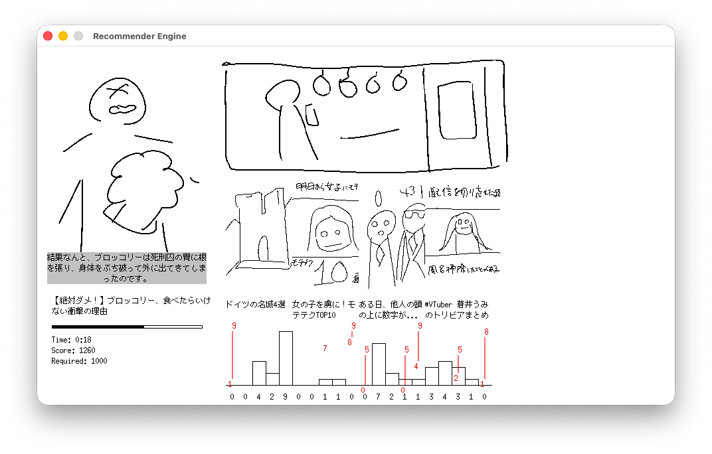

こんにちは。kypです。今週は月曜日に前もって記事を書いておいて、そのまま投稿を忘れて水曜日になっていました。これは開発日記です。基本的に隔週火曜日に更新される予定です。

#### 最近何した

何したんだろう...。相変わらず、SAEKOに関しては極秘プロジェクト™が進行中で、そのための準備を進めています。今月末ぐらいには詳細を発表できるはずですが、それまでは、「わからんけど何かやってる」ぐらいのことしか言えなそうです。

ゲーム本編を作っていた頃と比べて、なんというか、色々なことが複雑になってきたのを感じます。一番は他の人に協力してもらえることが増えたこと。いわゆる監修とか、指示出しのような仕事が増えてきた気がします。うわ〜厳しすぎるかな〜と思いつつ、色々なことに対して口出ししています。申し訳ねえ...。

なんというか、SAEKOを作った経験を通して、プレイヤーには直接見えないゲーム開発の裏側みたいなのは多少見えてくるようになってきた気がします。ゲームを売るというのはただのexeファイルを作って配るだけとは違うんだなと思ったり。それでも、心のなかではやっぱり、結局一番大事なのはプレイヤーに渡るexeファイルの中身と思っています。絵、音楽、プログラムやデザインなど、感想には現れない小さな部分にも無限のディテールがある。もちろん、プログラムの外にある理念や宣伝も大事だけど、結局良い作品はexeの中の全てのディテールを完璧に積み上げていくことでしか作れない、みたいな......。

書くことがなさすぎてポエマーになりそう。あああ。上の段落も10回くらい書き直しました。

#### その他

その他！メインのタスクが少し落ち着きつつあるので、空いた時間でSAEKOとは全く違うゲームのアイデアを試したりしています。超少人数開発で、企画書なんてものも作らないので、作りながらゲームシステムを考える超アジャイル開発です。まずは遊んでいて楽しいシステムを考えるフェーズなので、見ての通り、絵もレイアウトもめっっっちゃくちゃ雑です。

あまりにも雑なので少し補足をすると、今はYouTubeショートやTikTokを題材にしたゲームを考えています。SAEKOは暗く、ゲーム性は限られているノベルゲームだったので、次のゲームはもう少し明るく、かつゲーム性もそれなりにあるものを作りたいです。まあ、ゲーム性の高いシステムを考えるのってすごく難しいなと痛感していて、今もまだ頭を捻りながら考えている段階ですが...。

この検証で手応えを得られたら、もう少し真剣なアセットで開発を続けていく予定です。できれば今年の後半くらいから、自力でゲームイベントに出たりしたい。ノベルゲームという大枠すらなく、全てのシステムを手探りで作っていく必要があるので、試遊のフィードバックは大きな助けになるはず......。あと、SAEKOよりはイベント向きのゲームになりそう、という気もします。カジュアルで短いし、友達と盛り上がれるようなリアルタイム性もあるし、あと性癖とか出てこないし。

新しいゲームを作っていて改めて思いましたが、何の計画も立てず、自分の作りたいものを作るのはめちゃくちゃ楽しいです！目の前の締め切りやバグ修正に追われず、プログラムを一から書き直せるのもすごく幸せ。SAEKOのプロジェクトも残っているし、それも手を抜かずに進めていきたいとは思っていますが、やっぱりゲーム開発者としては常に新しい何かを作り続けていたいなと思います。

おわり！
