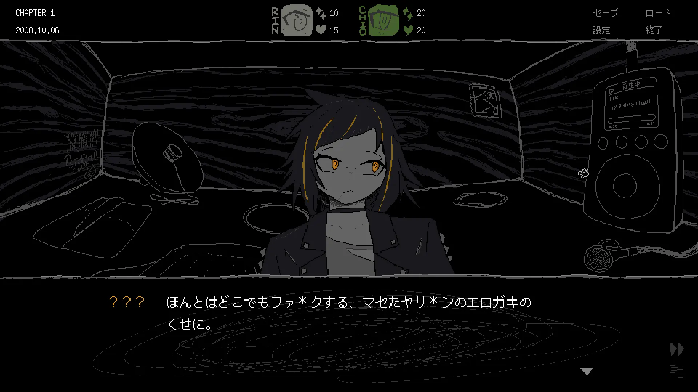
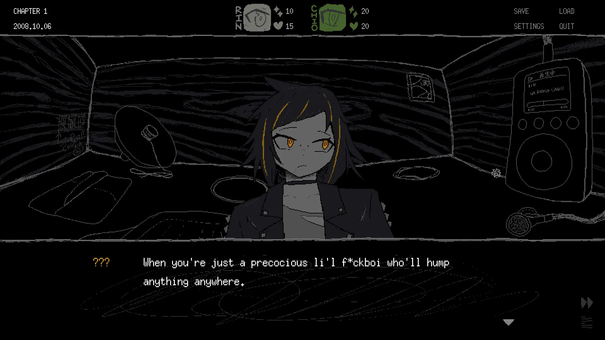
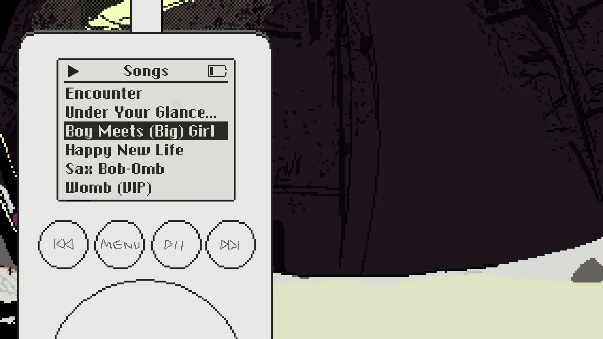
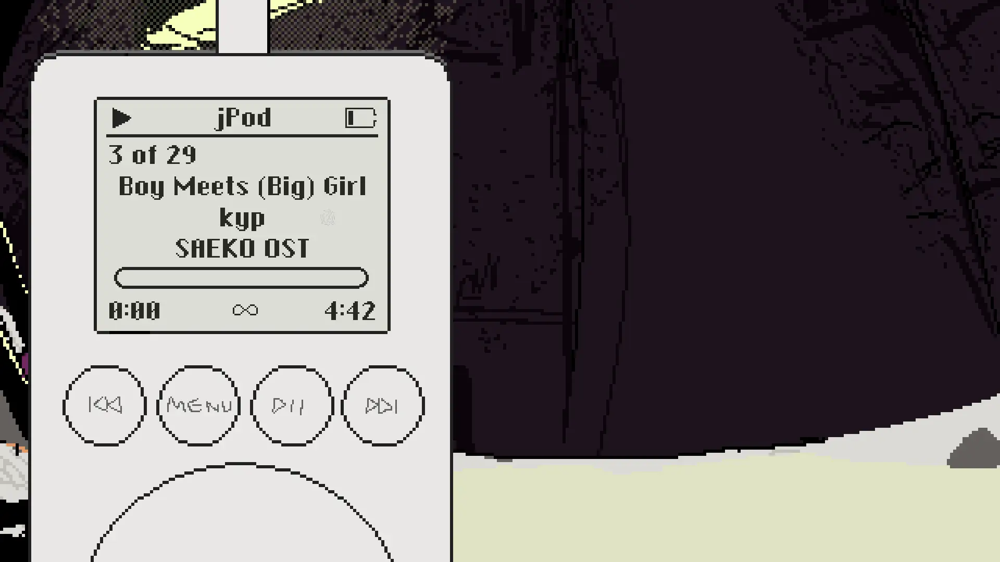

こんにちは。kypです。2週間の過ぎる早さにただただビビり続けています。これは3月10日の開発日記です。

#### Switch対応とか

[先週の記事](https://safehavn.dev/blog/2026-02-26/)でお伝えした通り、SAFE HAVN STUDIOのゲーム、『SAEKO: Giantess Dating Sim』が2026年6月25日にNintendo Switch™で発売されます（株式会社任天堂の登録商標です）。そして、現在はこのSwitch版発売に向けた準備を主に進めています。

前回の記事で、ゲーム自体のSwitch版への移植は既に完了している、と書いた気がします。実際、SAEKOが使っている[Ebitengine](https://ebitengine.org/)はとても優秀なエンジンで、入力周りのいくつかのコードを変えただけで、SAEKOはパフォーマンス的にも全く問題なくSwitch用の開発機で動作しました。

ただ、Switch上でゲームを出すためには、ただゲームが動作するだけではダメで、Ｎ社の非常に厳しい（と思われる）審査を乗り越える必要があります。ご存じの方も多いと思うのですが、SAEKOの歴史はあらゆる審査との格闘の歴史です。ご多分に漏れず、今回も軽めのジャブを食らいました。

<figure>
    

      
    

    

      
    

    <figcaption>ひどい発言（訂正済み）</figcaption>
  </figure>

とはいえ、審査に理不尽なところは少なく、SAEKOも指摘されたのは上に掲げたような細かい表現だけでした。実を言うと、SAEKOの審査はまだ続いていて、これから何が起こるかは完全には分かりません。ただ、審査上のやり取りはとても丁寧で、レスポンスも早くて明確なので、大きな問題になることは無さそうな気がします。Ｎ社さんはとても素晴らしい会社です。

それに比べてValveは本当にダメです。

<figure>
    <blockquote class="twitter-tweet">
      

        <a href="https://t.co/APLSMlailT">pic.twitter.com/APLSMlailT</a>
      

      — SAEKO: Giantess Dating Sim 🔜 Switch (@saekogame)
      <a href="https://twitter.com/saekogame/status/1927939664507240934?ref_src=twsrc%5Etfw">May 29, 2025</a>
    </blockquote>
    
    <figcaption>
      V社は発売予定日の翌日まで審査結果が帰ってきませんでした
    </figcaption>
  </figure>

通常版・限定版の各特典についても、主にkohとmaztaniが中心となってデザインを進めています。ゲームやデジタルな素材については、チーム内でもそれなりに経験があると思うのですが、アナログなグッズは初めて知ることが多く、とても勉強になります。一番大きな知見：アートブックは作るのが本当に大変。

まだまだ制作中のものも多いので、詳細は今回の記事では伏せておきます。ただ、現時点でもけっこう良いと思うので、最後までいい感じに作りきりたいです。

#### その他

その他！「SAEKOのゲーム内にBGMプレイヤーを実装する」という計画があり、現在実装を進めています。見て分かる通りまだまだ仮の状態ですが、オリジナリティ溢れる（過去のどんなプレイヤーにも似ていない）独自のUIにしたいと考えています。

<figure>
    

      
    

    

      
    

    <figcaption></figcaption>
  </figure>

それから、SAEKO以外のゲームもこそこそ準備中です。ただ、ゲームシステムとかで詰まり始めて、今はひたすら考え込むフェーズです。色々悩みもありますが、システムの面白さってとても大事なことだと思うので、実装を急がずしっかり考えていこうと思います。

  

今回は頑張れた気がする。みんなSNSをやめよう。おわり！
