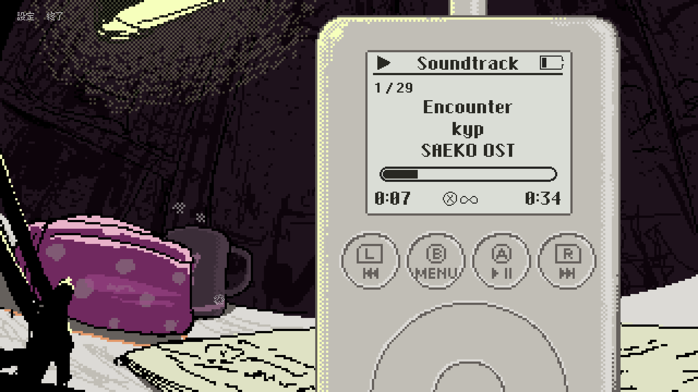

こんにちは。kypです。気づいたら23時近くになってました。眠いです。今日の開発日記は短いです。

#### サントラ実装とか

ここ数回の開発日記に書いている通り、Switch版にはゲーム内のサウンドプレイヤーを実装する予定です。Switch向けのサントラDLC、または物理パッケージ版を購入してくださった方には、ゲーム内のBGMを聴ける機能が解放されます。実装はほとんど完了し、今のスクリーンショットはこんな感じです。

N社の審査はけっこう厳しいので、デザインはここから変更が入る可能性があります。ゲーム内のオマージュなので、許してくれると信じていますが...。2000年代を舞台にしたゲームとして、携帯電話でやったように、スマホ以前の当時のガジェットたちの魅力を少しでも伝えられたらなと思っています。

それと、Switch版本編の審査対応や、パッケージ版に付属する各コンテンツのデザイン作業などは引き続き行っています。ここ数回書いてるような気がするけど、多くの人が関わる中で、自分たちだけで本編を作っていた頃とはまた違う難しさがあります。誰かに自分の意見を伝えないといけない、みたいな。

でも、自分のゲームの物理パッケージ版が出るのはそうそうないことですし、妥協せずにやっていきたいです。裏側の頑張りとか人間関係とか、最終的に見る人にとっては関係ないです。仏に逢えば仏を殺せ、父母に逢えば父母を殺せ、臨済録の好きな言葉です。真理に身を捧げる覚悟はできている。

#### 新作とか

その他、次のゲームの準備も引き続き進めています。ただ、すぐに見せられるような成果はないです。次もストーリー性のあるゲームにはしたいと考えているのですが、ほとんどノベルゲームとして操作が固定されていたSAEKOと異なり、次のゲームは少しプレイに幅があるような、ある程度の自由度を持つゲームにしたいと考えています。

というわけで、ストーリー的にも意味がありつつ、プレイしていて面白いゲームシステムを考える必要があり、これがとてつもなく難しいです。SAEKOのことが落ち着き、徐々に新作にかける時間が増えてきていますが、PCのキーボードを叩いていることはほとんどなく、大抵は椅子に座ってうんうん唸っているうちに過ぎています。ずっと袋小路にいる気がする。

で、そもそもゲームデザインのこと何もわからないなと思ったので、近所の大きめに本屋に行って「ゲームデザイン」の棚に行き、分厚い順に何冊か本を買ってきました。[帰りの電車で読んでいたのですが](https://www.amazon.co.jp/dp/4873118018/)、[もうめちゃくちゃ面白いです](https://www.amazon.co.jp/dp/4798176745)。 [調子に乗って](https://www.amazon.co.jp/dp/B00I3U7ACA) [kindleでも同様の本を揃え始めたので](https://www.amazon.co.jp/dp/B07PG499J8)、もう今後ゲームデザインに困ることは一生ないと思います。

...というのは冗談だけど、数ページ読んだだけでも、自分がうんうん唸りながら考えていたこと、あるいはプレイヤーとしてなんとなく感じていたことなどが、数百倍洗練された形で書かれていてとても楽しいです。もちろん、良いアイデアは本からじゃ出てこないので、これを読んでも何一つ新作は進まないのですが、とはいえアイデアの触媒として機能してくれたらいいなと思っています。

おわり！
